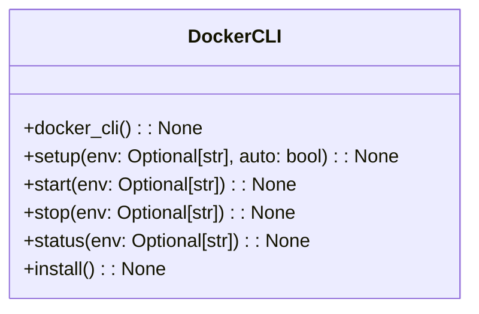
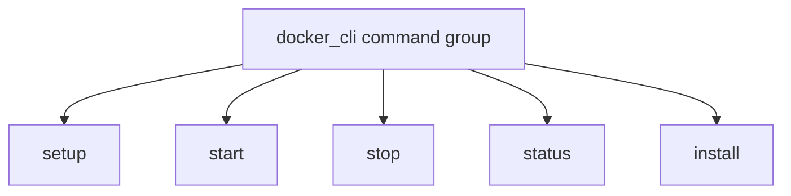

# CLI Docker Module Documentation

## Overview
The `cli_docker.py` module provides a command-line interface for managing Docker environments within the AutoProjectManagement system. This module allows users to set up, start, stop, and check the status of Docker services, as well as install Docker CLI tools.

## Architecture

### Command Structure


### Command Flow


## Detailed Functionality

### Docker Environment Management

#### Setup Docker Environment
**Command**: `setup(env: Optional[str], auto: bool) -> None`

Sets up the Docker environment automatically. This command:
- Detects the environment if not specified
- Initializes Docker services based on the selected environment
- Provides feedback on setup success or failure

**Parameters**:
- `env`: Environment to set up (development or production)
- `auto`: Automatically detect environment if not specified

**Usage**:
```bash
autoprojectmanagement docker setup --env development
autoprojectmanagement docker setup --auto
```

#### Start Docker Services
**Command**: `start(env: Optional[str]) -> None`

Starts the Docker services for the specified environment. This command:
- Initializes Docker services based on the selected environment
- Provides feedback on service start success or failure

**Parameters**:
- `env`: Environment to start (development or production)

**Usage**:
```bash
autoprojectmanagement docker start --env production
```

#### Stop Docker Services
**Command**: `stop(env: Optional[str]) -> None`

Stops the Docker services for the specified environment. This command:
- Shuts down Docker services based on the selected environment
- Provides feedback on service stop success or failure

**Parameters**:
- `env`: Environment to stop (development or production)

**Usage**:
```bash
autoprojectmanagement docker stop --env development
```

#### Show Docker Services Status
**Command**: `status(env: Optional[str]) -> None`

Displays the status of Docker services for the specified environment. This command:
- Checks the current status of Docker services
- Provides feedback on service status

**Parameters**:
- `env`: Environment to check (development or production)

**Usage**:
```bash
autoprojectmanagement docker status --env production
```

#### Install Docker CLI Tools
**Command**: `install() -> None`

Installs Docker CLI tools. This command:
- Attempts to install necessary Docker CLI tools
- Provides feedback on installation success or failure

**Usage**:
```bash
autoprojectmanagement docker install
```

## Integration Points

### Docker Setup Integration
The CLI integrates with the `DockerSetup` class from the `docker_setup` module, which handles the actual setup, starting, stopping, and status checking of Docker services.

### Error Handling
- Provides clear error messages for failed operations
- Handles invalid environment specifications
- Ensures graceful exits on errors

## Usage Examples

### Basic Docker Workflow
```bash
# Setup Docker environment
autoprojectmanagement docker setup --env development

# Start Docker services
autoprojectmanagement docker start --env production

# Check status of Docker services
autoprojectmanagement docker status --env development

# Stop Docker services
autoprojectmanagement docker stop --env production

# Install Docker CLI tools
autoprojectmanagement docker install
```

## Performance Characteristics

- **Command Execution**: Sub-second response for most operations
- **Memory Usage**: Minimal footprint for CLI operations
- **Network Usage**: Local operations only (no external calls)

## Security Considerations

- No sensitive data exposure in command output
- Local file operations only
- Input validation prevents injection attacks
- No external network calls in core commands
