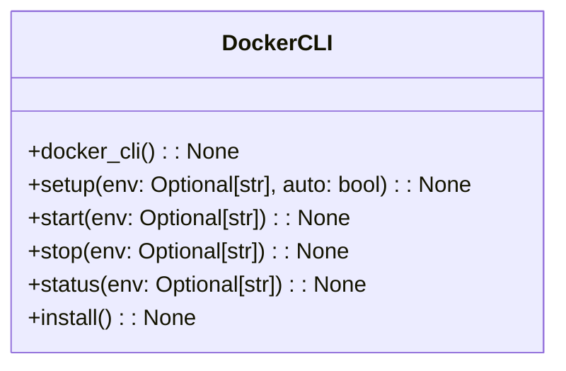
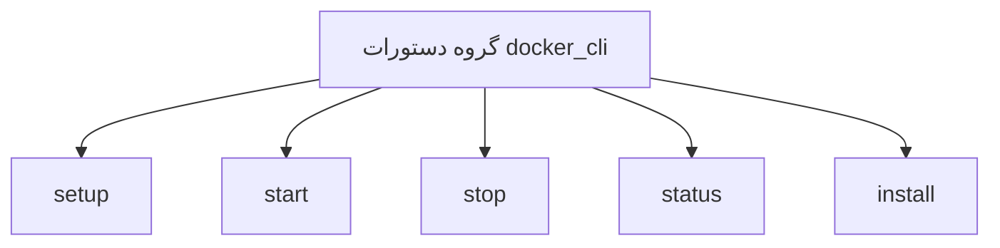

# مستندات ماژول CLI Docker

## بررسی کلی
ماژول `cli_docker.py` یک رابط خط فرمان برای مدیریت محیط‌های Docker در سیستم AutoProjectManagement فراهم می‌کند. این ماژول به کاربران امکان می‌دهد تا سرویس‌های Docker را راه‌اندازی، شروع، متوقف و وضعیت آن‌ها را بررسی کنند، همچنین ابزارهای CLI Docker را نصب کنند.

## معماری

### ساختار دستورات


### جریان دستورات


## عملکرد تفصیلی

### مدیریت محیط Docker

#### راه‌اندازی محیط Docker
**دستور**: `setup(env: Optional[str], auto: bool) -> None`

محیط Docker را به صورت خودکار راه‌اندازی می‌کند. این دستور:
- محیط را در صورت عدم مشخص شدن تشخیص می‌دهد
- سرویس‌های Docker را بر اساس محیط انتخاب شده مقداردهی اولیه می‌کند
- بازخورد موفقیت یا شکست راه‌اندازی فراهم می‌کند

**پارامترها**:
- `env`: محیط برای راه‌اندازی (توسعه یا تولید)
- `auto`: تشخیص خودکار محیط در صورت عدم مشخص شدن

**استفاده**:
```bash
autoprojectmanagement docker setup --env development
autoprojectmanagement docker setup --auto
```

#### شروع سرویس‌های Docker
**دستور**: `start(env: Optional[str]) -> None`

سرویس‌های Docker را برای محیط مشخص شده شروع می‌کند. این دستور:
- سرویس‌های Docker را بر اساس محیط انتخاب شده مقداردهی اولیه می‌کند
- بازخورد موفقیت یا شکست شروع سرویس فراهم می‌کند

**پارامترها**:
- `env`: محیط برای شروع (توسعه یا تولید)

**استفاده**:
```bash
autoprojectmanagement docker start --env production
```

#### توقف سرویس‌های Docker
**دستور**: `stop(env: Optional[str]) -> None`

سرویس‌های Docker را برای محیط مشخص شده متوقف می‌کند. این دستور:
- سرویس‌های Docker را بر اساس محیط انتخاب شده خاموش می‌کند
- بازخورد موفقیت یا شکست توقف سرویس فراهم می‌کند

**پارامترها**:
- `env`: محیط برای توقف (توسعه یا تولید)

**استفاده**:
```bash
autoprojectmanagement docker stop --env development
```

#### نمایش وضعیت سرویس‌های Docker
**دستور**: `status(env: Optional[str]) -> None`

وضعیت سرویس‌های Docker را برای محیط مشخص شده نمایش می‌دهد. این دستور:
- وضعیت فعلی سرویس‌های Docker را بررسی می‌کند
- بازخورد وضعیت سرویس فراهم می‌کند

**پارامترها**:
- `env`: محیط برای بررسی (توسعه یا تولید)

**استفاده**:
```bash
autoprojectmanagement docker status --env production
```

#### نصب ابزارهای CLI Docker
**دستور**: `install() -> None`

ابزارهای CLI Docker را نصب می‌کند. این دستور:
- تلاش می‌کند ابزارهای CLI Docker لازم را نصب کند
- بازخورد موفقیت یا شکست نصب فراهم می‌کند

**استفاده**:
```bash
autoprojectmanagement docker install
```

## نقاط یکپارچه‌سازی

### یکپارچه‌سازی راه‌اندازی Docker
CLI با کلاس `DockerSetup` از ماژول `docker_setup` یکپارچه می‌شود که راه‌اندازی، شروع، توقف و بررسی وضعیت سرویس‌های Docker را مدیریت می‌کند.

### مدیریت خطا
- پیام‌های خطای واضح برای عملیات ناموفق فراهم می‌کند
- مشخصات محیط نامعتبر را مدیریت می‌کند
- خروجی گرانولار در خطاها را تضمین می‌کند

## مثال‌های استفاده

### گردش کار پایه Docker
```bash
# راه‌اندازی محیط Docker
autoprojectmanagement docker setup --env development

# شروع سرویس‌های Docker
autoprojectmanagement docker start --env production

# بررسی وضعیت سرویس‌های Docker
autoprojectmanagement docker status --env development

# توقف سرویس‌های Docker
autoprojectmanagement docker stop --env production

# نصب ابزارهای CLI Docker
autoprojectmanagement docker install
```

## ویژگی‌های عملکرد

- **اجرای دستور**: پاسخ زیر ثانیه برای اکثر عملیات
- **استفاده حافظه**: ردپای حداقل برای عملیات CLI
- **استفاده شبکه**: فقط عملیات محلی (بدون تماس خارجی)

## ملاحظات امنیتی

- هیچ داده حساسی در خروجی دستور افشا نمی‌شود
- فقط عملیات فایل محلی
- اعتبارسنجی ورودی از حملات تزریق جلوگیری می‌کند
- هیچ تماس شبکه خارجی در دستورات اصلی وجود ندارد
