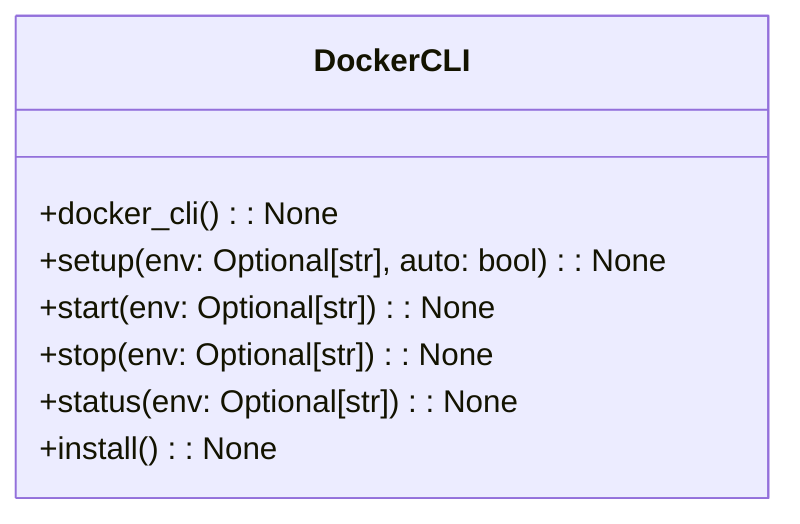
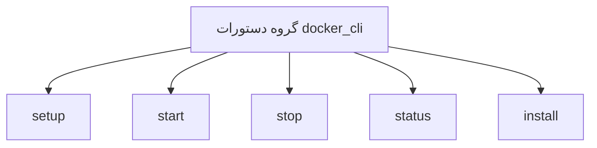

# مستندات ماژول CLI Docker

## بررسی کلی
ماژول `cli_docker.py` یک رابط خط فرمان برای مدیریت محیط‌های Docker در سیستم AutoProjectManagement فراهم می‌کند. این ماژول به کاربران امکان می‌دهد تا سرویس‌های Docker را راه‌اندازی، شروع، متوقف و وضعیت آن‌ها را بررسی کنند، همچنین ابزارهای CLI Docker را نصب کنند.

## معماری

### ساختار دستورات


### جریان دستورات


## عملکرد تفصیلی

### مدیریت محیط Docker

#### راه‌اندازی محیط Docker
**دستور**: `setup(env: Optional[str], auto: bool) -> None`

محیط Docker را به صورت خودکار راه‌اندازی می‌کند. این دستور:
- محیط را در صورت عدم مشخص شدن تشخیص می‌دهد
- سرویس‌های Docker را بر اساس محیط انتخاب شده مقداردهی اولیه می‌کند
- بازخورد موفقیت یا شکست راه‌اندازی فراهم می‌کند

**پارامترها**:
- `env`: محیط برای راه‌اندازی (توسعه یا تولید)
- `auto`: تشخیص خودکار محیط در صورت عدم مشخص شدن

**استفاده**:
```bash
autoprojectmanagement docker setup --env development
autoprojectmanagement docker setup --auto
```

#### شروع سرویس‌های Docker
**دستور**: `start(env: Optional[str]) -> None`

سرویس‌های Docker را برای محیط مشخص شده شروع می‌کند. این دستور:
- سرویس‌های Docker را بر اساس محیط انتخاب شده مقداردهی اولیه می‌کند
- بازخورد موفقیت یا شکست شروع سرویس فراهم می‌کند

**پارامترها**:
- `env`: محیط برای شروع (توسعه یا تولید)

**استفاده**:
```bash
autoprojectmanagement docker start --env production
```

#### توقف سرویس‌های Docker
**دستور**: `stop(env: Optional[str]) -> None`

سرویس‌های Docker را برای محیط مشخص شده متوقف می‌کند. این دستور:
- سرویس‌های Docker را بر اساس محیط انتخاب شده خاموش می‌کند
