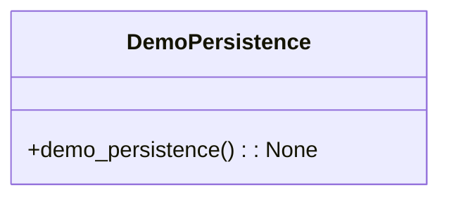

# Demo Persistence Module Documentation

## Overview
The `demo_persistence.py` module serves as a demonstration script for showcasing the persistence functionality of the AutoProjectManagement system. It illustrates how the system initializes, loads existing data, and manages projects and tasks.

## Architecture

### Key Components
- **ProjectManagementSystem**: The core class responsible for managing projects and tasks, including persistence operations.

### Command Structure


## Detailed Functionality

### Persistence Demonstration

#### Demo Persistence Function
**Function**: `demo_persistence() -> None`

This function demonstrates the persistence capabilities of the Project Management System. It performs the following operations:
- Initializes the Project Management System, loading any existing data.
- Checks if there are existing projects; if not, it creates a demo project and a demo task.
- Displays the current state of projects and tasks.
- Provides feedback on the success or failure of operations.

**Usage**:
```bash
python demo_persistence.py
```

### Key Operations

1. **Initialization**:
   - Loads existing projects and tasks from JSON files.
   - Displays the number of projects and tasks loaded.

2. **Project Creation**:
   - If no projects exist, a demo project is created with a predefined structure.
   - The project includes an ID, name, description, and status.

3. **Task Management**:
   - A demo task is added to the newly created project.
   - The task includes an ID, title, description, status, and priority.

4. **Data Display**:
   - Outputs the current state of the system, including the number of projects and tasks.
   - Lists all projects and their associated tasks.

5. **Persistence Verification**:
   - Informs the user that data is saved to JSON files in the `.auto_project_data` directory.
   - Encourages users to rerun the script to verify that data persists between executions.

## Example Output
When the script is executed, the following output is expected:
```
=== Project Management System Persistence Demo ===

System initialized. Loading existing data...
Number of projects: 0
Number of tasks: 0

✓ Added project: Demo Project
✓ Added task: Demo Task to project Demo Project

Data has been saved to JSON files in the .auto_project_data directory.

Current state:
Projects: 1
  - Project 1: Demo Project
    Tasks: 1
      - Task 1: Demo Task

To verify persistence, run this script again to see the data loaded from files.
```

## Dependencies
- **sys**: For system path manipulation.
- **os**: For file path operations.
- **ProjectManagementSystem**: The core class for managing projects and tasks.

## Security Considerations
- The script does not expose sensitive data.
- It operates locally and does not perform any network operations.

## Usage Example
To run the demo persistence script, use the following command:
```bash
python demo_persistence.py
```

This will execute the demonstration and show how the persistence functionality works within the AutoProjectManagement system.
