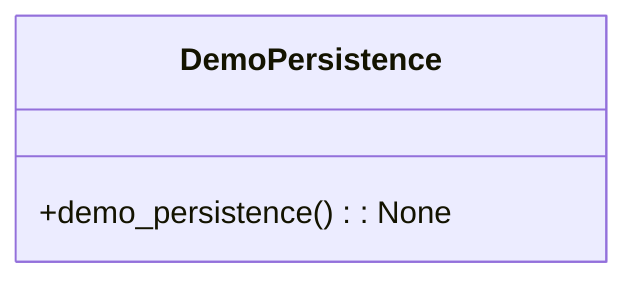

# مستندات ماژول Demo Persistence

## بررسی کلی
ماژول `demo_persistence.py` به عنوان یک اسکریپت نمایشی برای نمایش عملکرد تداوم سیستم AutoProjectManagement عمل می‌کند. این ماژول نشان می‌دهد که سیستم چگونه مقداردهی اولیه می‌کند، داده‌های موجود را بارگذاری می‌کند و پروژه‌ها و وظایف را مدیریت می‌کند.

## معماری

### اجزای کلیدی
- **ProjectManagementSystem**: کلاس اصلی مسئول مدیریت پروژه‌ها و وظایف، شامل عملیات تداوم.

### ساختار دستورات


## عملکرد تفصیلی

### نمایش تداوم

#### عملکرد Demo Persistence
**تابع**: `demo_persistence() -> None`

این تابع قابلیت‌های تداوم سیستم مدیریت پروژه را نمایش می‌دهد. عملیات زیر را انجام می‌دهد:
- سیستم مدیریت پروژه را مقداردهی اولیه می‌کند، هر داده موجود را بارگذاری می‌کند.
- بررسی می‌کند که آیا پروژه‌های موجود وجود دارند؛ اگر نه، یک پروژه نمایشی و یک وظیفه نمایشی ایجاد می‌کند.
- وضعیت فعلی پروژه‌ها و وظایف را نمایش می‌دهد.
- بازخورد موفقیت یا شکست عملیات را فراهم می‌کند.

**استفاده**:
```bash
python demo_persistence.py
```

### عملیات کلیدی

1. **مقداردهی اولیه**:
   - پروژه‌ها و وظایف موجود را از فایل‌های JSON بارگذاری می‌کند.
   - تعداد پروژه‌ها و وظایف بارگذاری شده را نمایش می‌دهد.

2. **ایجاد پروژه**:
   - اگر هیچ پروژه‌ای وجود نداشته باشد، یک پروژه نمایشی با ساختار از پیش تعریف شده ایجاد می‌کند.
   - پروژه شامل شناسه، نام، توضیحات و وضعیت است.

3. **مدیریت وظایف**:
   - یک وظیفه نمایشی به پروژه تازه ایجاد شده اضافه می‌کند.
   - وظیفه شامل شناسه، عنوان، توضیحات، وضعیت و اولویت است.

4. **نمایش داده**:
   - وضعیت فعلی سیستم، شامل تعداد پروژه‌ها و وظایف را خروجی می‌دهد.
   - تمام پروژه‌ها و وظایف مرتبط با آن‌ها را لیست می‌کند.

5. **تأیید تداوم**:
   - به کاربر اطلاع می‌دهد که داده در فایل‌های JSON در دایرکتوری `.auto_project_data` ذخیره شده است.
   - کاربران را تشویق می‌کند تا اسکریپت را دوباره اجرا کنند تا تداوم داده بین اجراها تأیید شود.

## مثال خروجی
هنگامی که اسکریپت اجرا می‌شود، خروجی زیر انتظار می‌رود:
```
=== نمایش تداوم سیستم مدیریت پروژه ===

سیستم مقداردهی اولیه شد. در حال بارگذاری داده‌های موجود...
تعداد پروژه‌ها: 0
تعداد وظایف: 0

✓ پروژه اضافه شد: Demo Project
✓ وظیفه اضافه شد: Demo Task به پروژه Demo Project

داده در فایل‌های JSON در دایرکتوری .auto_project_data ذخیره شده است.

وضعیت فعلی:
پروژه‌ها: 1
  - پروژه 1: Demo Project
    وظایف: 1
      - وظیفه 1: Demo Task

برای تأیید تداوم، این اسکریپت را دوباره اجرا کنید تا داده از فایل‌ها بارگذاری شود.
```

## وابستگی‌ها
- **sys**: برای دستکاری مسیر سیستم.
- **os**: برای عملیات مسیر فایل.
- **ProjectManagementSystem**: کلاس اصلی برای مدیریت پروژه‌ها و وظایف.

## ملاحظات امنیتی
- اسکریپت داده حساس را افشا نمی‌کند.
- به صورت محلی عمل می‌کند و هیچ عملیات شبکه‌ای انجام نمی‌دهد.

## مثال استفاده
برای اجرای اسکریپت نمایش تداوم، از دستور زیر استفاده کنید:
```bash
python demo_persistence.py
```

این دستور نمایش را اجرا می‌کند و نشان می‌دهد که عملکرد تداوم در سیستم AutoProjectManagement چگونه کار می‌کند.
