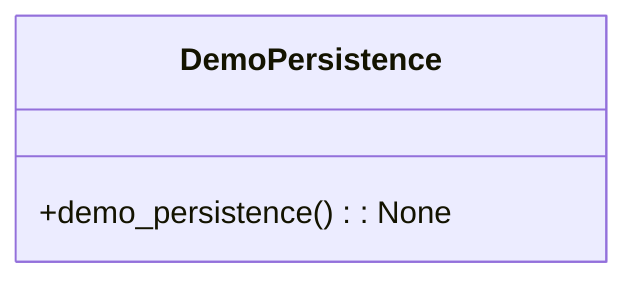

# مستندات ماژول Demo Persistence

## بررسی کلی
ماژول `demo_persistence.py` به عنوان یک اسکریپت نمایشی برای نمایش عملکرد تداوم سیستم AutoProjectManagement عمل می‌کند. این ماژول نشان می‌دهد که سیستم چگونه مقداردهی اولیه می‌کند، داده‌های موجود را بارگذاری می‌کند و پروژه‌ها و وظایف را مدیریت می‌کند.

## معماری

### اجزای کلیدی
- **ProjectManagementSystem**: کلاس اصلی مسئول مدیریت پروژه‌ها و وظایف، شامل عملیات تداوم.

### ساختار دستورات

## عملکرد تفصیلی

### نمایش تداوم

#### عملکرد Demo Persistence
**تابع**: `demo_persistence() -> None`

این تابع قابلیت‌های تداوم سیستم مدیریت پروژه را نمایش می‌دهد. عملیات زیر را انجام می‌دهد:
- سیستم مدیریت پروژه را مقداردهی اولیه می‌کند، هر داده موجود را بارگذاری می‌کند.
