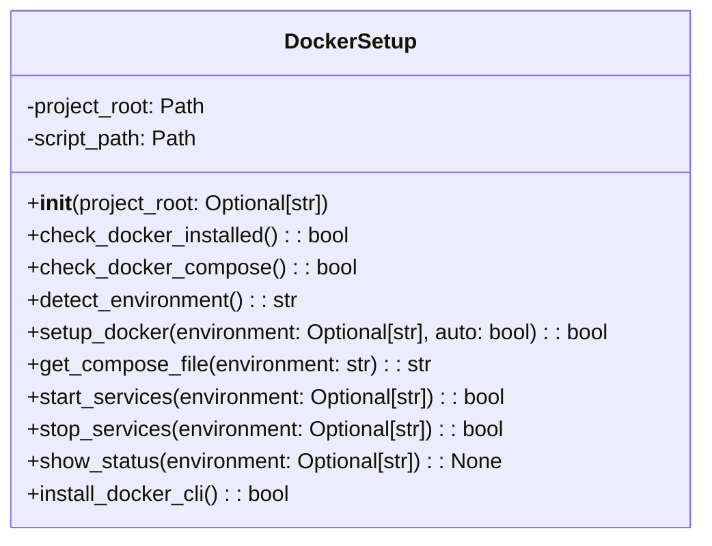

# Docker Setup Module Documentation

## Overview
The `docker_setup.py` module provides automated Docker setup and management functionality for the AutoProjectManagement system. It handles Docker installation, environment detection, service management, and post-installation setup.

## Architecture

### Class Structure


## Detailed Functionality

### Docker Setup Class

#### Initialization
**Method**: `__init__(project_root: Optional[str] = None)`

Initializes the DockerSetup class with the project root directory and script path.

**Parameters**:
- `project_root`: Optional path to the project root directory.

#### Check Docker Installation
**Method**: `check_docker_installed() -> bool`

Checks if Docker is installed and available on the system.

**Returns**: Boolean indicating if Docker is installed.

#### Check Docker Compose
**Method**: `check_docker_compose() -> bool`

Checks if Docker Compose is available on the system.

**Returns**: Boolean indicating if Docker Compose is available.

#### Detect Environment
**Method**: `detect_environment() -> str`

Auto-detects the appropriate environment (development or production) based on the current Git branch.

**Returns**: Environment string ("development" or "production").

#### Setup Docker
**Method**: `setup_docker(environment: Optional[str] = None, auto: bool = True) -> bool`

Sets up the Docker environment automatically by running the setup script.

**Parameters**:
- `environment`: Optional environment to set up.
- `auto`: Automatically detect environment if not specified.

**Returns**: Boolean indicating success.

#### Get Compose File
**Method**: `get_compose_file(environment: str) -> str`

Returns the appropriate Docker Compose file for the given environment.

**Parameters**:
- `environment`: Environment string.

**Returns**: Path to the Docker Compose file.

#### Start Services
**Method**: `start_services(environment: Optional[str] = None) -> bool`

Starts Docker services for the specified environment.

**Parameters**:
- `environment`: Optional environment to start.

**Returns**: Boolean indicating success.

#### Stop Services
**Method**: `stop_services(environment: Optional[str] = None) -> bool`

Stops Docker services for the specified environment.

**Parameters**:
- `environment`: Optional environment to stop.

**Returns**: Boolean indicating success.

#### Show Status
**Method**: `show_status(environment: Optional[str] = None) -> None`

Displays the status of Docker services for the specified environment.

**Parameters**:
- `environment`: Optional environment to check.

#### Install Docker CLI
**Method**: `install_docker_cli() -> bool`

Installs Docker CLI tools if not available, with support for Linux distributions.

**Returns**: Boolean indicating success.

### Post-Installation Setup

#### Post Install Setup
**Function**: `post_install_setup() -> None`

Runs automatic Docker setup after package installation, including Docker installation and environment setup.

## Usage Examples

### Basic Docker Setup
```python
from autoprojectmanagement.docker_setup import DockerSetup

# Initialize DockerSetup
docker_setup = DockerSetup()

# Check Docker installation
if docker_setup.check_docker_installed():
    print("Docker is installed")
else:
    print("Docker is not installed")

# Setup Docker environment
if docker_setup.setup_docker():
    print("Docker setup completed")
else:
    print("Docker setup failed")
```

### Service Management
```python
# Start Docker services
docker_setup.start_services("development")

# Stop Docker services
docker_setup.stop_services("development")

# Show service status
docker_setup.show_status("development")
```

## Integration Points

### Docker Compose Files
The module integrates with Docker Compose files located in the project root:
- `docker-compose.dev.yml` for development environment
- `docker-compose.prod.yml` for production environment
- `docker-compose.yml` as default

### Setup Script
The module uses the `auto-docker-setup.sh` script located in the `scripts` directory for automated setup.

## Error Handling
