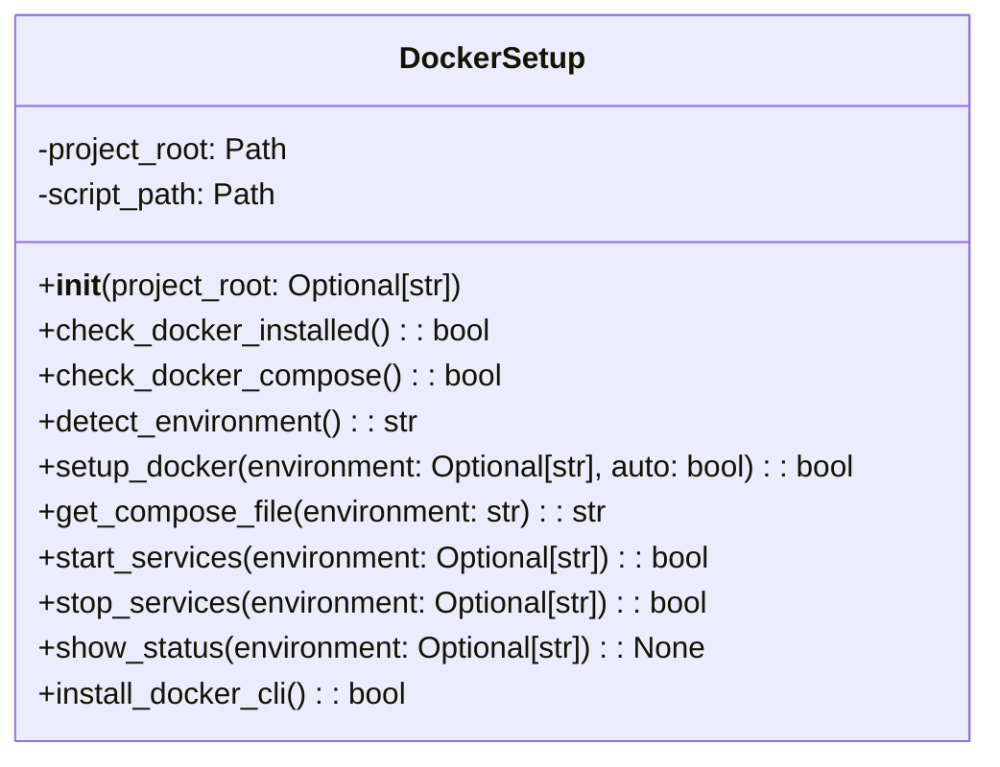

# Docker Setup Module Documentation

## Overview
The `docker_setup.py` module provides automated Docker setup and management functionality for the AutoProjectManagement system. It handles Docker installation, environment detection, service management, and post-installation setup.

## Architecture

### Class Structure

## Detailed Functionality

