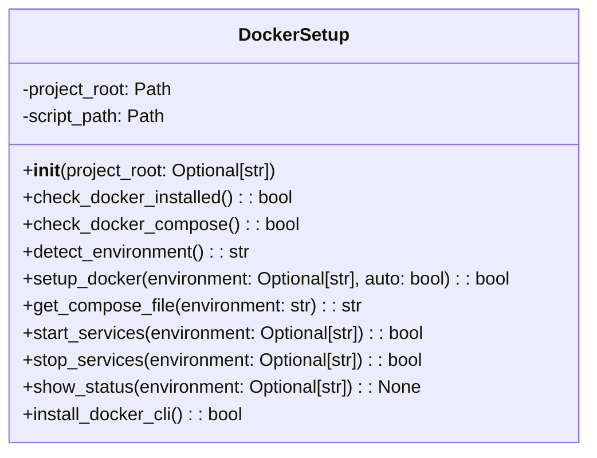

# مستندات ماژول Docker Setup

## بررسی کلی
ماژول `docker_setup.py` عملکرد راه‌اندازی و مدیریت خودکار Docker را برای سیستم AutoProjectManagement فراهم می‌کند. این ماژول نصب Docker، تشخیص محیط، مدیریت سرویس و راه‌اندازی پس از نصب را مدیریت می‌کند.

## معماری

### ساختار کلاس


## عملکرد تفصیلی

### کلاس DockerSetup

#### مقداردهی اولیه
**متد**: `__init__(project_root: Optional[str] = None)`

کلاس DockerSetup را با دایرکتوری ریشه پروژه و مسیر اسکریپت مقداردهی اولیه می‌کند.

**پارامترها**:
- `project_root`: مسیر اختیاری به دایرکتوری ریشه پروژه.

#### بررسی نصب Docker
**متد**: `check_docker_installed() -> bool`

بررسی می‌کند که آیا Docker روی سیستم نصب و در دسترس است.

**برمی‌گرداند**: بولین نشان‌دهنده نصب Docker.

#### بررسی Docker Compose
**متد**: `check_docker_compose() -> bool`

بررسی می‌کند که آیا Docker Compose روی سیستم در دسترس است.

**برمی‌گرداند**: بولین نشان‌دهنده در دسترس بودن Docker Compose.

#### تشخیص محیط
**متد**: `detect_environment() -> str`

به طور خودکار محیط مناسب (توسعه یا تولید) را بر اساس شاخه Git فعلی تشخیص می‌دهد.

**برمی‌گرداند**: رشته محیط ("development" یا "production").

#### راه‌اندازی Docker
**متد**: `setup_docker(environment: Optional[str] = None, auto: bool = True) -> bool`

محیط Docker را به صورت خودکار با اجرای اسکریپت راه‌اندازی می‌کند.

**پارامترها**:
- `environment`: محیط اختیاری برای راه‌اندازی.
- `auto`: تشخیص خودکار محیط در صورت عدم مشخص شدن.

**برمی‌گرداند**: بولین نشان‌دهنده موفقیت.

#### دریافت فایل Compose
**متد**: `get_compose_file(environment: str) -> str`

فایل Docker Compose مناسب برای محیط داده شده را برمی‌گرداند.

**پارامترها**:
- `environment`: رشته محیط.

**برمی‌گرداند**: مسیر به فایل Docker Compose.

#### شروع سرویس‌ها
**متد**: `start_services(environment: Optional[str] = None) -> bool`

سرویس‌های Docker را برای محیط مشخص شده شروع می‌کند.

**پارامترها**:
- `environment`: محیط اختیاری برای شروع.

**برمی‌گرداند**: بولین نشان‌دهنده موفقیت.

#### توقف سرویس‌ها
**متد**: `stop_services(environment: Optional[str] = None) -> bool`

سرویس‌های Docker را برای محیط مشخص شده متوقف می‌کند.

**پarameters**:
- `environment`: محیط اختیاری برای توقف.

**برمی‌گرداند**: بولین نشان‌دهنده موفقیت.

#### نمایش وضعیت
**متد**: `show_status(environment: Optional[str] = None) -> None`

وضعیت سرویس‌های Docker را برای محیط مشخص شده نمایش می‌دهد.

**پارامترها**:
- `environment`: محیط اختیاری برای بررسی.

#### نصب CLI Docker
**متد**: `install_docker_cli() -> bool`

ابزارهای CLI Docker را در صورت عدم دسترسی نصب می‌کند، با پشتیبانی از توزیع‌های لینوکس.

**برمی‌گرداند**: بولین نشان‌دهنده موفقیت.

### راه‌اندازی پس از نصب

#### راه‌اندازی پس از نصب
**تابع**: `post_install_setup() -> None`

راه‌اندازی خودکار Docker پس از نصب بسته را اجرا می‌کند، شامل نصب Docker و راه‌اندازی محیط.

## مثال‌های استفاده

### راه‌اندازی پایه Docker
```python
from autoprojectmanagement.docker_setup import DockerSetup

# مقداردهی اولیه DockerSetup
docker_setup = DockerSetup()

# بررسی نصب Docker
if docker_setup.check_docker_installed():
    print("Docker نصب شده است")
else:
    print("Docker نصب نشده است")

# راه‌اندازی محیط Docker
if docker_setup.setup_docker():
    print("راه‌اندازی Docker تکمیل شد")
else:
    print("راه‌اندازی Docker ناموفق بود")
```

### مدیریت سرویس
```python
# شروع سرویس‌های Docker
docker_setup.start_services("development")

# توقف سرویس‌های Docker
docker_setup.stop_services("development")

# نمایش وضعیت سرویس
docker_setup.show_status("development")
```

## نقاط یکپارچه‌سازی

### فایل‌های Docker Compose
ماژول با فایل‌های Docker Compose واقع در ریشه پروژه یکپارچه می‌شود:
- `docker-compose.dev.yml` برای محیط توسعه
- `docker-compose.prod.yml` برای محیط تولید
- `docker-compose.yml` به عنوان پیش‌فرض

### اسکریپت راه‌اندازی
ماژول از اسکریپت `auto-docker-setup.sh` واقع در دایرکتوری `scripts` برای راه‌اندازی خودکار استفاده می‌کند.

## مدیریت خطا
- پیام‌های خطای واضح برای عملیات ناموفق فراهم می‌کند.
- نصب‌های Docker از دست رفته را به صورت گرانولار مدیریت می‌کند.
- از مکانیسم‌های جایگزین برای توزیع‌های مختلف لینوکس پشتیبانی می‌کند.

## ملاحظات امنیتی
- از فراخوانی‌های زیرفرآیند برای عملیات Docker استفاده می‌کند.
- مجوزهای مناسب کاربر برای گروه Docker را تضمین می‌کند.
- هیچ داده حساسی در خروجی دستور افشا نمی‌شود.

## ویژگی‌های عملکرد
- **اجرای دستور**: وابسته به عملکرد Docker و سیستم.
- **استفاده حافظه**: ردپای حداقل برای عملیات راه‌اندازی.
- **استفاده شبکه**: فقط عملیات محلی.

## وابستگی‌ها
- **subprocess**: برای اجرای دستورات Docker.
- **platform**: برای تشخیص سیستم.
- **shutil**: برای بررسی دسترسی دستورات.
- **pathlib**: برای دستکاری مسیرها.

## مثال خروجی
