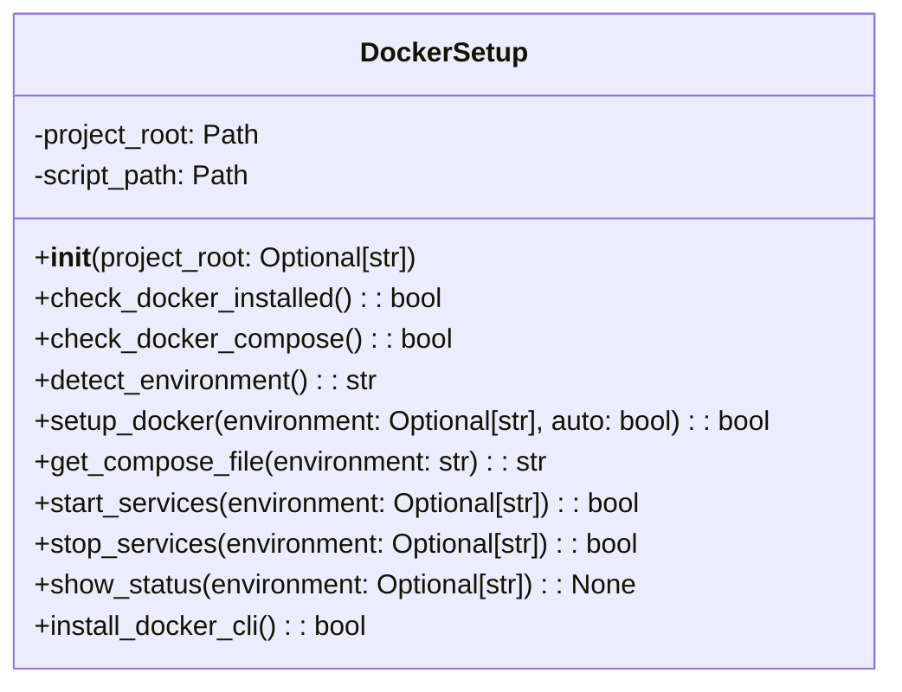

# مستندات ماژول Docker Setup

## بررسی کلی
ماژول `docker_setup.py` عملکرد راه‌اندازی و مدیریت خودکار Docker را برای سیستم AutoProjectManagement فراهم می‌کند. این ماژول نصب Docker، تشخیص محیط، مدیریت سرویس و راه‌اندازی پس از نصب را مدیریت می‌کند.

## معماری

### ساختار کلاس

## عملکرد تفصیلی

### کلاس DockerSetup

#### مقداردهی اولیه
**متد**: `__init__(project_root: Optional[str] = None)`

