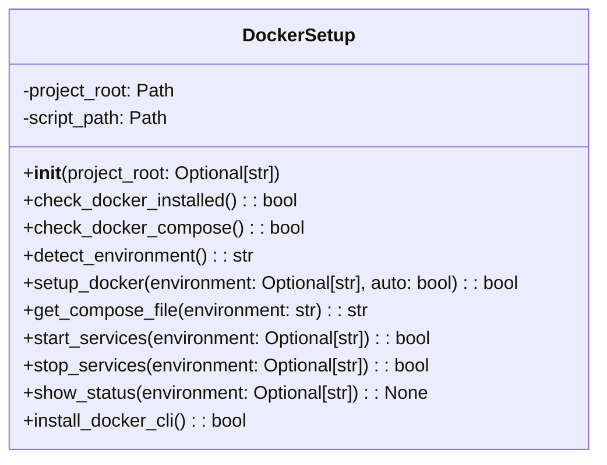

# مستندات ماژول Docker Setup

## بررسی کلی
ماژول `docker_setup.py` عملکرد راه‌اندازی و مدیریت خودکار Docker را برای سیستم AutoProjectManagement فراهم می‌کند. این ماژول نصب Docker، تشخیص محیط، مدیریت سرویس و راه‌اندازی پس از نصب را مدیریت می‌کند.

## معماری

### ساختار کلاس

## عملکرد تفصیلی

### کلاس DockerSetup

#### مقداردهی اولیه
**متد**: `__init__(project_root: Optional[str] = None)`

کلاس DockerSetup را با دایرکتوری ریشه پروژه و مسیر اسکریپت مقداردهی اولیه می‌کند.

**پارامترها**:
- `project_root`: مسیر اختیاری به دایرکتوری ریشه پروژه.

#### بررسی نصب Docker
**متد**: `check_docker_installed() -> bool`

بررسی می‌کند که آیا Docker روی سیستم نصب و در دسترس است.

**برمی‌گرداند**: بولین نشان‌دهنده نصب Docker.

#### بررسی Docker Compose
**متد**: `check_docker_compose() -> bool`

بررسی می‌کند که آیا Docker Compose روی سیستم در دسترس است.

**برمی‌گرداند**: بولین نشان‌دهنده در دسترس بودن Docker Compose.

#### تشخیص محیط
**متد**: `detect_environment() -> str`

به طور خودکار محیط مناسب (توسعه یا تولید) را بر اساس شاخه Git فعلی تشخیص می‌دهد.

**برمی‌گرداند**: رشته محیط ("development" یا "production").

#### راه‌اندازی Docker
**متد**: `setup_docker(environment: Optional[str] = None, auto: bool = True) -> bool`

محیط Docker را به صورت خودکار با اجرای اسکریپت راه‌اندازی می‌کند.

**پارامترها**:
- `environment`: محیط اختیاری برای راه‌اندازی.
- `auto`: تشخیص خودکار محیط در صورت عدم مشخص شدن.

**برمی‌گرداند**: بولین نشان‌دهنده موفقیت.

#### دریافت فایل Compose
**متد**: `get_compose_file(environment: str) -> str`

فایل Docker Compose مناسب برای محیط داده شده را برمی‌گرداند.

**پارامترها**:
- `environment`: رشته محیط.

**برمی‌گرداند**: مسیر به فایل Docker Compose.

#### شروع سرویس‌ها
**متد**: `start_services(environment: Optional[str] = None) -> bool`

سرویس‌های Docker را برای محیط مشخص شده شروع می‌کند.

**پارامترها**:
- `environment`: محیط اختیاری برای شروع.

**برمی‌گرداند**: بولین نشان‌دهنده موفقیت.

#### توقف سرویس‌ها
**متد**: `stop_services(environment: Optional[str] = None) -> bool`

سرویس‌های Docker را برای محیط مشخص شده متوقف می‌کند.

**پarameters**:
- `environment`: محیط اختیاری برای توقف.

**برمی‌گرداند**: بولین نشان‌دهنده موفقیت.

#### نمایش وضعیت
**متد**: `show_status(environment: Optional[str] = None) -> None`

وضعیت سرویس‌های Docker را برای محیط مشخص شده نمایش می‌دهد.

**پارامترها**:
- `environment`: محیط اختیاری برای بررسی.

#### نصب CLI Docker
**متد**: `install_docker_cli() -> bool`

ابزارهای CLI Docker را در صورت عدم دسترسی نصب می‌کند، با پشتیبانی از توزیع‌های لینوکس.

**برمی‌گرداند**: بولین نشان‌دهنده موفقیت.

### راه‌اندازی پس از نصب

#### راه‌اندازی پس از نصب
**تابع**: `post_install_setup() -> None`

