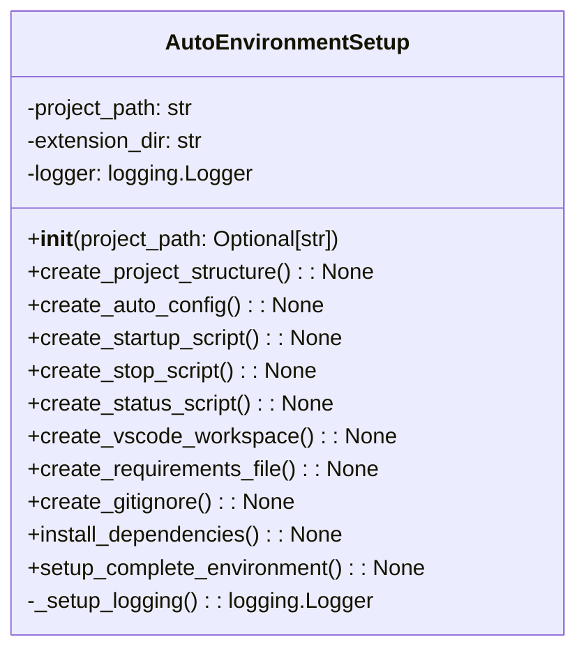

# Setup Auto Environment Module Documentation

## Overview
The `setup_auto_environment.py` module provides comprehensive setup functionality for creating a complete automatic project management environment. It handles directory structure creation, configuration file generation, script automation, VS Code workspace setup, dependency management, and Git integration.

## Architecture

### Class Structure


## Detailed Functionality

### AutoEnvironmentSetup Class

#### Initialization
**Method**: `__init__(project_path: Optional[str] = None)`

Initializes the AutoEnvironmentSetup class with the project path and sets up logging.

**Parameters**:
- `project_path`: Optional path to the project directory.

#### Create Project Structure
**Method**: `create_project_structure() -> None`

Creates the complete project structure for automatic management, including logs, configuration, data, reports, and backup directories.

#### Create Auto Config
**Method**: `create_auto_config() -> None`

Generates a JSON configuration file with all necessary settings for the AutoProjectManagement system.

#### Create Startup Script
**Method**: `create_startup_script() -> None`

Creates a shell script to start the automatic project management system with proper logging and error handling.

#### Create Stop Script
**Method**: `create_stop_script() -> None`

Creates a shell script to gracefully stop the automatic project management system and perform cleanup.

#### Create Status Script
**Method**: `create_status_script() -> None`

Creates a shell script to display the current status of the automatic project management system.

#### Create VS Code Workspace
**Method**: `create_vscode_workspace() -> None`

Creates a VS Code workspace file with optimized settings for automatic project management.

#### Create Requirements File
**Method**: `create_requirements_file() -> None`

Creates a requirements.txt file with all necessary dependencies for the AutoProjectManagement system.

#### Create Gitignore
**Method**: `create_gitignore() -> None`

Creates a .gitignore file with patterns for excluding temporary files, logs, backups, and other non-essential files from version control.

#### Install Dependencies
**Method**: `install_dependencies() -> None`

Installs all necessary Python packages from the requirements file.

#### Setup Complete Environment
**Method**: `setup_complete_environment() -> None`

Orchestrates the complete setup process including directory creation, configuration generation, script creation, and dependency installation.

### Main Function
**Function**: `main() -> None`

Main entry point for the setup script, providing command line interface for setting up the automatic project management environment.

## Usage Examples

### Basic Setup
```python
from autoprojectmanagement.setup_auto_environment import AutoEnvironmentSetup

# Initialize AutoEnvironmentSetup
setup = AutoEnvironmentSetup()

# Setup complete environment
setup.setup_complete_environment()
```

### Command Line Usage
```bash
# Setup in current directory
python -m autoprojectmanagement.setup_auto_environment

# Setup in specific directory
python -m autoprojectmanagement.setup_auto_environment --path /path/to/project

# Enable verbose logging
python -m autoprojectmanagement.setup_auto_environment --verbose
```

## Configuration Files Created

### Auto Config File
Located at `.auto_project/config/auto_config.json`, this file contains settings for:
- Auto management features
- Monitoring configurations
- Git integration
- Reporting settings
- Notifications
- Backup configurations

### VS Code Workspace
Located at `auto_project_management.code-workspace`, this file includes:
- Folder settings
- Editor configurations
- Launch configurations for debugging
- Task definitions for automation

### Shell Scripts
- `start_auto_management.sh`: Starts the automatic management system
- `stop_auto_management.sh`: Stops the automatic management system
- `status_auto_management.sh`: Displays system status

## Dependencies
- **os**: For operating system interactions
- **sys**: For system-specific parameters
- **json**: For JSON file handling
- **subprocess**: For running shell commands
- **shutil**: For file operations
- **logging**: For logging setup
- **pathlib**: For path manipulations

## Error Handling
- Comprehensive error logging for all operations
- Graceful handling of missing files or directories
- Validation of project path existence
- Clear error messages for failed operations

## Security Considerations
- No sensitive data exposure in configuration files
- Local file operations only
- Proper file permissions for shell scripts
- Secure handling of environment variables

## Performance Characteristics
- **Setup Time**: Dependent on project size and system performance
- **Memory Usage**: Minimal footprint for setup operations
- **Disk Usage**: Creates necessary directories and files

## Example Output
When running the setup script, the following output is expected:
```
🎉 Setup complete!

Next steps:
1. Run './start_auto_management.sh' to start automatic management
2. Open 'auto_project_management.code-workspace' in VS Code
3. Start coding - project management will happen automatically!
```

## Integration Points
- **Git Integration**: Sets up .gitignore patterns for auto-generated files
- **VS Code Integration**: Creates workspace with optimized settings
- **Dependency Management**: Installs required Python packages
- **Shell Scripts**: Provides automation scripts for system management

## Extension Points
- **Custom Configurations**: Additional settings can be added to the auto_config.json
- **Additional Scripts**: New shell scripts can be created for extended functionality
- **Workspace Customization**: VS Code workspace can be modified for specific needs
- **Dependency Updates**: Requirements can be updated to include additional packages
