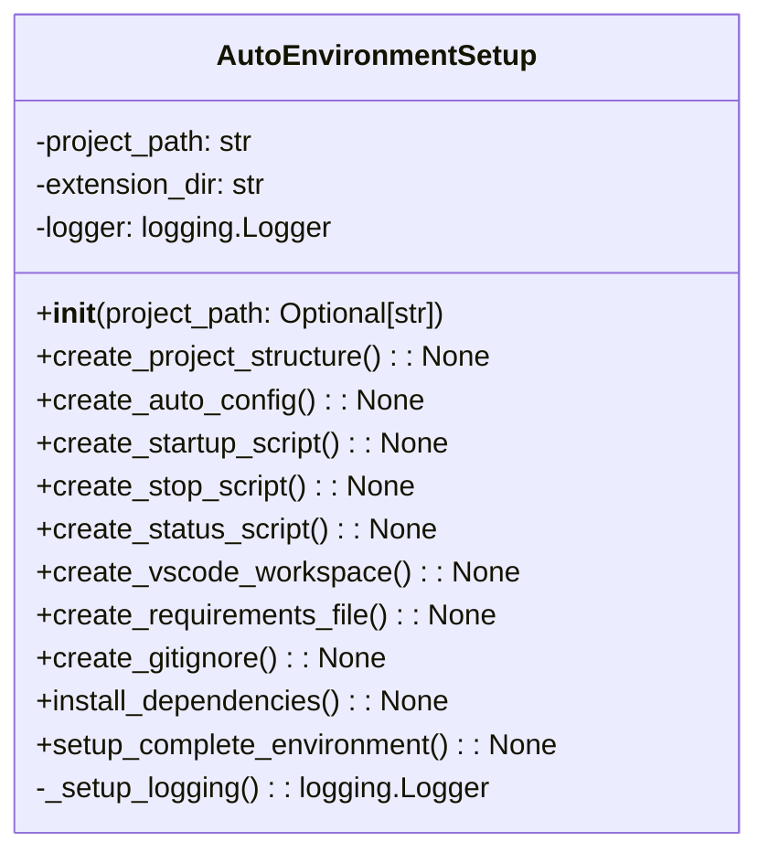

# Setup Auto Environment Module Documentation

## Overview
The `setup_auto_environment.py` module provides comprehensive setup functionality for creating a complete automatic project management environment. It handles directory structure creation, configuration file generation, script automation, VS Code workspace setup, dependency management, and Git integration.

## Architecture

### Class Structure

## Detailed Functionality

