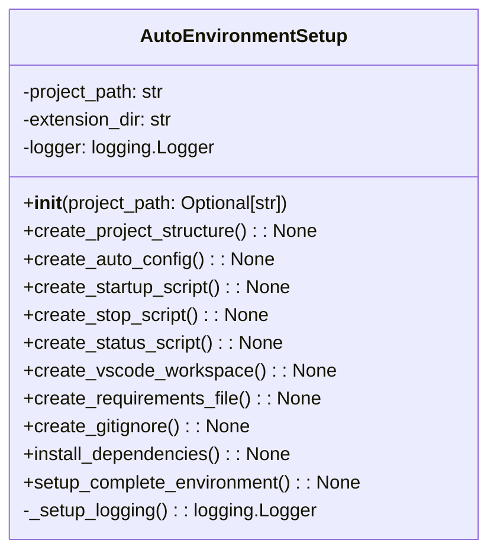

# مستندات ماژول Setup Auto Environment

## بررسی کلی
ماژول `setup_auto_environment.py` عملکرد راه‌اندازی جامع برای ایجاد یک محیط کامل مدیریت پروژه خودکار فراهم می‌کند. این ماژول ایجاد ساختار دایرکتوری، تولید فایل پیکربندی، خودکارسازی اسکریپت، راه‌اندازی فضای کاری VS Code، مدیریت وابستگی و یکپارچه‌سازی Git را مدیریت می‌کند.

## معماری

### ساختار کلاس

## عملکرد تفصیلی

### کلاس AutoEnvironmentSetup

#### مقداردهی اولیه
**متد**: `__init__(project_path: Optional[str] = None)`

کلاس AutoEnvironmentSetup را با مسیر پروژه مقداردهی اولیه می‌کند و لاگ‌گیری را راه‌اندازی می‌کند.

**پارامترها**:
- `project_path`: مسیر اختیاری به دایرکتوری پروژه.

#### ایجاد ساختار پروژه
**متد**: `create_project_structure() -> None`

