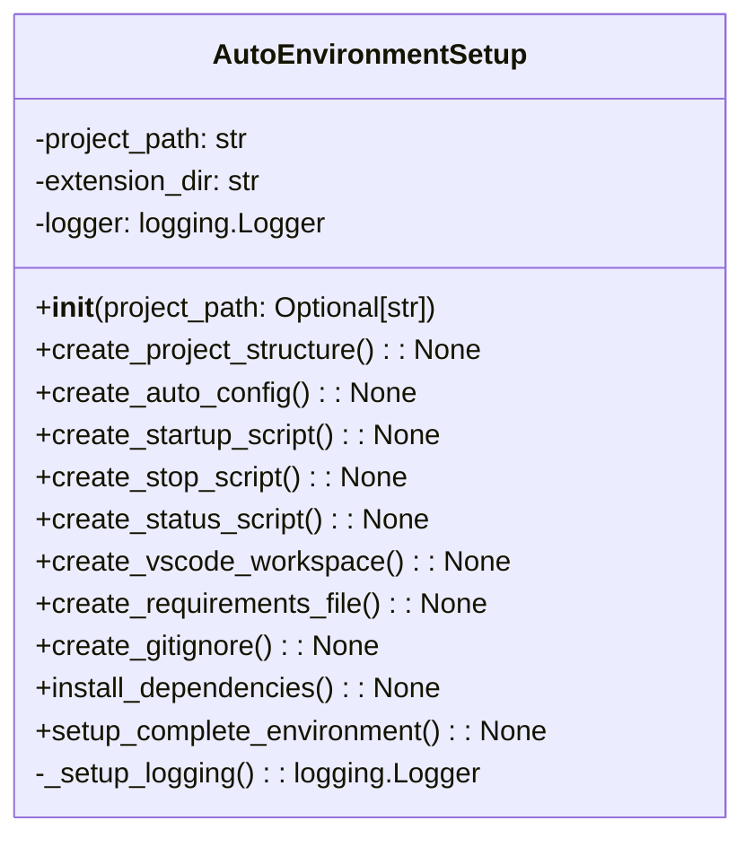

# مستندات ماژول Setup Auto Environment

## بررسی کلی
ماژول `setup_auto_environment.py` عملکرد راه‌اندازی جامع برای ایجاد یک محیط کامل مدیریت پروژه خودکار فراهم می‌کند. این ماژول ایجاد ساختار دایرکتوری، تولید فایل پیکربندی، خودکارسازی اسکریپت، راه‌اندازی فضای کاری VS Code، مدیریت وابستگی و یکپارچه‌سازی Git را مدیریت می‌کند.

## معماری

### ساختار کلاس

## عملکرد تفصیلی

### کلاس AutoEnvironmentSetup

#### مقداردهی اولیه
**متد**: `__init__(project_path: Optional[str] = None)`

کلاس AutoEnvironmentSetup را با مسیر پروژه مقداردهی اولیه می‌کند و لاگ‌گیری را راه‌اندازی می‌کند.

**پارامترها**:
- `project_path`: مسیر اختیاری به دایرکتوری پروژه.

#### ایجاد ساختار پروژه
**متد**: `create_project_structure() -> None`

ساختار کامل پروژه را برای مدیریت خودکار ایجاد می‌کند، شامل دایرکتوری‌های لاگ، پیکربندی، داده، گزارش و پشتیبان.

#### ایجاد پیکربندی خودکار
**متد**: `create_auto_config() -> None`

یک فایل پیکربندی JSON با تمام تنظیمات لازم برای سیستم AutoProjectManagement تولید می‌کند.

#### ایجاد اسکریپت راه‌اندازی
**متد**: `create_startup_script() -> None`

یک اسکریپت شل برای راه‌اندازی سیستم مدیریت پروژه خودکار با لاگ‌گیری و مدیریت خطای مناسب ایجاد می‌کند.

#### ایجاد اسکریپت توقف
**متد**: `create_stop_script() -> None`

یک اسکریپت شل برای توقف گرانولار سیستم مدیریت پروژه خودکار و انجام پاکسازی ایجاد می‌کند.

#### ایجاد اسکریپت وضعیت
**متد**: `create_status_script() -> None`

یک اسکریپت شل برای نمایش وضعیت فعلی سیستم مدیریت پروژه خودکار ایجاد می‌کند.

#### ایجاد فضای کاری VS Code
**متد**: `create_vscode_workspace() -> None`

یک فایل فضای کاری VS Code با تنظیمات بهینه‌شده برای مدیریت پروژه خودکار ایجاد می‌کند.

#### ایجاد فایل Requirements
**متد**: `create_requirements_file() -> None`

یک فایل requirements.txt با تمام وابستگی‌های لازم برای سیستم AutoProjectManagement ایجاد می‌کند.

#### ایجاد Gitignore
**متد**: `create_gitignore() -> None`

