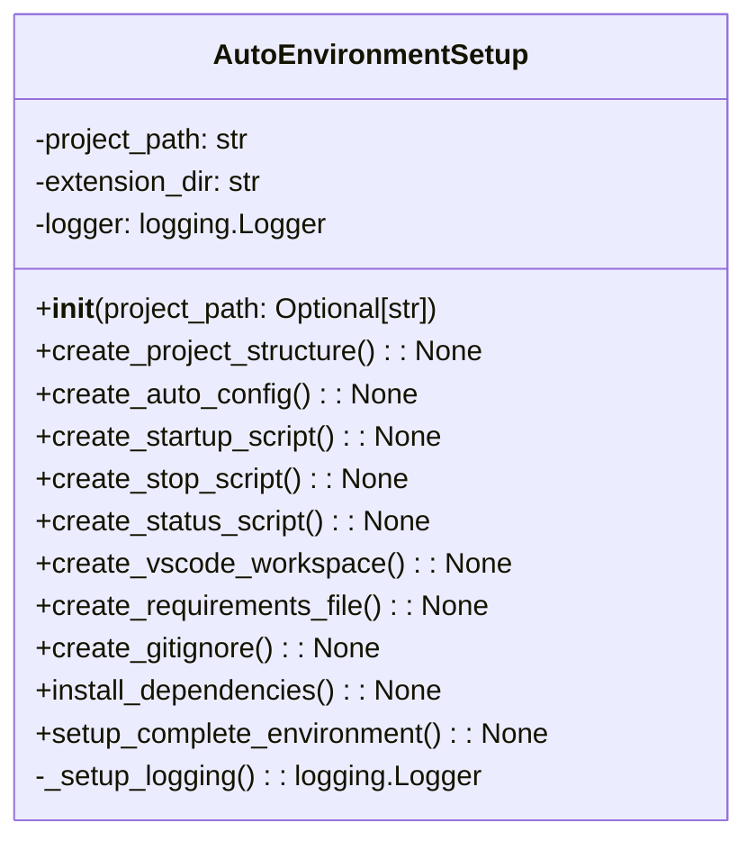

# مستندات ماژول Setup Auto Environment

## بررسی کلی
ماژول `setup_auto_environment.py` عملکرد راه‌اندازی جامع برای ایجاد یک محیط کامل مدیریت پروژه خودکار فراهم می‌کند. این ماژول ایجاد ساختار دایرکتوری، تولید فایل پیکربندی، خودکارسازی اسکریپت، راه‌اندازی فضای کاری VS Code، مدیریت وابستگی و یکپارچه‌سازی Git را مدیریت می‌کند.

## معماری

### ساختار کلاس


## عملکرد تفصیلی

### کلاس AutoEnvironmentSetup

#### مقداردهی اولیه
**متد**: `__init__(project_path: Optional[str] = None)`

کلاس AutoEnvironmentSetup را با مسیر پروژه مقداردهی اولیه می‌کند و لاگ‌گیری را راه‌اندازی می‌کند.

**پارامترها**:
- `project_path`: مسیر اختیاری به دایرکتوری پروژه.

#### ایجاد ساختار پروژه
**متد**: `create_project_structure() -> None`

ساختار کامل پروژه را برای مدیریت خودکار ایجاد می‌کند، شامل دایرکتوری‌های لاگ، پیکربندی، داده، گزارش و پشتیبان.

#### ایجاد پیکربندی خودکار
**متد**: `create_auto_config() -> None`

یک فایل پیکربندی JSON با تمام تنظیمات لازم برای سیستم AutoProjectManagement تولید می‌کند.

#### ایجاد اسکریپت راه‌اندازی
**متد**: `create_startup_script() -> None`

یک اسکریپت شل برای راه‌اندازی سیستم مدیریت پروژه خودکار با لاگ‌گیری و مدیریت خطای مناسب ایجاد می‌کند.

#### ایجاد اسکریپت توقف
**متد**: `create_stop_script() -> None`

یک اسکریپت شل برای توقف گرانولار سیستم مدیریت پروژه خودکار و انجام پاکسازی ایجاد می‌کند.

#### ایجاد اسکریپت وضعیت
**متد**: `create_status_script() -> None`

یک اسکریپت شل برای نمایش وضعیت فعلی سیستم مدیریت پروژه خودکار ایجاد می‌کند.

#### ایجاد فضای کاری VS Code
**متد**: `create_vscode_workspace() -> None`

یک فایل فضای کاری VS Code با تنظیمات بهینه‌شده برای مدیریت پروژه خودکار ایجاد می‌کند.

#### ایجاد فایل Requirements
**متد**: `create_requirements_file() -> None`

یک فایل requirements.txt با تمام وابستگی‌های لازم برای سیستم AutoProjectManagement ایجاد می‌کند.

#### ایجاد Gitignore
**متد**: `create_gitignore() -> None`

یک فایل .gitignore با الگوها برای حذف فایل‌های موقت، لاگ‌ها، پشتیبان‌ها و سایر فایل‌های غیرضروری از کنترل نسخه ایجاد می‌کند.

#### نصب وابستگی‌ها
**متد**: `install_dependencies() -> None`

تمام بسته‌های Python لازم را از فایل requirements نصب می‌کند.

#### راه‌اندازی محیط کامل
**متد**: `setup_complete_environment() -> None`

فرآیند راه‌اندازی کامل را هماهنگ می‌کند شامل ایجاد دایرکتوری، تولید پیکربندی، ایجاد اسکریپت و نصب وابستگی.

### تابع اصلی
**تابع**: `main() -> None`

نقطه ورود اصلی برای اسکریپت راه‌اندازی، فراهم کردن رابط خط فرمان برای راه‌اندازی محیط مدیریت پروژه خودکار.

## مثال‌های استفاده

### راه‌اندازی پایه
```python
from autoprojectmanagement.setup_auto_environment import AutoEnvironmentSetup

# مقداردهی اولیه AutoEnvironmentSetup
setup = AutoEnvironmentSetup()

# راه‌اندازی محیط کامل
setup.setup_complete_environment()
```

### استفاده از خط فرمان
```bash
# راه‌اندازی در دایرکتوری فعلی
python -m autoprojectmanagement.setup_auto_environment

# راه‌اندازی در دایرکتوری خاص
python -m autoprojectmanagement.setup_auto_environment --path /path/to/project

# فعال کردن لاگ‌گیری تفصیلی
python -m autoprojectmanagement.setup_auto_environment --verbose
```

## فایل‌های پیکربندی ایجاد شده

### فایل پیکربندی خودکار
واقع در `.auto_project/config/auto_config.json`، این فایل شامل تنظیمات برای موارد زیر است:
- ویژگی‌های مدیریت خودکار
- پیکربندی‌های نظارت
- یکپارچه‌سازی Git
- تنظیمات گزارش‌دهی
- اعلان‌ها
- پیکربندی‌های پشتیبان

### فضای کاری VS Code
واقع در `auto_project_management.code-workspace`، این فایل شامل موارد زیر است:
- تنظیمات پوشه
- پیکربندی‌های ویرایشگر
- پیکربندی‌های راه‌اندازی برای دیباگ
- تعاریف وظایف برای خودکارسازی

### اسکریپت‌های شل
- `start_auto_management.sh`: سیستم مدیریت خودکار را راه‌اندازی می‌کند
- `stop_auto_management.sh`: سیستم مدیریت خودکار را متوقف می‌کند
- `status_auto_management.sh`: وضعیت سیستم را نمایش می‌دهد

## وابستگی‌ها
- **os**: برای تعاملات سیستم عامل
- **sys**: برای پارامترهای خاص سیستم
- **json**: برای مدیریت فایل‌های JSON
- **subprocess**: برای اجرای دستورات شل
- **shutil**: برای عملیات فایل
- **logging**: برای راه‌اندازی لاگ‌گیری
- **pathlib**: برای دستکاری مسیرها

## مدیریت خطا
- لاگ‌گیری خطای جامع برای تمام عملیات
- مدیریت گرانولار فایل‌ها یا دایرکتوری‌های از دست رفته
- اعتبارسنجی وجود مسیر پروژه
- پیام‌های خطای واضح برای عملیات ناموفق

## ملاحظات امنیتی
- هیچ داده حساسی در فایل‌های پیکربندی افشا نمی‌شود
- فقط عملیات فایل محلی
- مجوزهای مناسب فایل برای اسکریپت‌های شل
- مدیریت ایمن متغیرهای محیطی

## ویژگی‌های عملکرد
- **زمان راه‌اندازی**: وابسته به اندازه پروژه و عملکرد سیستم
- **استفاده حافظه**: ردپای حداقل برای عملیات راه‌اندازی
- **استفاده دیسک**: دایرکتوری‌ها و فایل‌های لازم را ایجاد می‌کند

## مثال خروجی
هنگام اجرای اسکریپت راه‌اندازی، خروجی زیر انتظار می‌رود:
```
🎉 راه‌اندازی تکمیل شد!

مراحل بعدی:
1. اجرای './start_auto_management.sh' برای شروع مدیریت خودکار
2. باز کردن 'auto_project_management.code-workspace' در VS Code
3. شروع کدنویسی - مدیریت پروژه به صورت خودکار انجام خواهد شد!
```

## نقاط یکپارچه‌سازی
- **یکپارچه‌سازی Git**: الگوهای .gitignore برای فایل‌های تولید شده خودکار راه‌اندازی می‌کند
- **یکپارچه‌سازی VS Code**: فضای کاری با تنظیمات بهینه‌شده ایجاد می‌کند
- **مدیریت وابستگی**: بسته‌های Python مورد نیاز را نصب می‌کند
- **اسکریپت‌های شل**: اسکریپت‌های خودکارسازی برای مدیریت سیستم فراهم می‌کند

## نقاط توسعه
- **پیکربندی‌های سفارشی**: تنظیمات اضافی را می‌توان به auto_config.json اضافه کرد
- **اسکریپت‌های اضافی**: اسکریپت‌های شل جدید را می‌توان برای عملکرد گسترده ایجاد کرد
- **سفارشی‌سازی فضای کاری**: فضای کاری VS Code را می‌توان برای نیازهای خاص تغییر داد
- **به‌روزرسانی وابستگی**: Requirements را می‌توان برای شامل کردن بسته‌های اضافی به‌روزرسانی کرد
