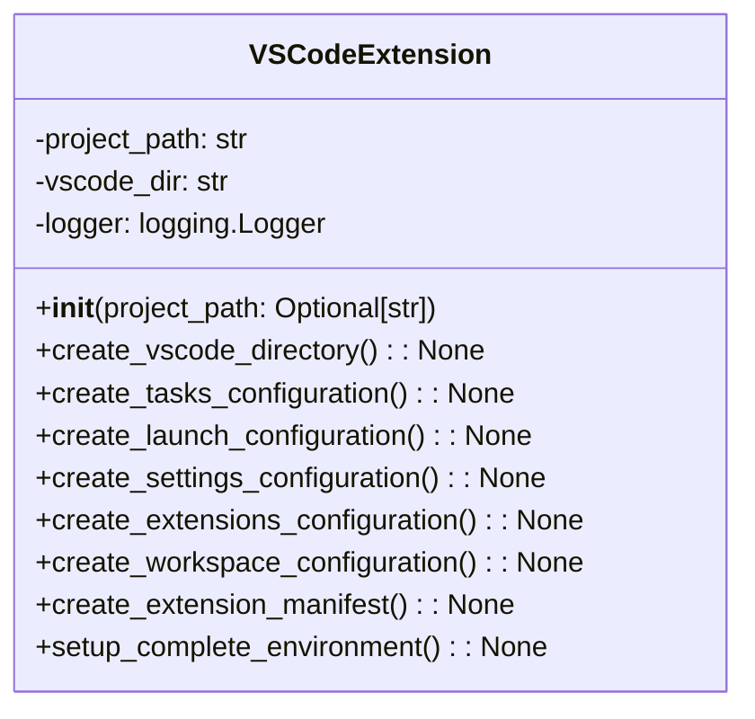

# VS Code Extension Module Documentation

## Overview
The `vscode_extension.py` module provides comprehensive VS Code integration for the AutoProjectManagement system. It creates workspace configurations, extension manifests, task automation setups, debugging configurations, and development environments specifically tailored for VS Code.

## Architecture

### Class Structure


## Detailed Functionality

### VSCodeExtension Class

#### Initialization
**Method**: `__init__(project_path: Optional[str] = None)`

Initializes the VSCodeExtension class with the project path and sets up logging.

**Parameters**:
- `project_path`: Optional path to the project directory.

#### Create VS Code Directory
**Method**: `create_vscode_directory() -> None`

Creates the VS Code configuration directory if it doesn't exist.

#### Create Tasks Configuration
**Method**: `create_tasks_configuration() -> None`

Creates a comprehensive `tasks.json` file for automation, including:
- Starting and stopping auto management
- Checking status
- Setting up environment
- Running tests

#### Create Launch Configuration
**Method**: `create_launch_configuration() -> None`

Creates a comprehensive `launch.json` file for debugging, including:
- Auto project management
- Debugging auto runner
- Debugging API server

#### Create Settings Configuration
**Method**: `create_settings_configuration() -> None`

Creates a comprehensive `settings.json` file for VS Code, including:
- Auto-save settings
- Git integration
- Python interpreter settings
- Formatting and linting configurations

#### Create Extensions Configuration
**Method**: `create_extensions_configuration() -> None`

Creates an `extensions.json` file with recommended extensions for the project.

#### Create Workspace Configuration
**Method**: `create_workspace_configuration() -> None`

Creates a workspace configuration file for VS Code.

#### Create Extension Manifest
**Method**: `create_extension_manifest() -> None`

Creates a `package.json` manifest for VS Code extension development.

#### Setup Complete Environment
**Method**: `setup_complete_environment() -> None`

Orchestrates the complete setup process for the VS Code environment, including all configurations and manifests.

## Usage Examples

### Basic VS Code Extension Setup
```python
from autoprojectmanagement.vscode_extension import VSCodeExtension

# Initialize VSCodeExtension
extension = VSCodeExtension()

# Setup complete environment
extension.setup_complete_environment()
```

### Command Line Usage
```bash
# Setup VS Code environment in current directory
python -m autoprojectmanagement.vscode_extension

# Setup in specific directory
python -m autoprojectmanagement.vscode_extension --path /path/to/project
```

## Configuration Files Created

### Tasks Configuration
Located at `.vscode/tasks.json`, this file includes tasks for:
- Starting and stopping auto management
- Checking status
- Setting up environment
- Running tests

### Launch Configuration
Located at `.vscode/launch.json`, this file includes configurations for:
- Debugging auto project management
- Debugging auto runner
- Debugging API server

### Settings Configuration
Located at `.vscode/settings.json`, this file includes settings for:
- Auto-save
- Git integration
- Python interpreter
- Formatting and linting

### Extensions Configuration
Located at `.vscode/extensions.json`, this file recommends extensions for:
- Python development
- Git integration
- Docker support
- Remote development

### Workspace Configuration
Located at `auto_project_management.code-workspace`, this file includes:
- Folder settings
- Workspace-specific configurations

### Extension Manifest
Located at `package.json`, this file includes:
- Extension metadata
- Command definitions
- Configuration properties
- Scripts and dependencies

## Integration Points

### VS Code Integration
The module integrates with VS Code through:
- Workspace configurations
- Task definitions
- Debugging setups
- Extension development

### Project Management Integration
The extension integrates with the AutoProjectManagement system to provide:
- Automated task management
- Real-time status updates
- Configuration management

## Error Handling
- Provides clear error messages for failed operations.
- Handles missing files or directories gracefully.
- Validates project path existence.

## Security Considerations
- No sensitive data exposure in configuration files.
- Local file operations only.
- Proper file permissions for scripts.

## Performance Characteristics
- **Setup Time**: Dependent on project size and system performance.
- **Memory Usage**: Minimal footprint for setup operations.
- **Disk Usage**: Creates necessary directories and files.

## Example Output
When the VS Code environment is set up, the following output is expected:
```
VS Code environment setup completed successfully
```

## Extension Points
- **Custom Tasks**: Additional tasks can be added to the tasks configuration.
- **Additional Launch Configurations**: New debugging configurations can be created.
- **Workspace Customization**: The workspace can be modified for specific needs.
- **Extension Development**: The extension manifest can be extended with new features.
