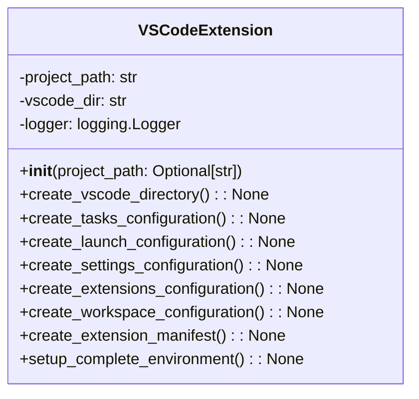

# VS Code Extension Module Documentation

## Overview
The `vscode_extension.py` module provides comprehensive VS Code integration for the AutoProjectManagement system. It creates workspace configurations, extension manifests, task automation setups, debugging configurations, and development environments specifically tailored for VS Code.

## Architecture

### Class Structure

## Detailed Functionality

### VSCodeExtension Class

#### Initialization
**Method**: `__init__(project_path: Optional[str] = None)`

Initializes the VSCodeExtension class with the project path and sets up logging.

**Parameters**:
- `project_path`: Optional path to the project directory.

#### Create VS Code Directory
**Method**: `create_vscode_directory() -> None`

Creates the VS Code configuration directory if it doesn't exist.

#### Create Tasks Configuration
**Method**: `create_tasks_configuration() -> None`

Creates a comprehensive `tasks.json` file for automation, including:
- Starting and stopping auto management
- Checking status
- Setting up environment
- Running tests

#### Create Launch Configuration
**Method**: `create_launch_configuration() -> None`

Creates a comprehensive `launch.json` file for debugging, including:
- Auto project management
- Debugging auto runner
- Debugging API server

#### Create Settings Configuration
**Method**: `create_settings_configuration() -> None`

Creates a comprehensive `settings.json` file for VS Code, including:
- Auto-save settings
- Git integration
- Python interpreter settings
- Formatting and linting configurations

#### Create Extensions Configuration
**Method**: `create_extensions_configuration() -> None`

Creates an `extensions.json` file with recommended extensions for the project.

#### Create Workspace Configuration
**Method**: `create_workspace_configuration() -> None`

Creates a workspace configuration file for VS Code.

#### Create Extension Manifest
**Method**: `create_extension_manifest() -> None`

Creates a `package.json` manifest for VS Code extension development.

#### Setup Complete Environment
**Method**: `setup_complete_environment() -> None`

Orchestrates the complete setup process for the VS Code environment, including all configurations and manifests.

## Usage Examples

