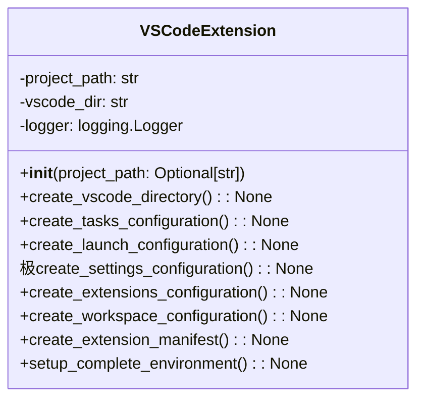

# مستندات ماژول VS Code Extension

## بررسی کلی
ماژول `vscode_extension.py` یکپارچه‌سازی جامع VS Code را برای سیستم AutoProjectManagement فراهم می‌کند. این ماژول پیکربندی‌های فضای کاری، مانیفست‌های افزونه، راه‌اندازی خودکارسازی وظایف، پیکربندی‌های دیباگ و محیط‌های توسعه را به طور خاص برای VS Code ایجاد می‌کند.

## معماری

### ساختار کلاس

## عملکرد تفصیلی

### کلاس VSCodeExtension

#### مقداردهی اولیه
**متد**: `__init__(project_path: Optional[str] = None)`

