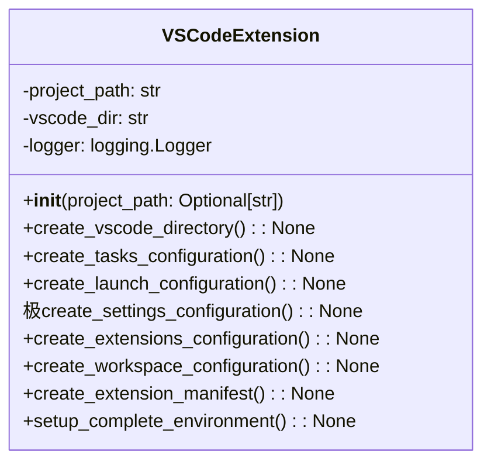

# مستندات ماژول VS Code Extension

## بررسی کلی
ماژول `vscode_extension.py` یکپارچه‌سازی جامع VS Code را برای سیستم AutoProjectManagement فراهم می‌کند. این ماژول پیکربندی‌های فضای کاری، مانیفست‌های افزونه، راه‌اندازی خودکارسازی وظایف، پیکربندی‌های دیباگ و محیط‌های توسعه را به طور خاص برای VS Code ایجاد می‌کند.

## معماری

### ساختار کلاس

## عملکرد تفصیلی

### کلاس VSCodeExtension

#### مقداردهی اولیه
**متد**: `__init__(project_path: Optional[str] = None)`

کلاس VSCodeExtension را با مسیر پروژه مقداردهی اولیه می‌کند و لاگ‌گیری را راه‌اندازی می‌کند.

**پارامترها**:
- `project_path`: مسیر اختیاری به دایرکتوری پروژه.

#### ایجاد دایرکتوری VS Code
**متد**: `create_vscode_directory() -> None`

دایرکتوری پیکربندی VS Code را در صورت عدم وجود ایجاد می‌کند.

#### ایجاد پیکربندی وظایف
**متد**: `create_tasks_configuration() -> None`

یک فایل `tasks.json` جامع برای خودکارسازی ایجاد می‌کند، شامل:
- راه‌اندازی و توقف مدیریت خودکار
- بررسی وضعیت
- راه‌اندازی محیط
- اجرای تست‌ها

#### ایجاد پیکربندی راه‌اندازی
**متد**: `create_launch_configuration() -> None`

یک فایل `launch.json` جامع برای دیباگ ایجاد می‌کند، شامل:
- مدیریت پروژه خودکار
- دیباگ auto runner
- دیباگ سرور API

#### ایجاد پیکربندی تنظیمات
**متد**: `create_settings_configuration() -> None`

