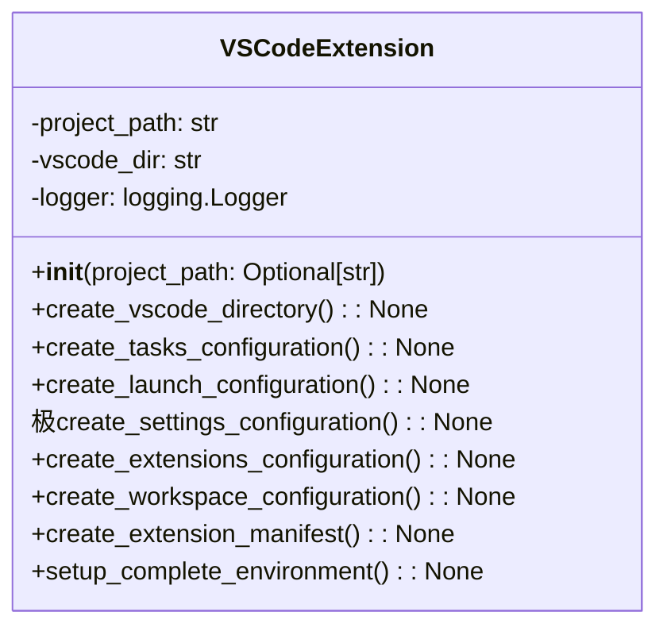

# مستندات ماژول VS Code Extension

## بررسی کلی
ماژول `vscode_extension.py` یکپارچه‌سازی جامع VS Code را برای سیستم AutoProjectManagement فراهم می‌کند. این ماژول پیکربندی‌های فضای کاری، مانیفست‌های افزونه، راه‌اندازی خودکارسازی وظایف، پیکربندی‌های دیباگ و محیط‌های توسعه را به طور خاص برای VS Code ایجاد می‌کند.

## معماری

### ساختار کلاس


## عملکرد تفصیلی

### کلاس VSCodeExtension

#### مقداردهی اولیه
**متد**: `__init__(project_path: Optional[str] = None)`

کلاس VSCodeExtension را با مسیر پروژه مقداردهی اولیه می‌کند و لاگ‌گیری را راه‌اندازی می‌کند.

**پارامترها**:
- `project_path`: مسیر اختیاری به دایرکتوری پروژه.

#### ایجاد دایرکتوری VS Code
**متد**: `create_vscode_directory() -> None`

دایرکتوری پیکربندی VS Code را در صورت عدم وجود ایجاد می‌کند.

#### ایجاد پیکربندی وظایف
**متد**: `create_tasks_configuration() -> None`

یک فایل `tasks.json` جامع برای خودکارسازی ایجاد می‌کند، شامل:
- راه‌اندازی و توقف مدیریت خودکار
- بررسی وضعیت
- راه‌اندازی محیط
- اجرای تست‌ها

#### ایجاد پیکربندی راه‌اندازی
**متد**: `create_launch_configuration() -> None`

یک فایل `launch.json` جامع برای دیباگ ایجاد می‌کند، شامل:
- مدیریت پروژه خودکار
- دیباگ auto runner
- دیباگ سرور API

#### ایجاد پیکربندی تنظیمات
**متد**: `create_settings_configuration() -> None`

یک فایل `settings.json` جامع برای VS Code ایجاد می‌کند، شامل:
- تنظیمات ذخیره خودکار
- یکپارچه‌سازی Git
- تنظیمات مفسر Python
- پیکربندی‌های قالب‌بندی و لینتینگ

#### ایجاد پیکربندی افزونه‌ها
**متد**: `create_extensions_configuration() -> None`

یک فایل `extensions.json` با افزونه‌های توصیه شده برای پروژه ایجاد می‌کند.

#### ایجاد پیکربندی فضای کاری
**متد**: `create_workspace_configuration() -> None`

یک فایل پیکربندی فضای کاری برای VS Code ایجاد می‌کند.

#### ایجاد مانیفست افزونه
**متد**: `create_extension_manifest() -> None`

یک مانیفست `package.json` برای توسعه افزونه VS Code ایجاد می‌کند.

#### راه‌اندازی محیط کامل
**متد**: `setup_complete_environment() -> None`

فرآیند راه‌اندازی کامل برای محیط VS Code را هماهنگ می‌کند، شامل تمام پیکربندی‌ها و مانیفست‌ها.

## مثال‌های استفاده

### راه‌اندازی پایه افزونه VS Code
```python
from autoprojectmanagement.vscode_extension import VSCodeExtension

# مقداردهی اولیه VSCodeExtension
extension = V极CodeExtension()

# راه‌اندازی محیط کامل
extension.setup_complete_environment()
```

### استفاده از خط فرمان
```bash
# راه‌اندازی محیط VS Code در دایرکتوری فعلی
python -m autoprojectmanagement.vscode_extension

# راه‌اندازی در دایرکتوری خاص
python -m autoprojectmanagement.vscode_extension --path /path/to/project
```

## فایل‌های پیکربندی ایجاد شده

### پیکربندی وظایف
واقع در `.vscode/tasks.json`، این فایل شامل وظایف برای موارد زیر است:
- راه‌اندازی و توقف مدیریت خودکار
- بررسی وضعیت
- راه‌اندازی محیط
- اجرای تست‌ها

### پیکربندی راه‌اندازی
واقع در `.v极code/launch.json`، این فایل شامل پیکربندی‌ها برای موارد زیر است:
- دیباگ مدیریت پروژه خودکار
- دیباگ auto runner
- دیباگ سرور API

### پیکربندی تنظیمات
واقع در `.vscode/settings.json`، این فایل شامل تنظیمات برای موارد زیر است:
- ذخیره خودکار
- یکپارچه‌سازی Git
- مفسر Python
- قالب‌بندی و لینتینگ

### پیکربندی افزونه‌ها
واقع در `.vscode/extensions.json`، این فایل افزونه‌های توصیه شده برای موارد زیر را پیشنهاد می‌کند:
- توسعه Python
- یکپارچه‌سازی Git
- پشتیبانی Docker
- توسعه ریموت

### پیکربندی فضای کاری
واقع در `auto_project_management.code-workspace`، این فایل شامل موارد زیر است:
- تنظیمات پوشه
- پیکربندی‌های خاص فضای کاری

### مانیفست افزونه
واقع در `package.json`، این فایل شامل موارد زیر است:
- ابرداده افزونه
- تعاریف دستورات
- ویژگی‌های پیکربندی
- اسکریپت‌ها و وابستگی‌ها

## نقاط یکپارچه‌سازی

### یکپارچه‌سازی VS Code
ماژول با VS Code از طریق موارد زیر یکپارچه می‌شود:
- پیکربندی‌های فضای کاری
- تعاریف وظایف
- راه‌اندازی دیباگ
- توسعه افزونه

### یکپارچه‌سازی مدیریت پروژه
افزونه با سیستم AutoProjectManagement یکپارچه می‌شود تا موارد زیر را فراهم کند:
- مدیریت خودکار وظایف
- به‌روزرسانی‌های وضعیت بلادرنگ
- مدیریت پیکربندی

## مدیریت خطا
- پیام‌های خطای واضح برای عملیات ناموفق فراهم می‌کند.
- فایل‌ها یا دایرکتوری‌های از دست رفته را به صورت گرانولار مدیریت می‌کند.
- وجود مسیر پروژه را اعتبارسنجی می‌کند.

## ملاحظات امنیتی
- هیچ داده حساسی در فایل‌های پیکربندی افشا نمی‌شود.
- فقط عملیات فایل محلی.
- مجوزهای مناسب فایل برای اسکریپت‌ها.

## ویژگی‌های عملکرد
- **زمان راه‌اندازی**: وابسته به اندازه پروژه و عملکرد سیستم.
- **استفاده حافظه**: ردپای حداقل برای عملیات راه‌اندازی.
- **استفاده دیسک**: دایرکتوری‌ها و فایل‌های لازم را ایجاد می‌کند.

## مثال خروجی
هنگامی که محیط VS Code راه‌اندازی می‌شود، خروجی زیر انتظار می‌رود:
```
راه‌اندازی محیط VS Code با موفقیت تکمیل شد
```

## نقاط توسعه
- **وظایف سفارشی**: وظایف اضافی را می‌توان به پیکربندی وظایف اضافه کرد.
- **پیکربندی‌های راه‌اندازی اضافی**: پیکربندی‌های دیباگ جدید را می‌توان ایجاد کرد.
- **سفارشی‌سازی فضای کاری**: فضای کاری را می‌توان برای نیازهای خاص تغییر داد.
- **توسعه افزونه**: مانیفست افزونه را می‌توان با ویژگی‌های جدید گسترش داد.
