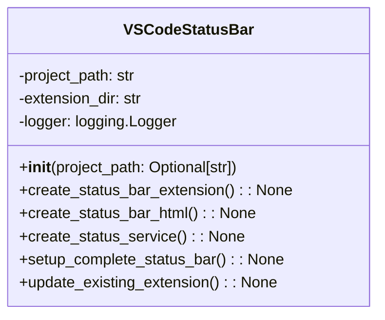

# VS Code Status Bar Module Documentation

## Overview
The `vscode_extension_status_bar.py` module integrates with Visual Studio Code to provide real-time project management status updates in the status bar. It allows users to monitor the state of the AutoProjectManagement system directly from the VS Code interface.

## Architecture

### Class Structure


## Detailed Functionality

### VSCodeStatusBar Class

#### Initialization
**Method**: `__init__(project_path: Optional[str] = None)`

Initializes the VSCodeStatusBar class with the project path and sets up logging.

**Parameters**:
- `project_path`: Optional path to the project directory.

#### Create Status Bar Extension
**Method**: `create_status_bar_extension() -> None`

Creates a VS Code extension with status bar support, including:
- JavaScript functionality for managing the status bar.
- Commands for starting, stopping, refreshing status, and showing project details.

#### Create Status Bar HTML
**Method**: `create_status_bar_html() -> None`

Creates an HTML file for the web interface that displays the project management status, including:
- Status updates
- Progress bars
- Last updated timestamps

#### Create Status Service
**Method**: `create_status_service() -> None`

Creates a Python service that provides real-time status updates for the VS Code extension and web interface.

#### Setup Complete Status Bar
**Method**: `setup_complete_status_bar() -> None`

Orchestrates the complete setup process for the status bar system, including:
- Creating the VS Code extension
- Creating the web interface
- Creating the status service

#### Update Existing Extension
**Method**: `update_existing_extension() -> None`

Updates the existing VS Code extension to include new commands for status bar functionality.

## Usage Examples

### Basic Status Bar Setup
```python
from autoprojectmanagement.vscode_extension_status_bar import VSCodeStatusBar

# Initialize VSCodeStatusBar
status_bar = VSCodeStatusBar()

# Setup complete status bar system
status_bar.setup_complete_status_bar()
```

### Command Line Usage
```bash
# Run the setup script to create the status bar integration
python -m autoprojectmanagement.vscode_extension_status_bar
```

## Integration Points

### VS Code Extension
The module integrates with the VS Code extension system, allowing users to:
- Monitor project status in real-time
- Access commands for managing the project directly from the status bar

### Status Service
The status service provides the necessary backend functionality to fetch and update project status information.

## Error Handling
- Provides clear error messages for failed operations.
- Handles missing files or directories gracefully.
- Validates project path existence.

## Security Considerations
- No sensitive data exposure in command output.
- Local file operations only.
- Proper file permissions for scripts.

## Performance Characteristics
- **Command Execution**: Sub-second response for most operations.
- **Memory Usage**: Minimal footprint for status bar operations.
- **Network Usage**: Local operations only.

## Example Output
When the status bar is set up, the following output is expected:
```
Status bar integration complete!
1. Reload VS Code to see the status bar
2. Use commands to manage project status
```

## Extension Points
- **Custom Commands**: Additional commands can be added to the status bar.
- **HTML Customization**: The web interface can be modified for specific needs.
- **Service Enhancements**: The status service can be extended to include more detailed information.
