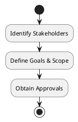
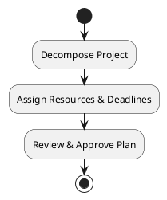
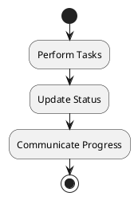
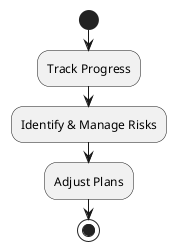
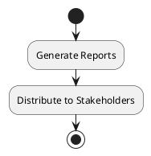
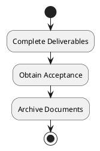

# BPMN Diagrams

## Project Management Process


## Task Creation Process

```mermaid
flowchart TD
|Monitoring & Control|
:Track Progress;
:Identify & Manage Risks;
:Adjust Plans;
|Reporting|
:Generate Reports;
:Distribute to Stakeholders;
|Project Closure|
:Complete Deliverables;
:Obtain Acceptance;
:Archive Documents;
stop
@enduml
```

## Detailed BPMN Processes

### Project Initiation



### Task Planning



### Task Execution



### Monitoring and Controlling



### Reporting



### Project Closure



(To be expanded with detailed BPMN diagrams)
