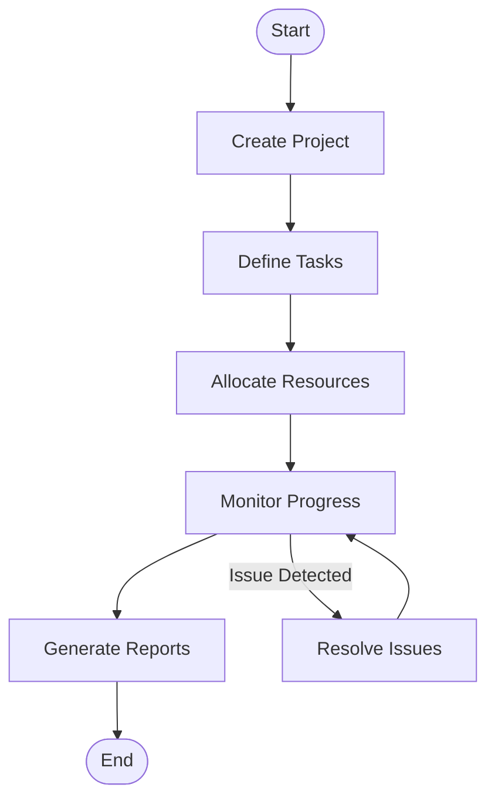
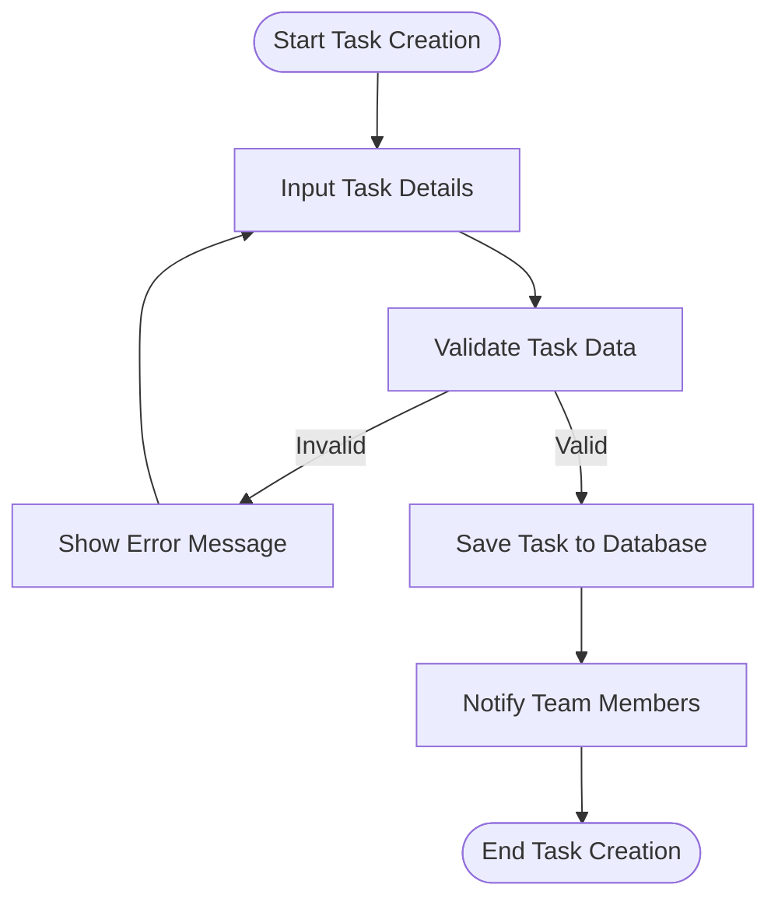
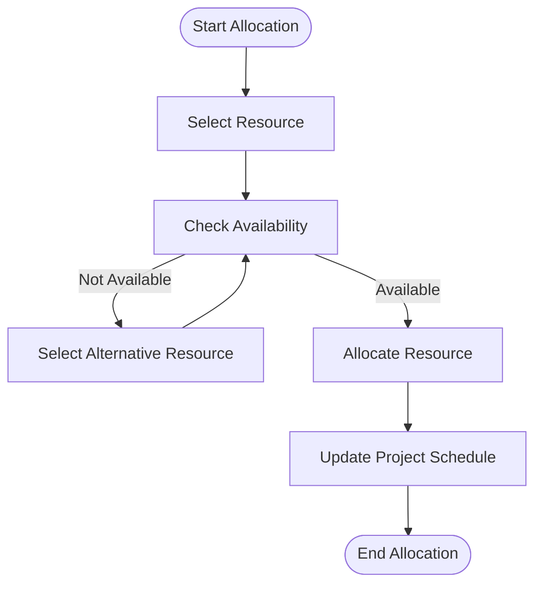
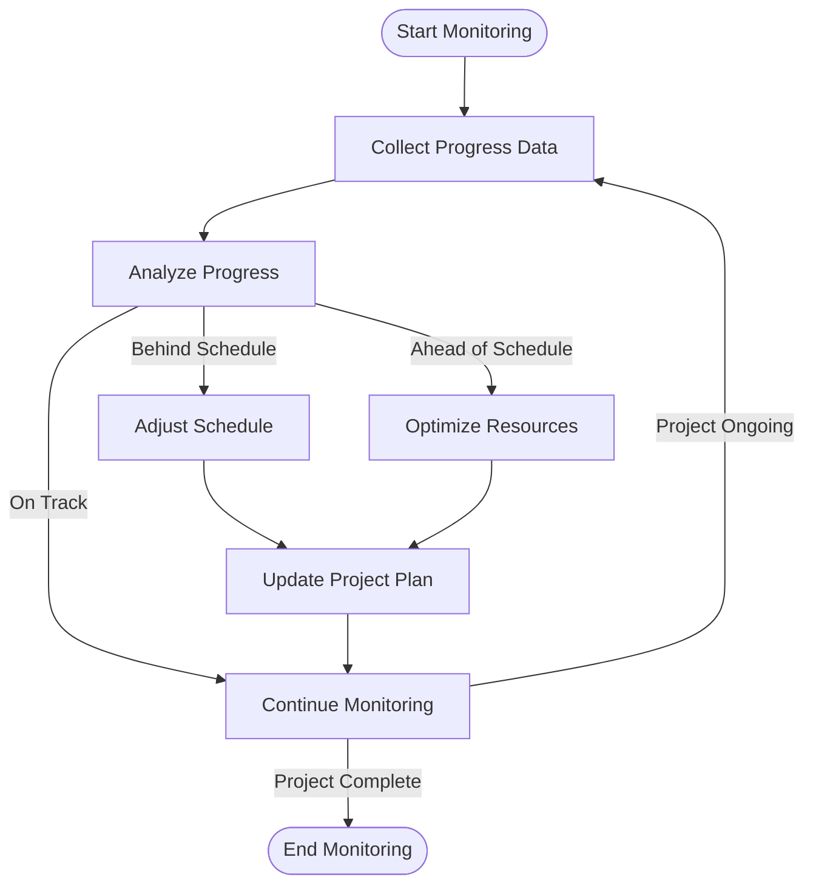
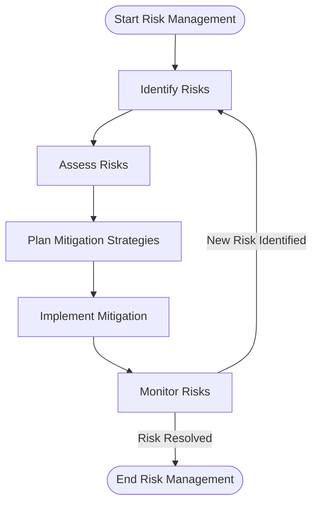
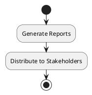
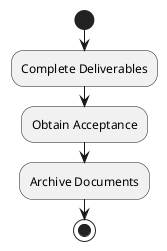

# BPMN Diagrams

## Project Management Process



## Task Creation Process



## Resource Allocation Process



## Progress Monitoring Process



## Risk Management Process



## Reporting Process

```mermaid
flowchart TD
    StartReport([Start Reporting]) --> GatherData[Gather Project Data]
    GatherData --> GenerateReport[Generate Report]
    GenerateReport --> ReviewReport[Review Report]
stop
@enduml
```

### Reporting



### Project Closure



(To be expanded with detailed BPMN diagrams)
