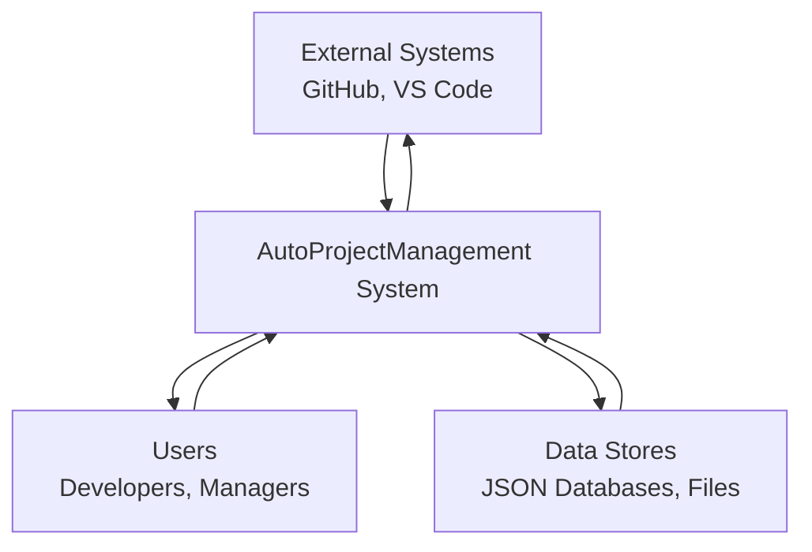
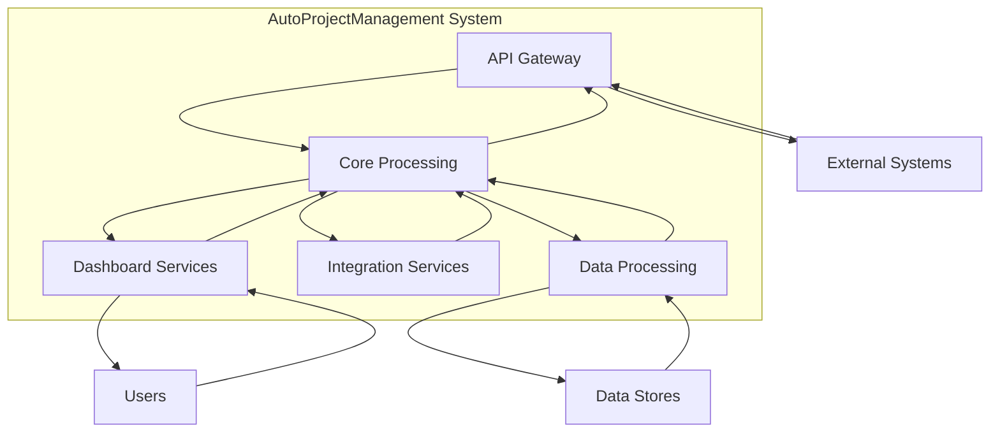
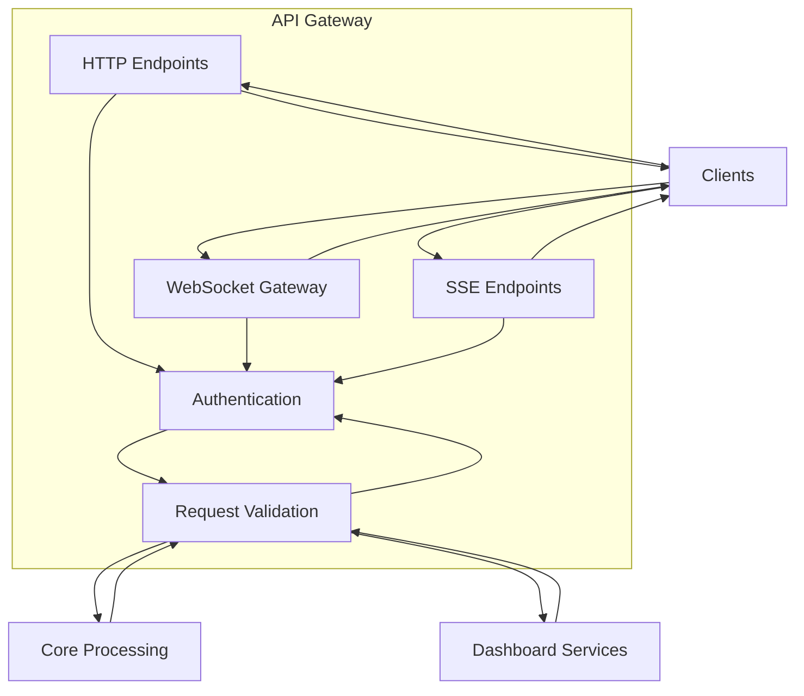
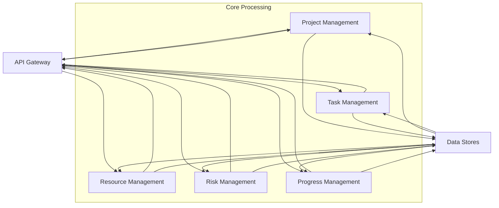
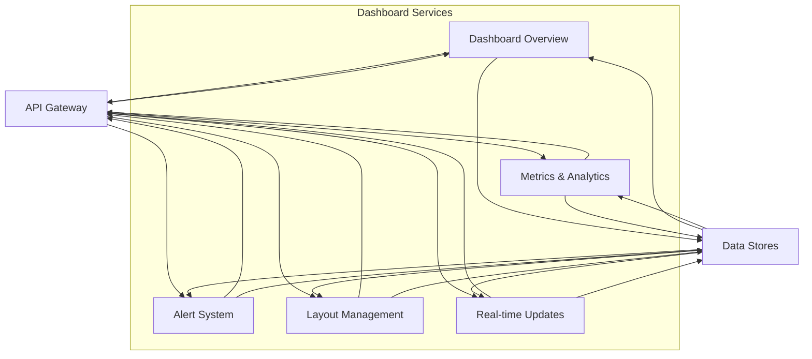

# DFD (Data Flow Diagrams)

## Level 0: Context Diagram



## Level 1: System Overview



## Level 2: API Gateway Data Flow



## Level 2: Core Processing Data Flow



## Level 2: Dashboard Services Data Flow



## Level 2: Integration Services Data Flow

```mermaid
flowchart TD
    subgraph IntegrationServices[Integration Services]
        GitHub[GitHub Integration]
        VSCode[VS Code Integration]
        Wiki[Wiki Services]
        ExternalAPIs[External APIs]
    end
    
    Core[Core Processing] --> GitHub
    GitHub --> Core
    
    Core --> VSCode
    VSCode --> Core
    
