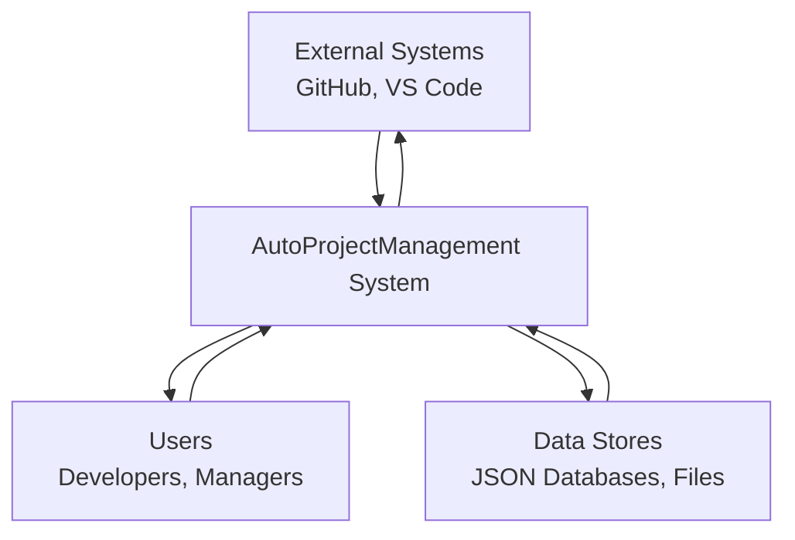
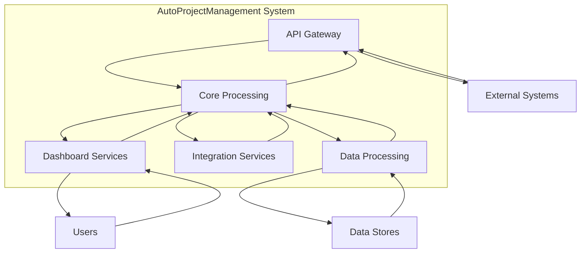
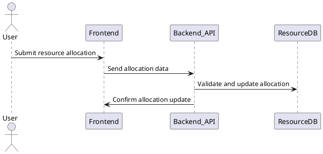
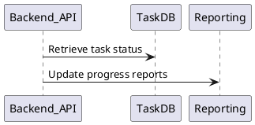
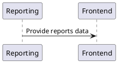

# DFD (Data Flow Diagrams)

## Level 0: Context Diagram



## Level 1: System Overview



participant Backend_API
participant TaskDB

User -> Frontend : Submit task data
Frontend -> Backend_API : Send task data
Backend_API -> TaskDB : Validate and store task
Backend_API -> Frontend : Confirm task creation
@enduml
```

### Resource Allocation Process



### Progress Tracking Process



### Reporting Process



(To be expanded with detailed diagrams)
