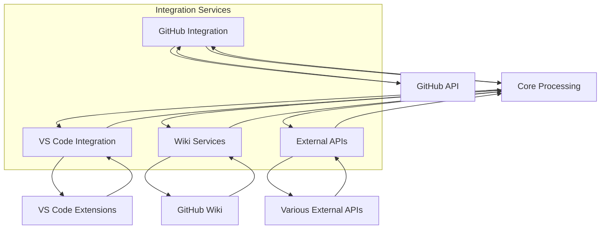
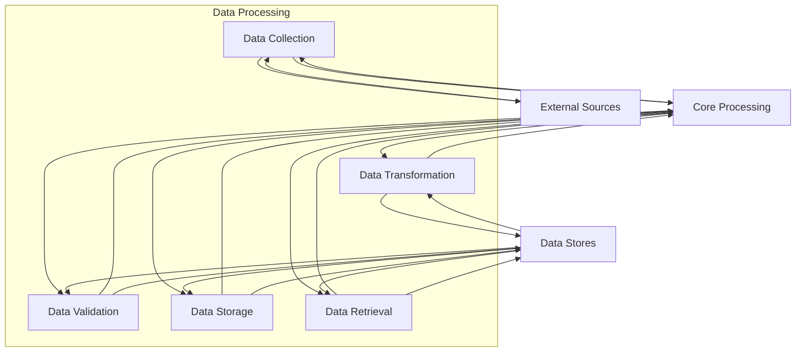

# DFD (Data Flow Diagrams)

## Level 0: Context Diagram

## Level 1: System Overview

## Level 2: API Gateway Data Flow

## Level 2: Core Processing Data Flow

## Level 2: Dashboard Services Data Flow

## Level 2: Integration Services Data Flow

## Level 2: Data Processing Data Flow

