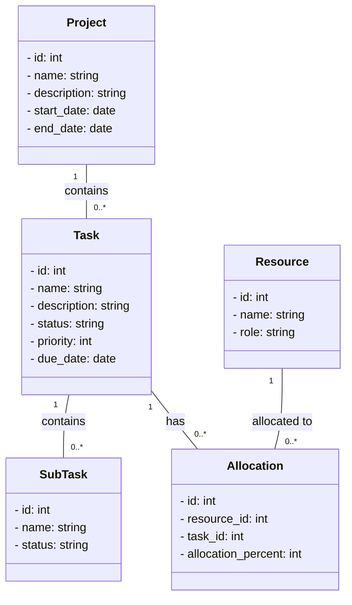
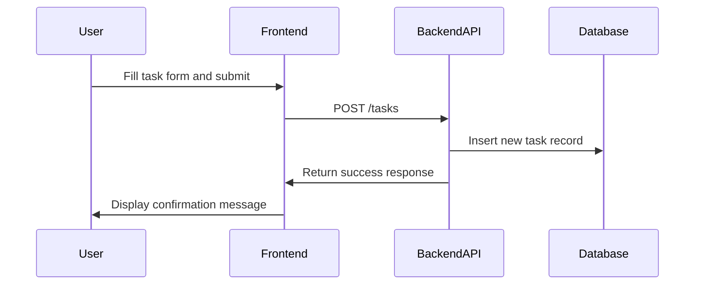
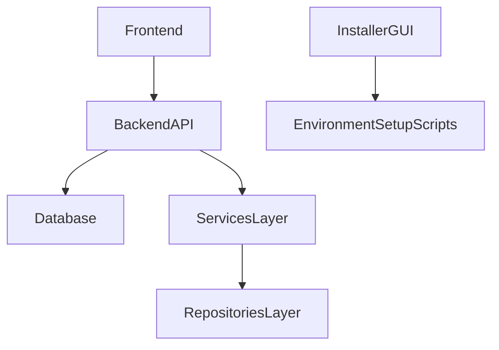
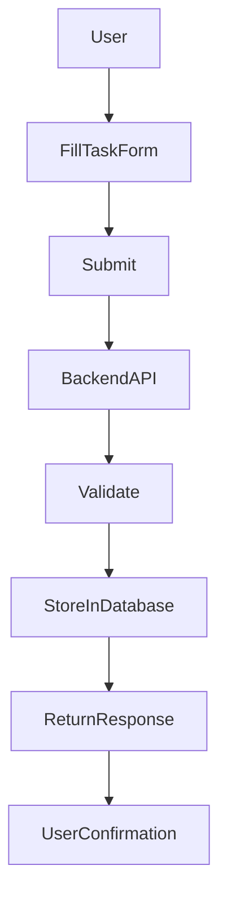

# UML Diagrams

## Class Diagram



## Sequence Diagram



## Component Diagram



## Additional UML Diagrams

### Activity Diagram for Task Creation



### State Diagram for Task Status

```mermaid
stateDiagram-v2
    [*] --> New
    New --> InProgress: When work starts
    InProgress --> Completed: When task is done
    Completed --> Archived: When task is archived
