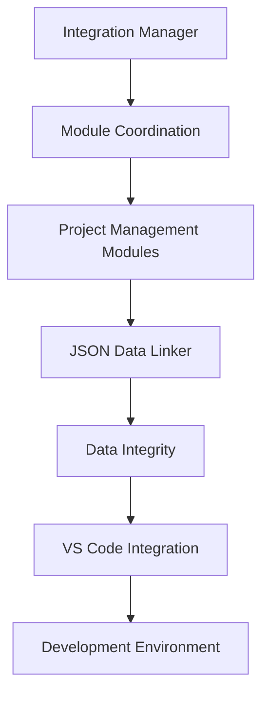

# Integration Services Documentation

## Overview
Integration Services provide the functionality to connect and coordinate various components of the AutoProjectManagement system. These services handle module execution, data linking, and external tool integration.

## Services
### 1. Integration Manager
The `integration_manager.py` module serves as the central integration manager for coordinating project management modules.

**Key Features:**
- Module dependency management
- Execution order coordination
- Error handling and retry logic
- Comprehensive reporting

**Documentation:** [integration_manager.md](./integration_manager.md)

### 2. JSON Data Linker
The `json_data_linker.py` module manages JSON data linking and relationships across the system.

**Key Features:**
- JSON file linking and validation
- Data integrity management
- Backup and recovery operations
- Relationship tracking

**Documentation:** [json_data_linker.md](./json_data_linker.md)

### 3. VS Code Extension Installer
The `vscode_extension_installer.py` module automates the installation of recommended VS Code extensions.

**Key Features:**
- Curated extension list
- Automated installation process
- Error handling and logging
- Development environment setup

**Documentation:** [vscode_extension_installer.md](./vscode_extension_installer.md)

## Architecture
### System Integration


### Data Flow
```mermaid
flowchart LR
    A[Configuration Files] --> B[Integration Manager]
