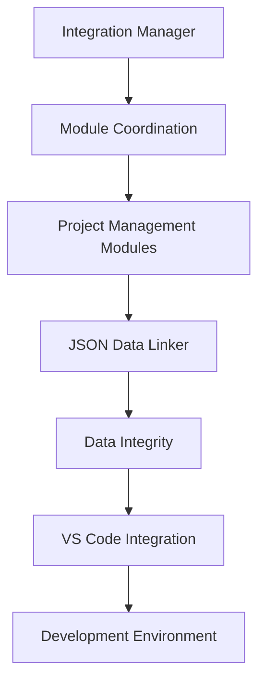

# Integration Services Documentation

## Overview
Integration Services provide the functionality to connect and coordinate various components of the AutoProjectManagement system. These services handle module execution, data linking, and external tool integration.

## Services
### 1. Integration Manager
The `integration_manager.py` module serves as the central integration manager for coordinating project management modules.

**Key Features:**
- Module dependency management
- Execution order coordination
- Error handling and retry logic
- Comprehensive reporting

**Documentation:** [integration_manager.md](./integration_manager.md)

### 2. JSON Data Linker
The `json_data_linker.py` module manages JSON data linking and relationships across the system.

**Key Features:**
- JSON file linking and validation
- Data integrity management
- Backup and recovery operations
- Relationship tracking

**Documentation:** [json_data_linker.md](./json_data_linker.md)

### 3. VS Code Extension Installer
The `vscode_extension_installer.py` module automates the installation of recommended VS Code extensions.

**Key Features:**
- Curated extension list
- Automated installation process
- Error handling and logging
- Development environment setup

**Documentation:** [vscode_extension_installer.md](./vscode_extension_installer.md)

## Architecture
### System Integration


### Data Flow


## Usage
### Integration Manager Usage
```python
from autoprojectmanagement.services.integration_services.integration_manager import IntegrationManager

manager = IntegrationManager()
results = manager.run_all()
```

### JSON Data Linker Usage
```python
from autoprojectmanagement.services.integration_services.json_data_linker import JSONDataLinker

linker = JSONDataLinker()
success = linker.link_files(['file1.json', 'file2.json'])
```

### VS Code Extension Installer Usage
```python
from autoprojectmanagement.services.integration_services.vscode_extension_installer import install_extensions

install_extensions()
```

## Error Handling
Integration Services include comprehensive error handling for:
- Module execution failures
- Data validation errors
- Network connectivity issues
- External tool integration problems

## Configuration
Services can be configured through:
- Environment variables
- Configuration files
- Command line arguments
- Programmatic settings

## Benefits
- **Seamless Integration**: Connects various system components
- **Data Integrity**: Ensures consistent and valid data
- **Automation**: Reduces manual intervention
- **Reliability**: Handles errors gracefully
- **Scalability**: Supports growing project needs

## Conclusion
Integration Services are essential for the smooth operation of the AutoProjectManagement system, providing the connectivity and coordination needed for effective project management.

---
*Last updated: 2025-08-14*
