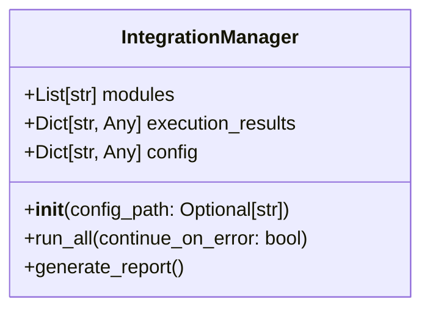

# Integration Manager Documentation

## Overview
The `integration_manager.py` module serves as the central integration manager for coordinating various project management modules within the AutoProjectManagement system. It handles dependencies, execution order, and error management.

## Class: IntegrationManager
### Purpose
The `IntegrationManager` class provides a unified interface for executing project management workflows by managing module dependencies and execution order.

### Attributes
- **modules**: List of module filenames to execute
- **execution_results**: Results from module executions
- **config**: Configuration settings

### Methods
- **__init__(self, config_path: Optional[str] = None)**: Initializes the IntegrationManager with configuration.
- **_load_config(self, config_path: Optional[str]) -> Dict[str, Any]**: Loads configuration from a JSON file.
- **_get_module_path(self, module_name: str) -> Path**: Gets the full path for a module file.
- **run_module(self, module_name: str, retry_count: int = 0) -> bool**: Executes a single module with error handling and retry logic.
- **run_all(self, continue_on_error: bool = False) -> Dict[str, Any]**: Executes all modules in the defined order.
- **generate_report(self) -> str**: Generates a comprehensive execution report.

## Diagrams
### UML Class Diagram


### BPMN Diagram
```mermaid
bpmn
    bpmn:process
        bpmn:startEvent Start
        bpmn:task Task1
        bpmn:task Task2
        bpmn:endEvent End
        Start --> Task1 --> Task2 --> End
```

## Error Handling
The IntegrationManager includes robust error handling to manage module execution failures and retries.

## Configuration Management
Configuration settings can be loaded from a JSON file or set to default values.

## Conclusion
The IntegrationManager is a critical component of the AutoProjectManagement system, enabling seamless integration and execution of project management modules.

---
*Last updated: 2025-08-14*
