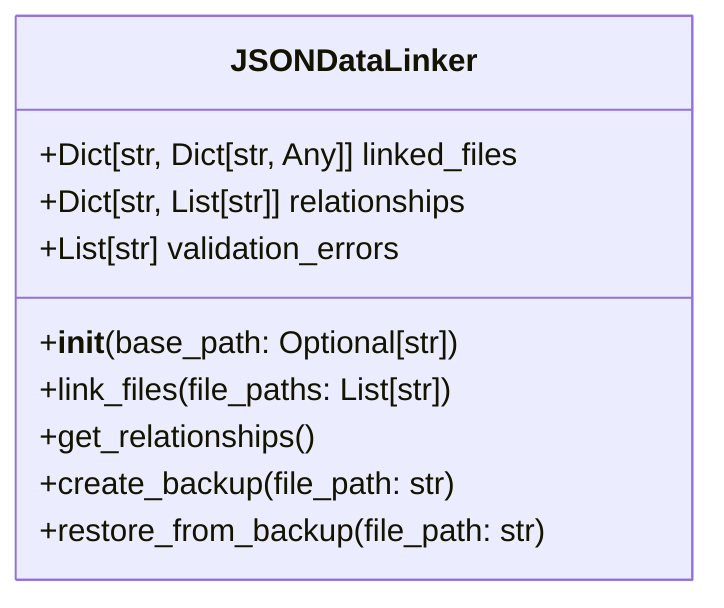
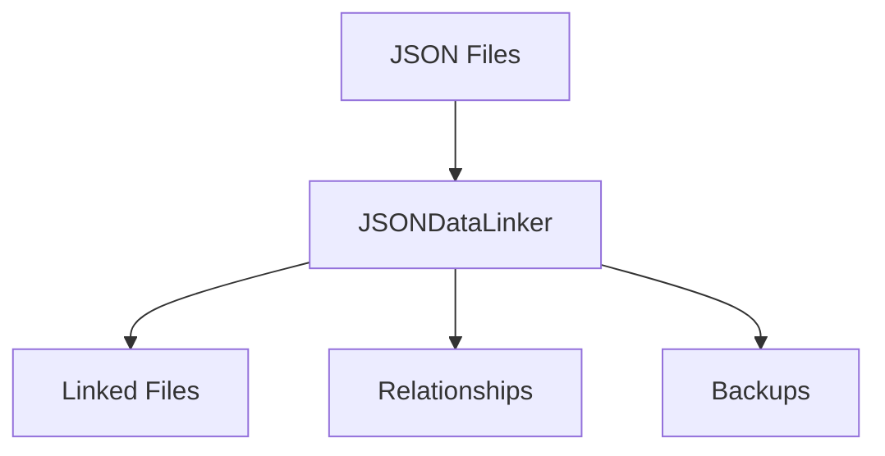

# JSON Data Linker Documentation

## Overview
The `json_data_linker.py` module manages JSON data linking and relationships across the AutoProjectManagement system. It provides functionality to link JSON files, validate data structures, and maintain data integrity.

## Class: JSONDataLinker
### Purpose
The `JSONDataLinker` class manages JSON data linking and relationships, ensuring data integrity and providing backup and recovery capabilities.

### Attributes
- **linked_files**: Dictionary of linked JSON files
- **relationships**: Dictionary of relationships between files
- **validation_errors**: List of validation errors

### Methods
- **__init__(self, base_path: Optional[str] = None)**: Initializes the JSON data linker.
- **link_files(self, file_paths: List[str]) -> bool**: Links multiple JSON files and establishes relationships.
- **_link_single_file(self, file_path: str) -> bool**: Links a single JSON file and validates its structure.
- **_calculate_hash(self, file_path: Path) -> str**: Calculates MD5 hash of file contents.
- **validate_json_structure(self, data: Dict[str, Any]) -> bool**: Validates JSON data structure against schema requirements.
- **get_relationships(self) -> Dict[str, List[str]]**: Gets all established relationships between linked files.
- **create_backup(self, file_path: str) -> bool**: Creates a backup of a JSON file before modification.
- **restore_from_backup(self, file_path: str) -> bool**: Restores a JSON file from its backup.
- **get_validation_errors(self) -> List[str]**: Gets list of validation errors from recent operations.
- **clear_validation_errors(self) -> None**: Clears all validation errors.
- **get_file_info(self, file_path: str) -> Optional[Dict[str, Any]]**: Gets information about a linked file.
- **unlink_file(self, file_path: str) -> bool**: Removes a file from the linked files.
- **get_linked_files_count(self) -> int**: Gets the number of currently linked files.
- **export_relationships(self, output_path: str) -> bool**: Exports relationships to a JSON file.
- **import_relationships(self, input_path: str) -> bool**: Import relationships from a JSON file.
- **atomic_operation(self, file_path: str)**: Context manager for atomic file operations with automatic backup.

## Diagrams
### UML Class Diagram

### DFD Diagram

## Error Handling
The JSONDataLinker includes comprehensive error handling for file operations and data validation.

## Backup and Recovery
The module provides robust backup and recovery mechanisms to ensure data integrity.

## Conclusion
The JSONDataLinker is an essential component for managing JSON data relationships and ensuring data integrity within the AutoProjectManagement system.

---
*Last updated: 2025-08-14*
