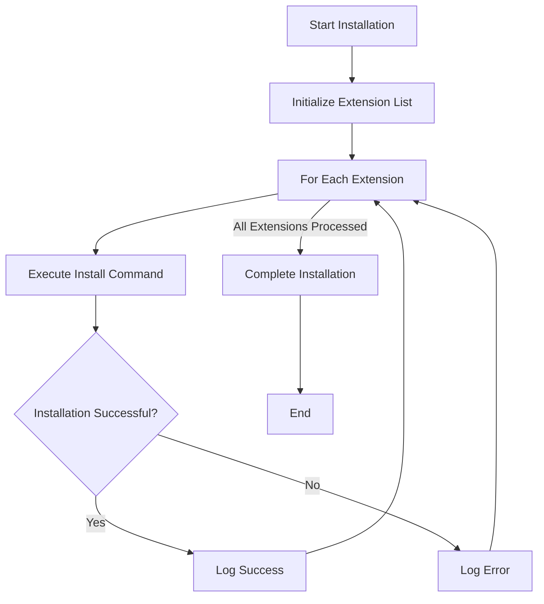

# VS Code Extension Installer Documentation

## Overview
The `vscode_extension_installer.py` module provides functionality to install recommended VS Code extensions for the AutoProjectManagement system. It automates the installation process of essential extensions for development and project management.

## Functionality
### Purpose
The module installs a curated list of VS Code extensions that enhance development productivity and project management capabilities.

### Extension List
The following VS Code extensions are installed:

1. **blackboxai.blackbox** - BLACKBOX AI for code assistance
2. **github.vscode-pull-request-github** - GitHub Pull Requests and Issues integration
3. **ms-python.python** - Python language support
4. **yzhang.markdown-all-in-one** - Markdown editing and preview
5. **alefragnani.project-manager** - Project management and navigation
6. **mhutchie.git-graph** - Git repository visualization
7. **vstirbu.vscode-mermaid-preview** - Mermaid diagram preview
8. **hediet.vscode-drawio** - Draw.io integration for diagrams
9. **bierner.markdown-mermaid** - Mermaid diagrams in markdown files

## Installation Process
### Method: install_extensions()
Installs all recommended VS Code extensions using the `code --install-extension` command.

### Workflow
1. Iterates through the extension list
2. Executes installation command for each extension
3. Provides real-time feedback on installation progress
4. Logs successful installations and any errors

## Diagrams
### BPMN Diagram


### Architecture Diagram


## Error Handling
The module includes basic error handling for:
- Missing VS Code installation
- Network connectivity issues
- Extension not found errors
- Permission issues

## Usage
### Command Line Usage
```bash
python -m autoprojectmanagement.services.integration_services.vscode_extension_installer
```

### Programmatic Usage
```python
from autoprojectmanagement.services.integration_services.vscode_extension_installer import install_extensions
