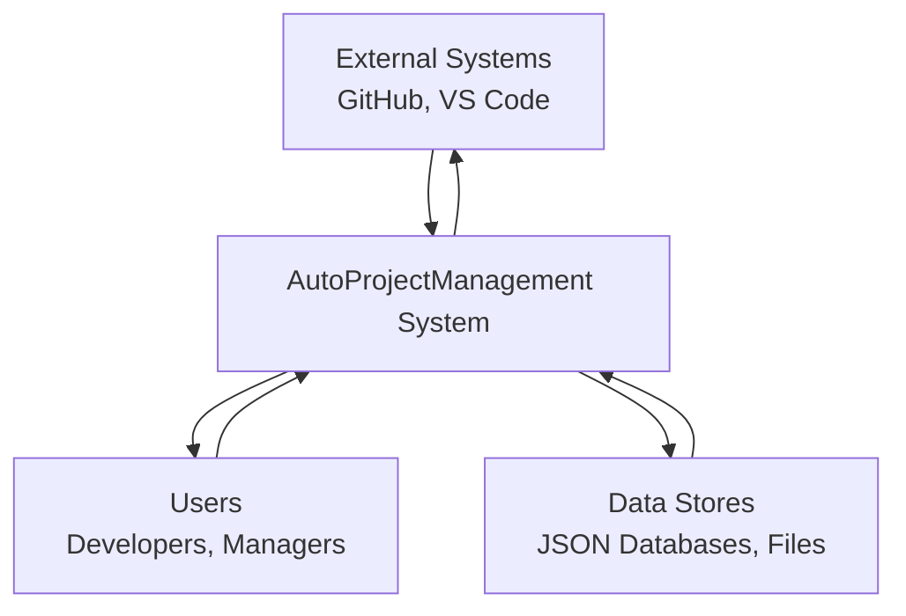
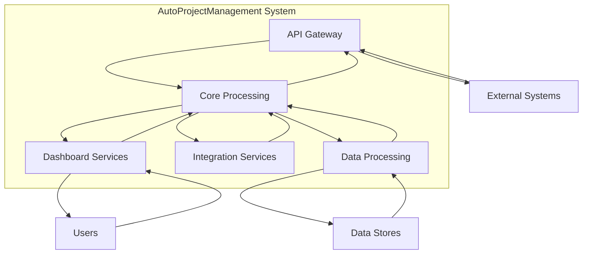
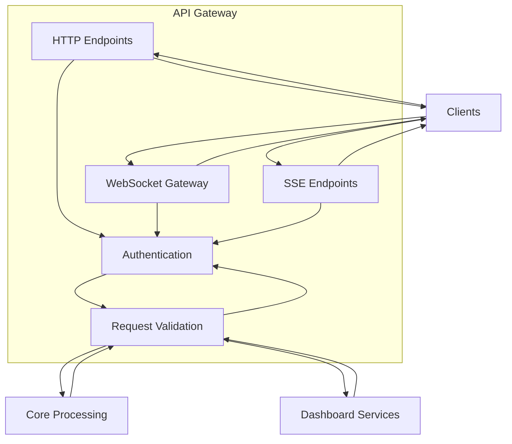

# DFD Diagram Template (Three Levels)

## Level 1: High-Level Overview

## Level 2: Detailed Component Interactions

## Level 3: Complete Implementation Details

## Usage Guidelines

### For Level 1 Diagrams:
- Use for executive summaries and high-level system overviews
- Focus on major system components and external interactions
- Keep it simple with 3-5 main components

### For Level 2 Diagrams:
- Use for technical documentation and detailed system architecture
- Include key system components and their relationships
- Show data flows between components

### For Level 3 Diagrams:
- Use for detailed implementation documentation
- Include all relevant components, processes, and data stores
- Show detailed data flows and transformations

### Best Practices:
1. Use consistent naming conventions for components and data flows
2. Maintain proper abstraction levels
3. Include only relevant details for each level
4. Use proper DFD notation
5. Keep diagrams readable and well-organized
6. Use comments for complex data flows
7. Validate diagrams for consistency

---

*Template last updated: 2025-08-14*
