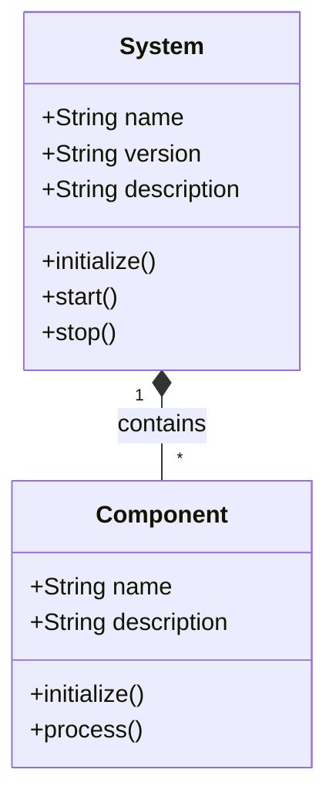
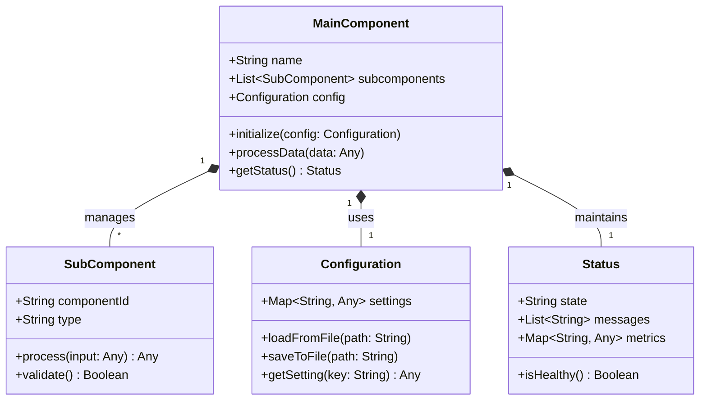
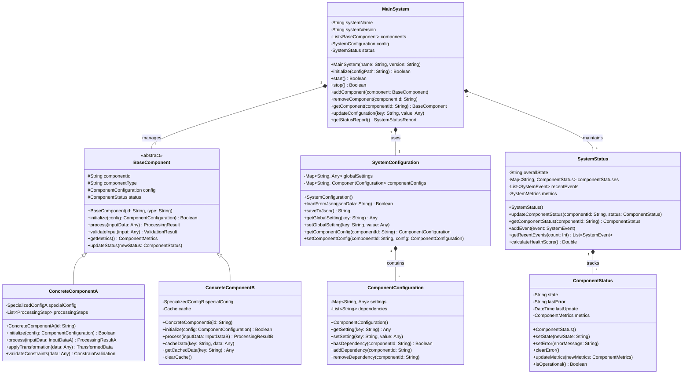

# UML Diagram Template (Three Levels)

## Level 1: High-Level Overview

## Level 2: Detailed Component Structure

## Level 3: Complete Implementation Details

## Usage Guidelines

### For Level 1 Diagrams:
- Use for executive summaries and high-level architecture overviews
- Focus on major system components and their relationships
- Keep it simple with 3-5 main classes

### For Level 2 Diagrams:
- Use for technical documentation and component design
- Include key methods and attributes
- Show relationships and dependencies between components

### For Level 3 Diagrams:
- Use for detailed implementation documentation
- Include all relevant classes, methods, and attributes
- Show inheritance, composition, and association relationships
- Include abstract classes and interfaces

### Best Practices:
1. Use consistent naming conventions
2. Maintain proper abstraction levels
3. Include only relevant details for each level
4. Use proper UML notation
5. Keep diagrams readable and well-organized
6. Use comments for complex relationships
7. Validate diagrams for consistency

### Mermaid.js Syntax Notes:
- Use `classDiagram` for class diagrams
- Use `+` for public methods/attributes
- Use `-` for private methods/attributes  
- Use `#` for protected methods/attributes
- Use `*--` for composition relationships
- Use `o--` for aggregation relationships
- Use `<|--` for inheritance relationships
- Use `-->` for association relationships

---

*Template last updated: 2025-08-14*
