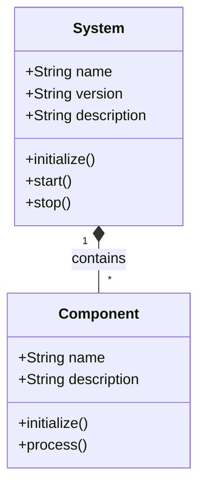
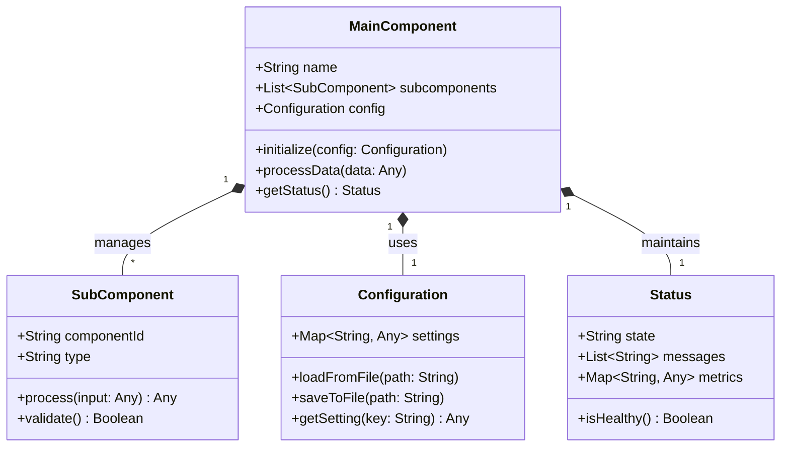

# UML Diagram Template (Three Levels)

## Level 1: High-Level Overview



## Level 2: Detailed Component Structure



## Level 3: Complete Implementation Details

```mermaid
classDiagram
    direction TB
    
    class MainSystem {
        -String systemName
        -String systemVersion
        -List~BaseComponent~ components
        -SystemConfiguration config
        -SystemStatus status
        +MainSystem(name: String, version: String)
        +initialize(configPath: String) Boolean
        +start() Boolean
        +stop() Boolean
        +addComponent(component: BaseComponent)
        +removeComponent(componentId: String)
        +getComponent(componentId: String) BaseComponent
        +updateConfiguration(key: String, value: Any)
        +getStatusReport() SystemStatusReport
    }
    
    class BaseComponent {
        <<abstract>>
        #String componentId
        #String componentType
        #ComponentConfiguration config
        #ComponentStatus status
        +BaseComponent(id: String, type: String)
        +initialize(config: ComponentConfiguration) Boolean
        +process(inputData: Any) ProcessingResult
        +validateInput(input: Any) ValidationResult
        +getMetrics() ComponentMetrics
        +updateStatus(newStatus: ComponentStatus)
    }
    
    class ConcreteComponentA {
        -SpecializedConfigA specialConfig
        -List~ProcessingStep~ processingSteps
        +ConcreteComponentA(id: String)
        +initialize(config: ComponentConfiguration) Boolean
        +process(inputData: InputDataA) ProcessingResultA
        +applyTransformation(data: Any) TransformedData
        +validateConstraints(data: Any) ConstraintValidation
    }
    
    class ConcreteComponentB {
        -SpecializedConfigB specialConfig
        -Cache cache
        +ConcreteComponentB(id: String)
        +initialize(config: ComponentConfiguration) Boolean
        +process(inputData: InputDataB) ProcessingResultB
        +cacheData(key: String, data: Any)
        +getCachedData(key: String) Any
        +clearCache()
    }
    
    class SystemConfiguration {
        -Map~String, Any~ globalSettings
        -Map~String, ComponentConfiguration~ componentConfigs
        +SystemConfiguration()
        +loadFromJson(jsonData: String) Boolean
        +saveToJson() String
        +getGlobalSetting(key: String) Any
