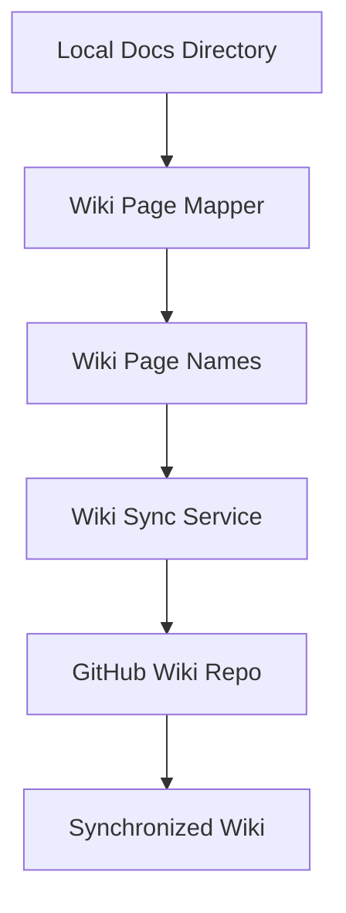

# Wiki Services Documentation

## Overview
Wiki Services provide automated synchronization between local documentation files and GitHub wiki repositories. These services handle file mapping, wiki creation, and change management.

## Services
### 1. Wiki Page Mapper
The `wiki_page_mapper.py` module converts file paths to GitHub wiki page names using standardized formatting rules.

**Key Features:**
- Character replacement and formatting
- Directory structure mapping
- Wiki page name generation
- File path validation

**Documentation:** [wiki_page_mapper.md](./wiki_page_mapper.md)

### 2. Wiki Sync Service
The `wiki_sync_service.py` module synchronizes markdown files from the Docs directory to the GitHub wiki.

**Key Features:**
- Automated wiki synchronization
- Dry-run capability for testing
- Change detection and management
- Error handling and recovery

**Documentation:** [wiki_sync_service.md](./wiki_sync_service.md)

## Architecture
### Synchronization Workflow


### File Processing
```mermaid
flowchart LR
    A[Markdown Files] --> B[Character Replacement]
