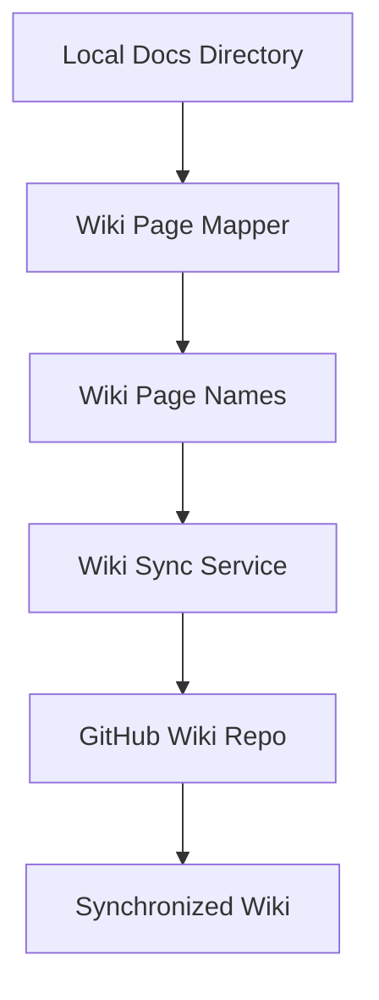

# Wiki Services Documentation

## Overview
Wiki Services provide automated synchronization between local documentation files and GitHub wiki repositories. These services handle file mapping, wiki creation, and change management.

## Services
### 1. Wiki Page Mapper
The `wiki_page_mapper.py` module converts file paths to GitHub wiki page names using standardized formatting rules.

**Key Features:**
- Character replacement and formatting
- Directory structure mapping
- Wiki page name generation
- File path validation

**Documentation:** [wiki_page_mapper.md](./wiki_page_mapper.md)

### 2. Wiki Sync Service
The `wiki_sync_service.py` module synchronizes markdown files from the Docs directory to the GitHub wiki.

**Key Features:**
- Automated wiki synchronization
- Dry-run capability for testing
- Change detection and management
- Error handling and recovery

**Documentation:** [wiki_sync_service.md](./wiki_sync_service.md)

## Architecture
### Synchronization Workflow


### File Processing


## Usage
### Wiki Page Mapper Usage
```python
from pathlib import Path
from autoprojectmanagement.services.wiki_services.wiki_page_mapper import WikiPageMapper

mapper = WikiPageMapper()
wiki_page = mapper.map_file_to_wiki_page(file_path, docs_root)
```

### Wiki Sync Service Usage
```python
from autoprojectmanagement.services.wiki_services.wiki_sync_service import WikiSyncService

sync_service = WikiSyncService("owner", "repo-name", "github-token")
results = sync_service.sync_to_wiki(dry_run=False)
```

## Error Handling
Wiki Services include comprehensive error handling for:
- File path validation errors
- GitHub API connectivity issues
- Git operation failures
- Network connectivity problems
- Authentication failures

## Configuration
Services can be configured through:
- GitHub repository settings
- Authentication tokens
- File path mappings
- Sync intervals

## Benefits
- **Automation**: Eliminates manual wiki updates
- **Consistency**: Ensures wiki matches documentation
- **Version Control**: Maintains change history through Git
- **Reliability**: Handles errors and retries automatically
- **Flexibility**: Supports dry-run for testing

## Integration
Wiki Services integrate with:
- GitHub repositories
- Local documentation directories
- Git operations
- Authentication systems

## Conclusion
Wiki Services provide robust automated synchronization between local documentation and GitHub wiki, ensuring that project documentation remains current and accessible to all team members.

---
*Last updated: 2025-08-14*
