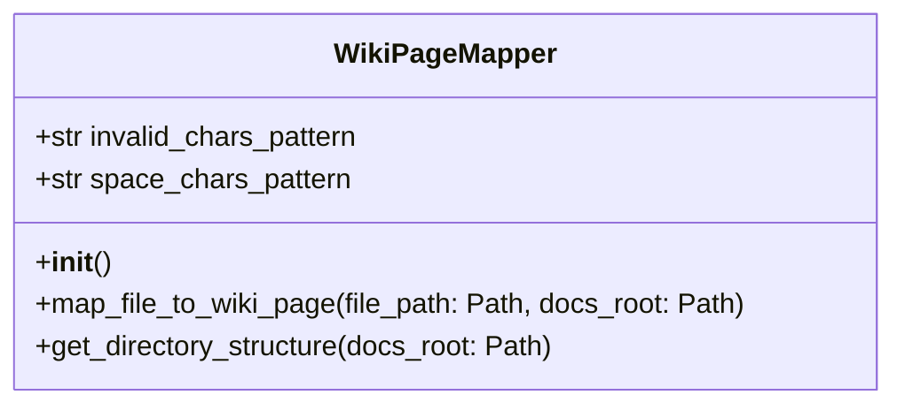
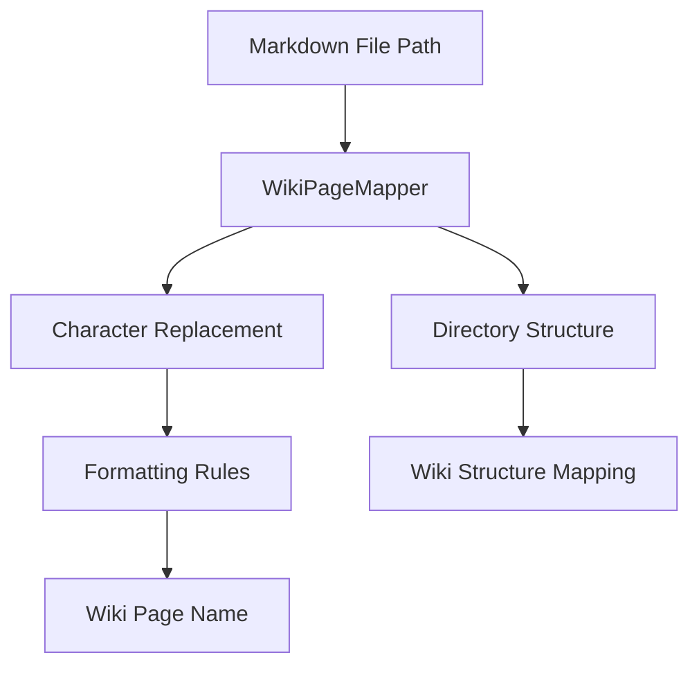

# Wiki Page Mapper Documentation

## Overview
The `wiki_page_mapper.py` module provides functionality to map file paths to GitHub wiki page names and vice versa. It handles character replacement, formatting, and directory structure mapping for automated wiki synchronization.

## Class: WikiPageMapper
### Purpose
The `WikiPageMapper` class converts markdown file paths to GitHub wiki page names using standardized formatting rules and character replacements.

### Attributes
- **invalid_chars_pattern**: Regular expression pattern for invalid characters
- **space_chars_pattern**: Regular expression pattern for space characters

### Methods
- **__init__(self)**: Initializes the WikiPageMapper with regex patterns.
- **map_file_to_wiki_page(self, file_path: Path, docs_root: Path) -> str**: Converts a markdown file path to a GitHub wiki page name.
- **get_directory_structure(self, docs_root: Path) -> Dict[str, List[str]]**: Gets the directory structure of the docs directory.

## Character Replacement Rules
### Invalid Characters
The following characters are replaced with hyphens:
- `<`, `>`, `:`, `"`, `/`, `\`, `|`, `?`, `*`

### Space Characters
The following characters are replaced with single hyphens:
- Spaces (` `), underscores (`_`), hyphens (`-`)

### Formatting Rules
1. Remove `.md` extension
2. Replace invalid characters with hyphens
3. Replace space characters with single hyphens
4. Remove duplicate hyphens
5. Strip leading/trailing hyphens
6. Capitalize each word in path segments

## Examples
### File Path to Wiki Page Mapping
- `Docs/SystemDesign/Architectural_Design.md` → `System-Design/Architectural-Design`
- `Docs/ModuleDocs/main_modules_doc/communication_management.md` → `Module-Docs/Main-Modules-Doc/Communication-Management`
- `Docs/JSON-Inputs-Standard/Deployment/docker_setup.md` → `JSON-Inputs-Standard/Deployment/Docker-Setup`

## Diagrams
### UML Class Diagram

### Data Flow Diagram

## Directory Structure Mapping
