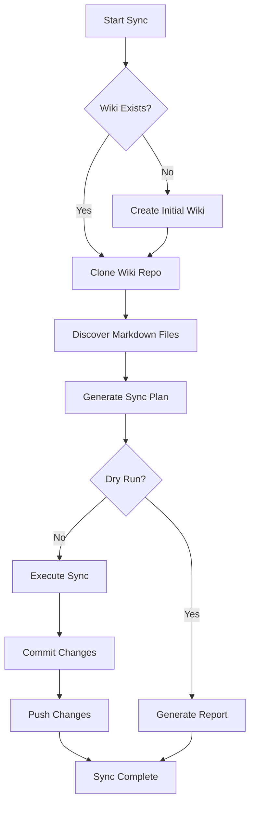
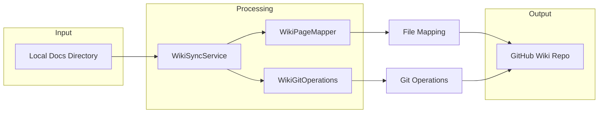

# Wiki Sync Service Documentation

## Overview
The `wiki_sync_service.py` module provides automated synchronization of markdown files from the Docs directory to the GitHub wiki. It handles wiki creation, file updates, and change management.

## Class: WikiSyncService
### Purpose
The `WikiSyncService` class manages the synchronization process between local documentation files and the GitHub wiki repository.

### Attributes
- **repo_owner**: GitHub repository owner
- **repo_name**: GitHub repository name  
- **github_token**: GitHub authentication token
- **wiki_repo_url**: URL of the wiki repository
- **docs_path**: Path to the local Docs directory
- **temp_dir**: Temporary directory for wiki operations
- **mapper**: WikiPageMapper instance for file mapping
- **git_ops**: WikiGitOperations instance for Git operations

### Methods
- **__init__(self, repo_owner: str, repo_name: str, github_token: str = None)**: Initializes the wiki sync service.
- **sync_to_wiki(self, dry_run: bool = False) -> Dict[str, Any]**: Main synchronization method.
- **_wiki_exists(self) -> bool**: Checks if wiki repository exists.
- **_create_initial_wiki(self)**: Creates initial wiki with Home page.
- **_discover_markdown_files(self) -> List[Path]**: Discovers all markdown files in Docs directory.
- **_generate_sync_plan(self, markdown_files: List[Path]) -> Dict[str, Any]**: Generates synchronization plan.

## Synchronization Process
### Workflow
1. **Wiki Existence Check**: Verifies if the wiki repository exists
2. **Wiki Creation**: Creates initial wiki if it doesn't exist
3. **Repository Cloning**: Clones the wiki repository to temporary directory
4. **File Discovery**: Finds all markdown files in Docs directory
5. **Sync Plan Generation**: Creates plan for file additions, updates, and deletions
6. **Execution**: Applies changes to wiki repository
7. **Commit & Push**: Commits and pushes changes to GitHub

### Sync Plan Components
- **Files to Add**: New files not present in wiki
- **Files to Update**: Existing files that have changed
- **Files to Delete**: Wiki files not present in local Docs

## Diagrams
### BPMN Diagram


### Architecture Diagram


## Error Handling
The service includes comprehensive error handling for:
- GitHub API connectivity issues
- Git operations failures
- File system access errors
- Network connectivity problems
- Authentication failures

## Dry Run Mode
The `dry_run` parameter allows testing synchronization without making actual changes, providing a preview of what would be modified.

## Initial Wiki Creation
When a wiki doesn't exist, the service automatically creates it with:
- Welcome page with project information
- Navigation structure
- Documentation organization guidelines

## File Comparison
The service uses content comparison to determine if files need updating, considering:
- File content changes
- File metadata modifications
- Structural changes

## Usage
### Basic Usage
```python
from autoprojectmanagement.services.wiki_services.wiki_sync_service import WikiSyncService

sync_service = WikiSyncService("owner", "repo-name", "github-token")
results = sync_service.sync_to_wiki(dry_run=False)
```

### Dry Run for Testing
```python
results = sync_service.sync_to_wiki(dry_run=True)
print(f"Files to add: {results['files_to_add']}")
print(f"Files to update: {results['files_to_update']}")
```

## Dependencies
- GitHub repository with wiki enabled
- Valid GitHub authentication token
- Internet connectivity
- Git installed and configured

## Benefits
- **Automation**: Eliminates manual wiki updates
- **Consistency**: Ensures wiki matches documentation
- **Version Control**: Maintains change history through Git
- **Reliability**: Handles errors and retries automatically
- **Flexibility**: Supports dry-run for testing

## Conclusion
The Wiki Sync Service provides robust automated synchronization between local documentation and GitHub wiki, ensuring that project documentation remains current and accessible to all team members.

---
*Last updated: 2025-08-14*
