# Core System Classes Documentation

## Overview

This document provides comprehensive documentation for the core system classes in the AutoProjectManagement system. It includes detailed class descriptions, relationships, diagrams, and visual representations using Mermaid diagrams.

## Table of Contents

1. [System Architecture Overview](#system-architecture-overview)
2. [Core System Classes](#core-system-classes)
3. [Class Relationships](#class-relationships)
4. [Detailed Class Descriptions](#detailed-class-descriptions)
5. [Data Models](#data-models)
6. [Sequence Diagrams](#sequence-diagrams)
7. [State Diagrams](#state-diagrams)
8. [Tables and Specifications](#tables-and-specifications)

---

## System Architecture Overview

The AutoProjectManagement system is built around a modular architecture with the following core components:

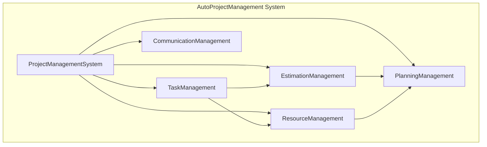

---

## Core System Classes

### 1. ProjectManagementSystem

The central orchestrator class that manages all project-related operations.

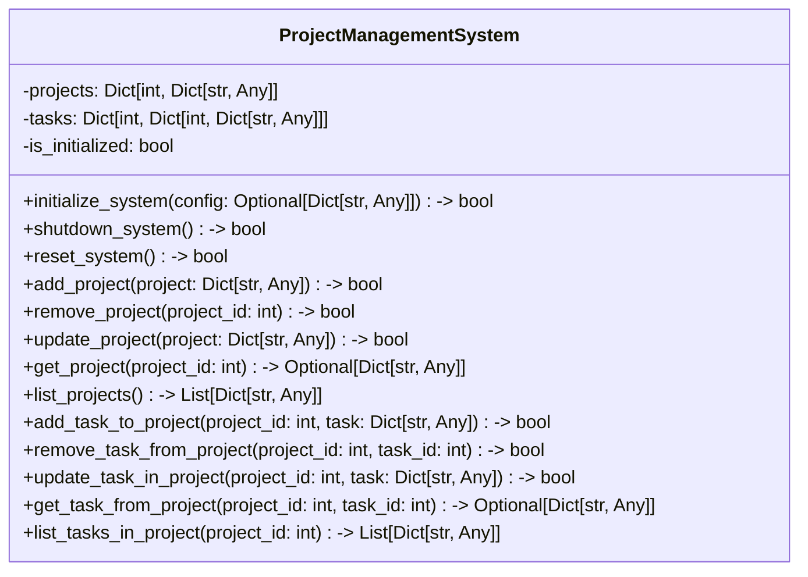

### 2. TaskManagement

Comprehensive task management with workflow tracking and GitHub integration.

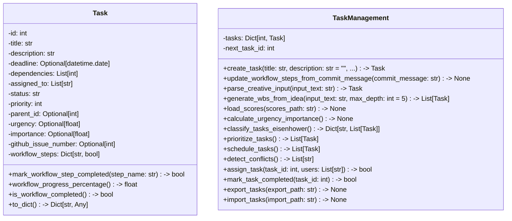

### 3. EstimationManagement

Project estimation with advanced methodologies including COCOMO II and parametric estimation.

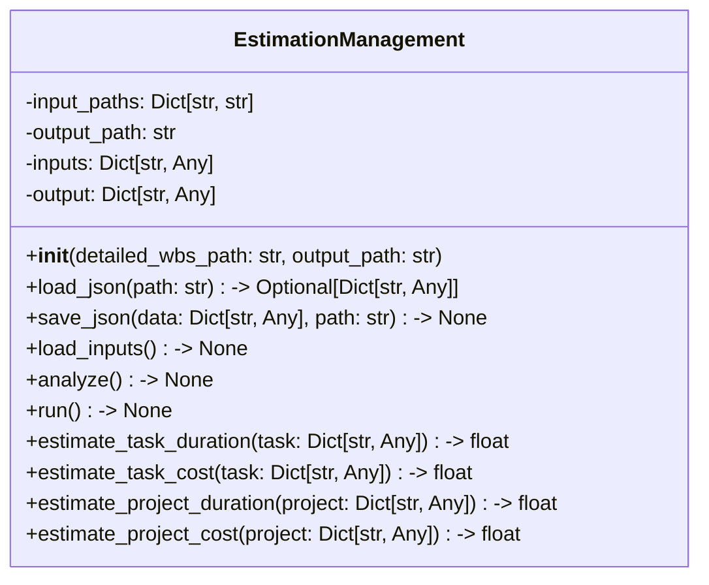

### 4. ResourceManagement

Comprehensive resource allocation and optimization.

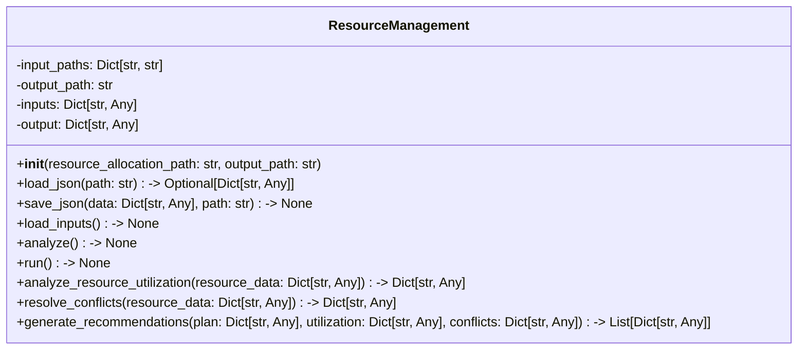

### 5. CommunicationManagement

Communication tracking and effectiveness analysis.

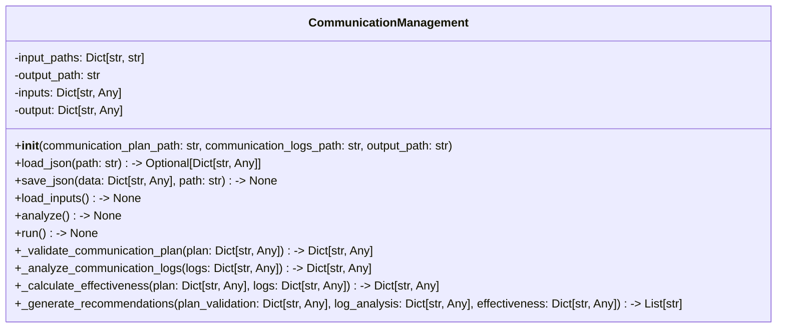

---

## Class Relationships

### Inheritance Hierarchy

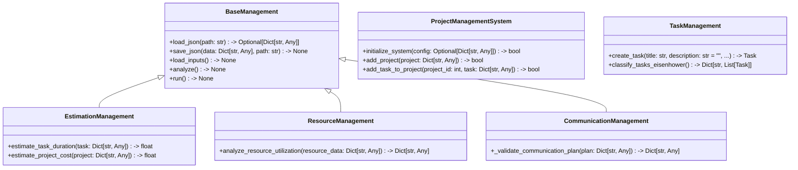

### Composition Relationships

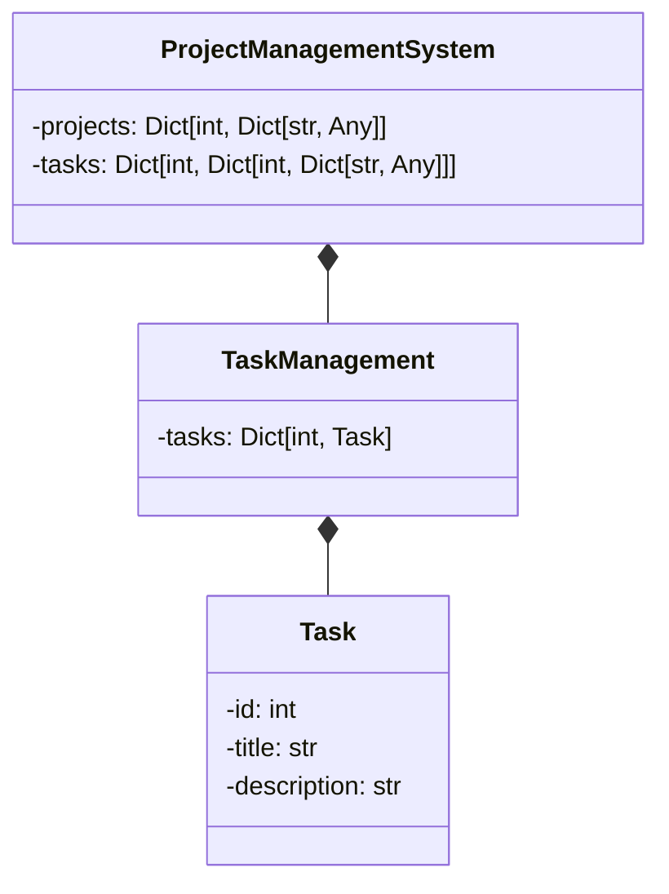

---

## Detailed Class Descriptions

### ProjectManagementSystem Class

**Purpose**: Central orchestrator for all project management operations.

**Key Features**:

- Project lifecycle management

- Task management with workflow tracking

- Resource allocation

- Progress monitoring

- Data integrity maintenance

**Methods**:

- `initialize_system()`: System initialization

- `add_project()`: Add new project

- `add_task_to_project()`: Add task to project

- `list_projects()`: List all projects

- `list_tasks_in_project()`: List tasks in project

### TaskManagement Class

**Purpose**: Comprehensive task management with workflow tracking and GitHub integration.

**Key Features**:

- Task lifecycle management

- Workflow step tracking

- GitHub integration via commit message parsing

- Eisenhower matrix classification

- Task prioritization and scheduling

**Methods**:

- `create_task()`: Create new task

- `classify_tasks_eisenhower()`: Classify tasks using Eisenhower matrix

- `prioritize_tasks()`: Prioritize tasks

- `schedule_tasks()`: Schedule tasks

### EstimationManagement Class

**Purpose**: Project estimation with advanced methodologies.

**Key Features**:

- Task duration estimation

- Cost estimation

- Project-level estimation

- Multiple estimation methodologies (COCOMO II, parametric)

**Methods**:
- `estimate_task_duration()`: Estimate task duration
- `estimate_task_cost()`: Estimate task cost
- `estimate_project_duration()`: Estimate project duration
- `estimate_project_cost()`: Estimate project cost

### ResourceManagement Class

**Purpose**: Comprehensive resource allocation and optimization.

**Key Features**:

- Resource allocation analysis

- Resource leveling optimization

- Utilization tracking

- Conflict detection and resolution

**Methods**:

- `analyze_resource_utilization()`: Analyze resource utilization

- `resolve_conflicts()`: Resolve conflicts

- `generate_recommendations()`: Generate recommendations

### CommunicationManagement Class

**Purpose**: Communication tracking and effectiveness analysis.

**Key Features**:

- Communication plan validation

- Log analysis

- Effectiveness metrics

- Gap identification

**Methods**:

- `_validate_communication_plan()`: Validate communication plan

- `_analyze_communication_logs()`: Analyze communication logs

- `_calculate_effectiveness()`: Calculate effectiveness

---

## Data Models

### Project Data Model

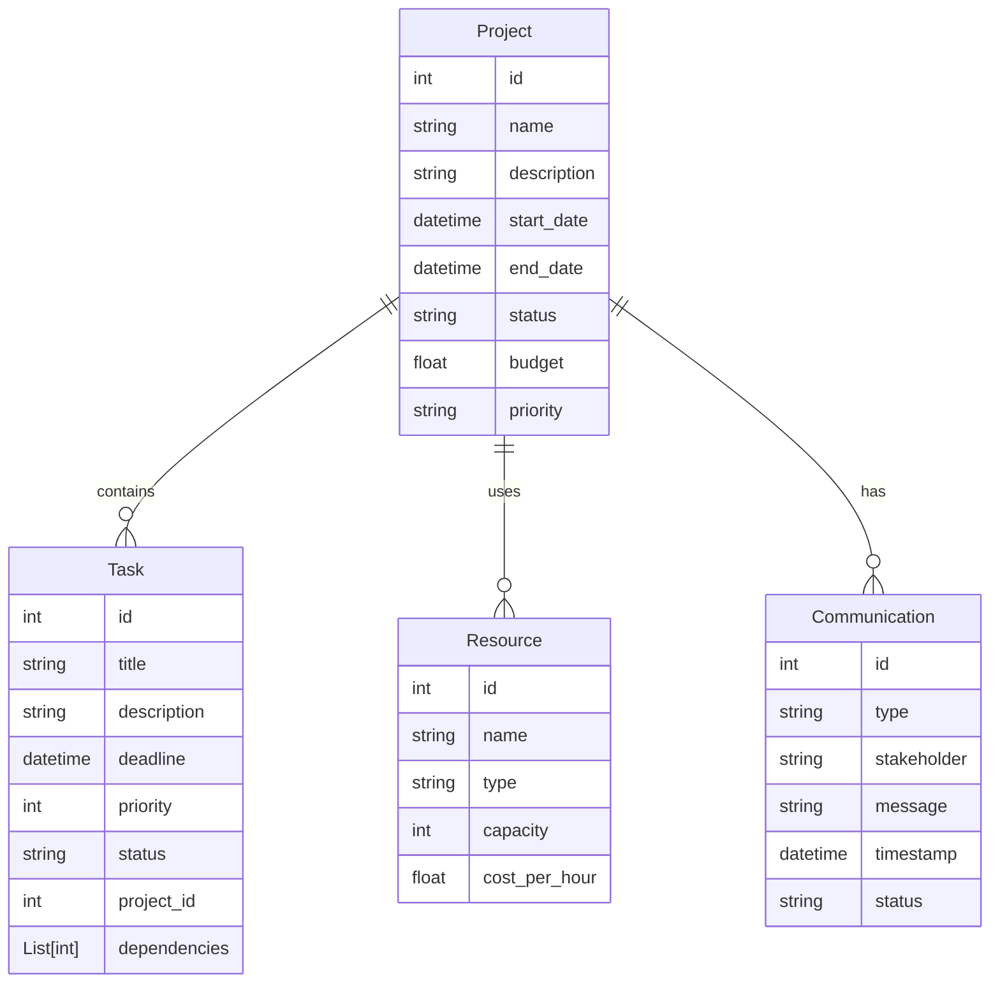

### Task Workflow Model

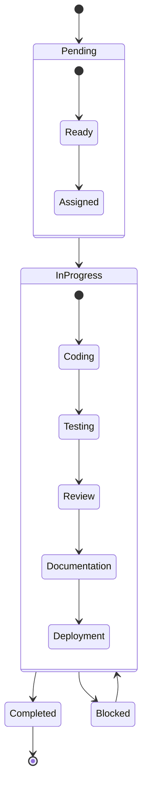

---

## Sequence Diagrams

### Project Creation Flow

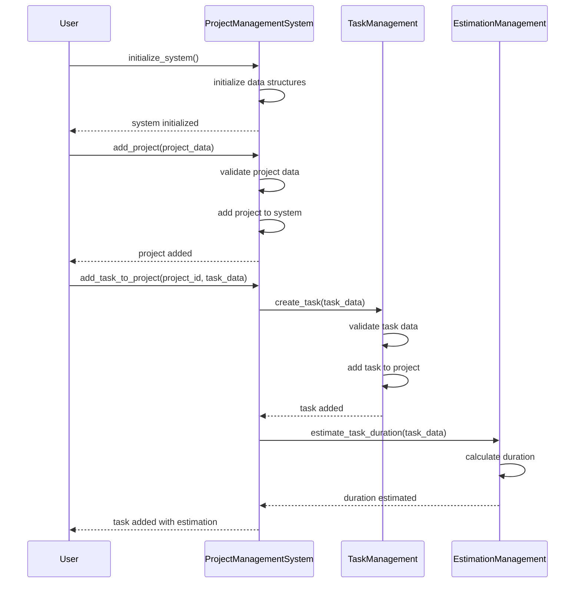

### Task Workflow Execution

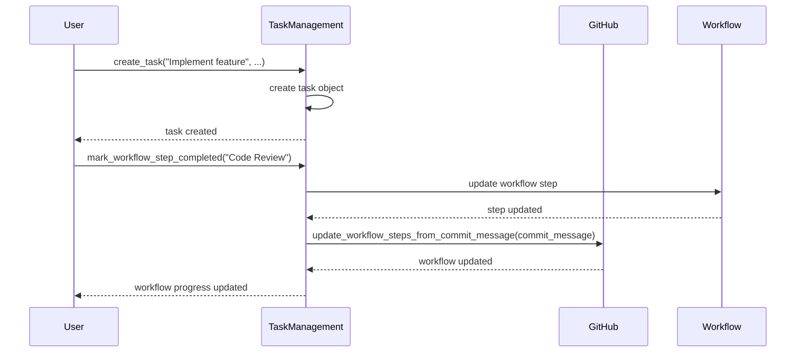

---

## State Diagrams

### Task Lifecycle States

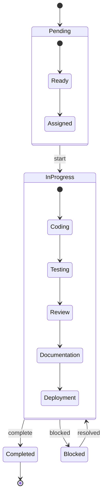

### Resource Allocation States

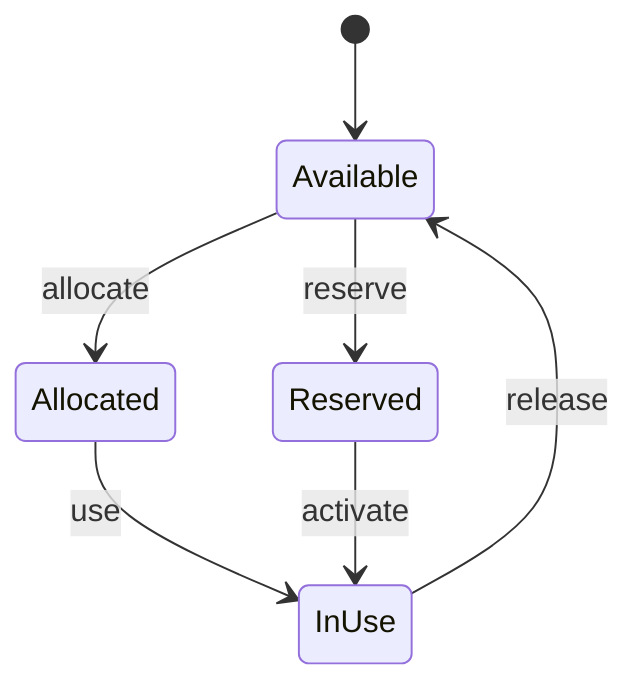

---

## Tables and Specifications

### Core System Classes Table

| Class Name | Purpose | Key Methods | Relationships |
|------------|---------|-------------|---------------|
| ProjectManagementSystem | Central orchestrator | initialize_system, add_project, add_task_to_project | Contains TaskManagement |
| TaskManagement | Task lifecycle management | create_task, classify_tasks_eisenhower, prioritize_tasks | Uses Task objects |
| EstimationManagement | Project estimation | estimate_task_duration, estimate_project_cost | Extends BaseManagement |
| ResourceManagement | Resource allocation | analyze_resource_utilization, resolve_conflicts | Extends BaseManagement |
| CommunicationManagement | Communication tracking | _validate_communication_plan, _analyze_communication_logs | Extends BaseManagement |

### Task Attributes Table

| Attribute | Type | Description | Required |
|-----------|------|-------------|----------|
| id | int | Unique task identifier | Yes |
| title | str | Task title | Yes |
| description | str | Task description | No |
| deadline | datetime | Task deadline | No |
| priority | int | Task priority (0-100) | No |
| status | str | Task status | Yes |
| dependencies | List[int] | Task dependencies | No |
| assigned_to | List[str] | Assigned users | No |

### Resource Attributes Table

| Attribute | Type | Description | Required |
|-----------|------|-------------|----------|
| id | int | Unique resource identifier | Yes |
| name | str | Resource name | Yes |
| type | str | Resource type | Yes |
| capacity | int | Resource capacity | Yes |
| cost_per_hour | float | Cost per hour | Yes |

### Communication Attributes Table

| Attribute | Type | Description | Required |
|-----------|------|-------------|----------|
| id | int | Unique communication identifier | Yes |
| type | str | Communication type | Yes |
| stakeholder | str | Target stakeholder | Yes |
| message | str | Communication message | Yes |
| timestamp | datetime | Communication timestamp | Yes |
| status | str | Communication status | Yes |

---

## Configuration Tables

### System Configuration

| Parameter | Default Value | Description |
|-----------|---------------|-------------|
| DEFAULT_PROJECT_FIELDS | {"id", "name"} | Default project fields |
| REQUIRED_TASK_FIELDS | {"id", "title"} | Required task fields |
| MAX_PROJECT_NAME_LENGTH | 100 | Maximum project name length |
| MAX_TASK_TITLE_LENGTH | 200 | Maximum task title length |
| DEFAULT_COST_PER_RESOURCE | 100.0 | Default cost per resource unit |

### Estimation Configuration

| Parameter | Default Value | Description |
|-----------|---------------|-------------|
| DEFAULT_COMPLEXITY_MAPPING | {"low": 1.0, "medium": 3.0, "high": 5.0, "extreme": 8.0} | Complexity mapping for estimation |
| ESTIMATION_METHODS | {"PARAMETRIC": "parametric", "COCOMO_II": "cocomo_ii", "AGILE": "agile"} | Available estimation methods |

---

## Conclusion

This documentation provides a comprehensive overview of the core system classes in the AutoProjectManagement system. The modular architecture allows for flexible project management with specialized components for different aspects of project management including task management, resource allocation, estimation, and communication tracking.

All classes are designed to work together seamlessly, providing a complete project management solution with advanced features like workflow tracking, GitHub integration, and comprehensive estimation methodologies.
