# AutoProjectManagement Class Diagram Documentation

## 🎯 Overview

The AutoProjectManagement system is a comprehensive automated project management platform built with Python 3.8+. It follows a modular architecture with clear separation of concerns, utilizing object-oriented design principles including inheritance, composition, and dependency injection.

### Key Design Principles

- **Single Responsibility Principle**: Each class has one primary responsibility
- **Open/Closed Principle**: Classes are open for extension but closed for modification
- **Dependency Inversion**: High-level modules don't depend on low-level modules
- **Composition over Inheritance**: Favor composition for flexibility

---

## 🏗️ System Architecture

### High-Level Architecture Diagram

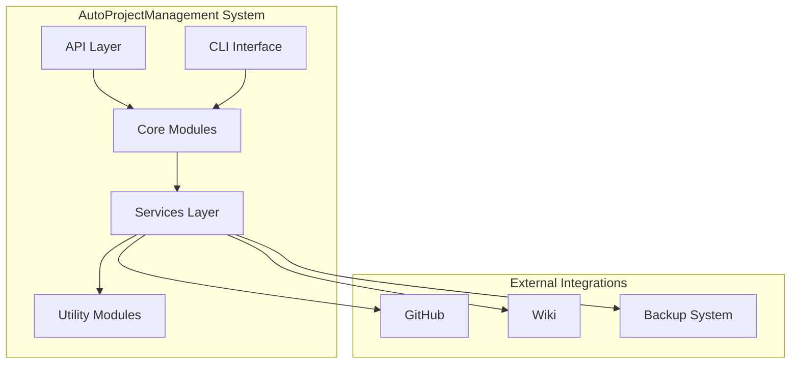

### Package Structure

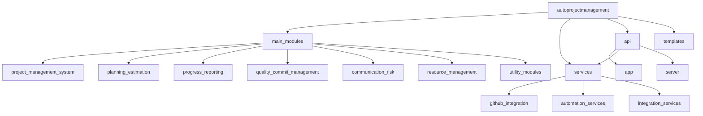

---

## 🔧 Core Class Diagrams

### ProjectManagementSystem Class

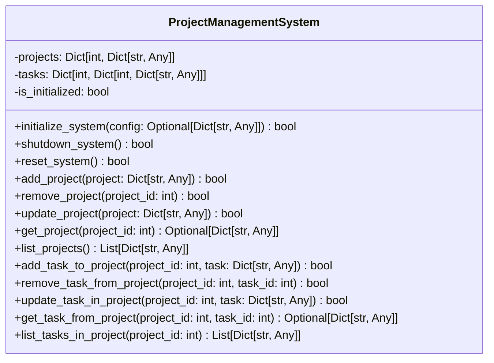

### QualityManagement Class

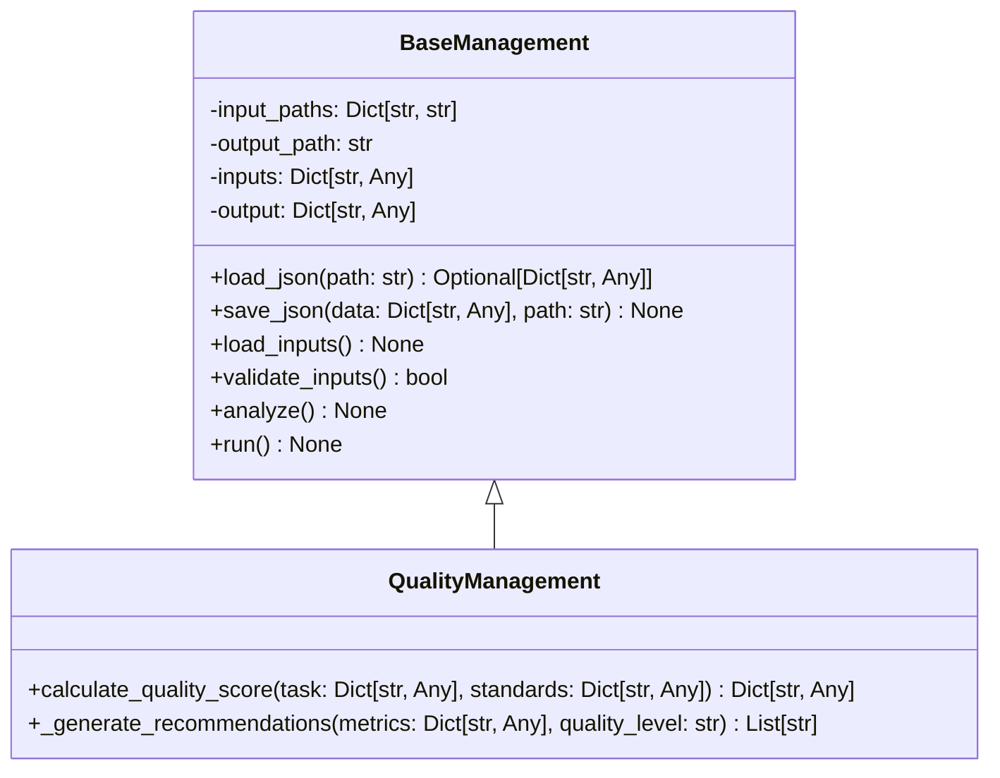

### GitHubIntegration Class

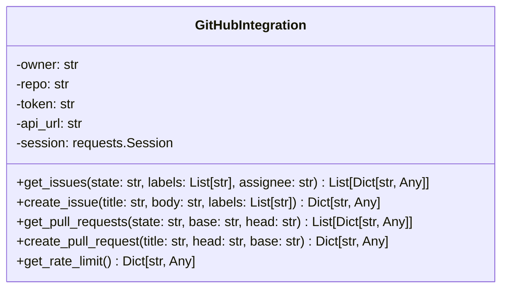

---

## 🛠️ Service Layer Classes

### Service Architecture Overview

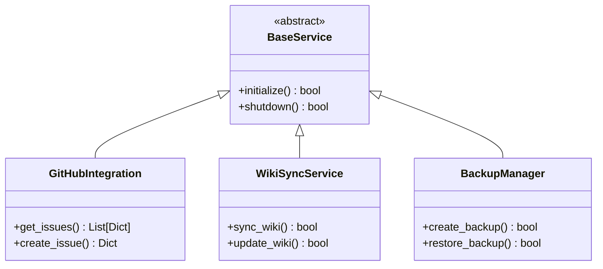

### Service Dependencies

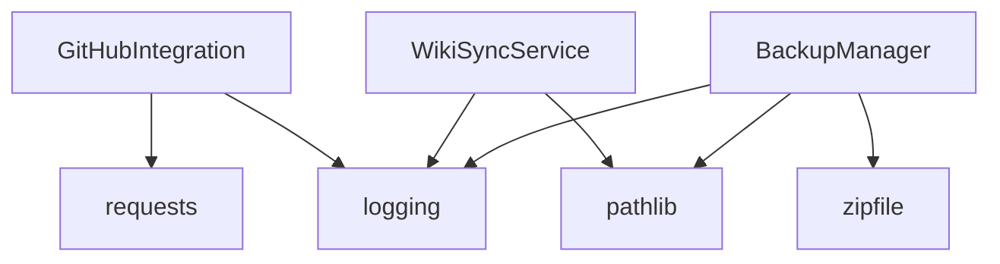

---

## 📊 Data Models

### Core Data Models

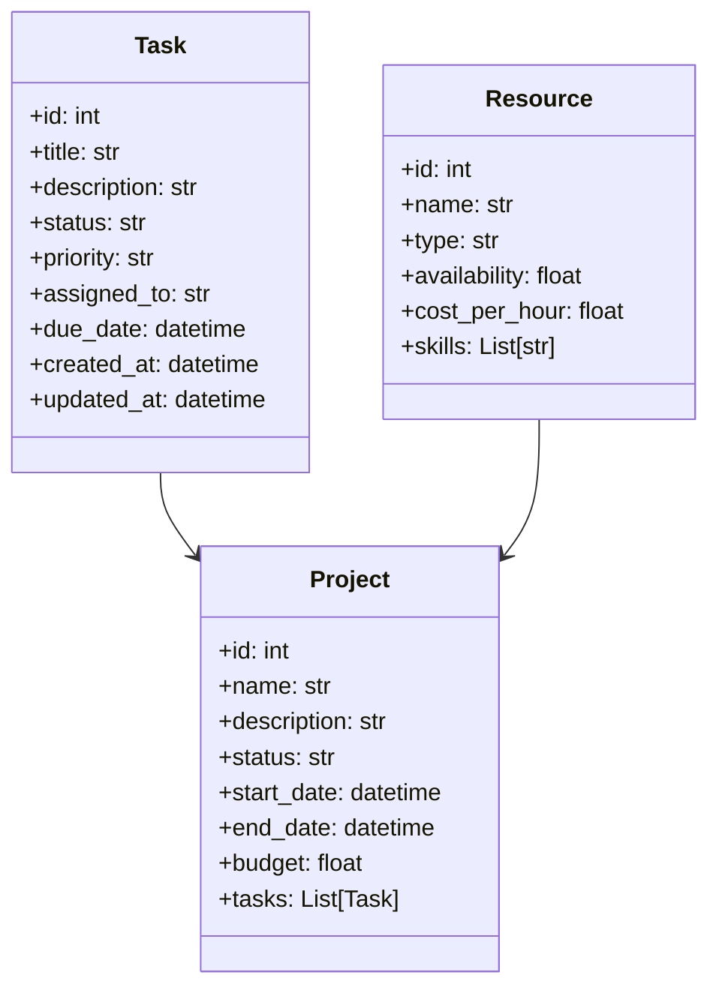

### JSON Data Models

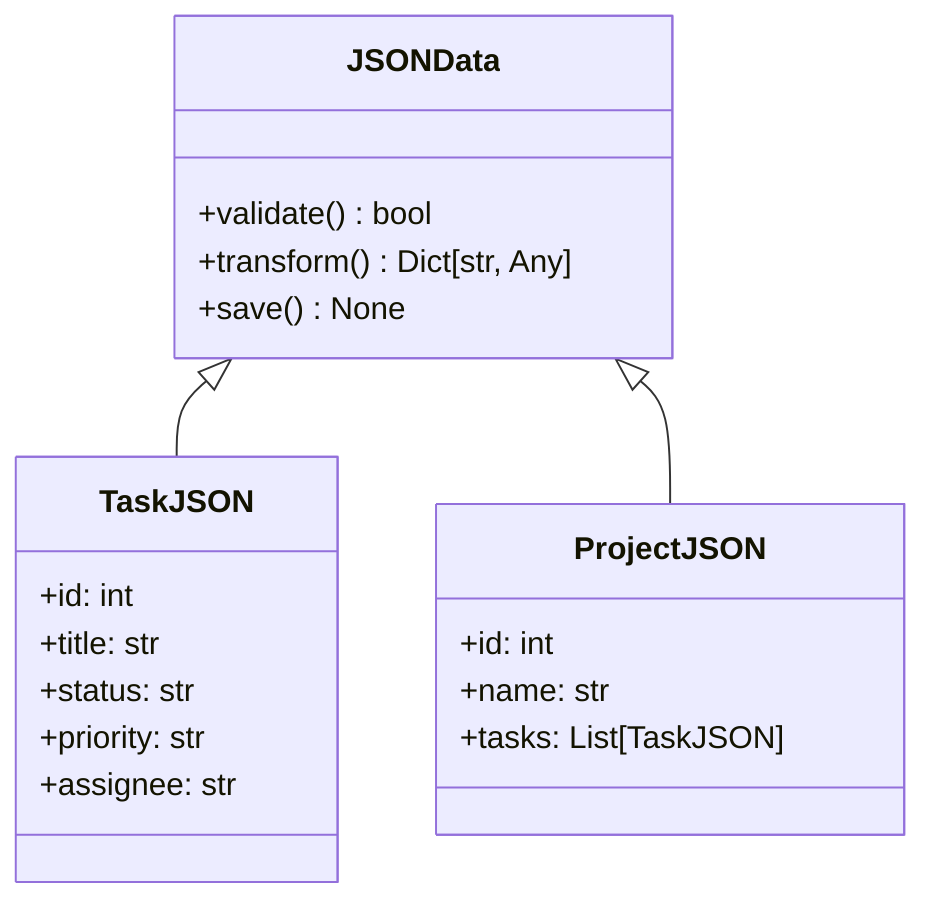

---

## 🔗 Relationships & Dependencies

### Inheritance Hierarchy

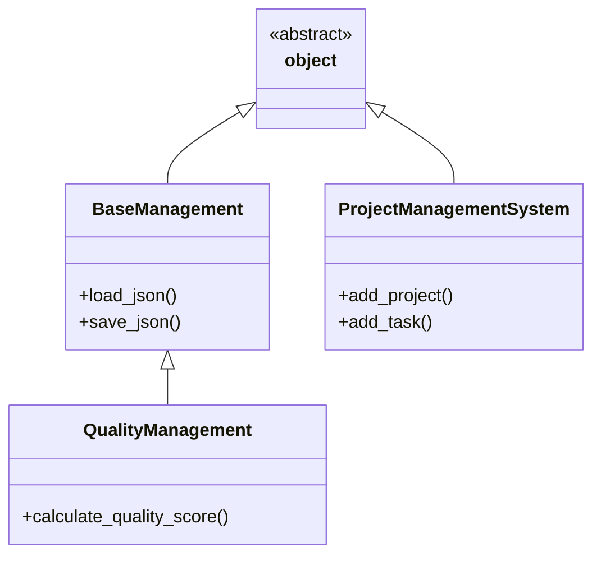

### Composition Relationships

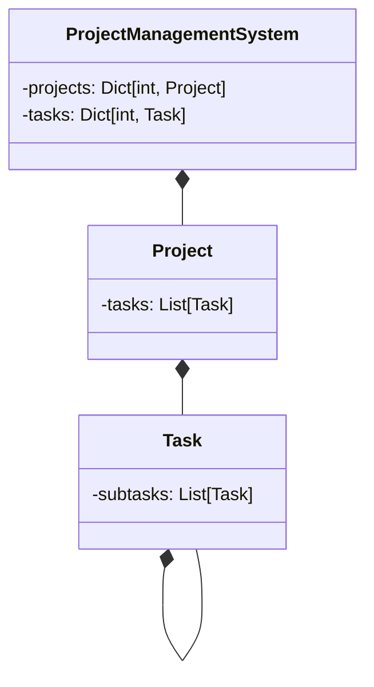

---

## 📋 Tables & Specifications

### Class Specifications Table

| Class Name | Responsibility | Dependencies | Inheritance | Interface |
|------------|----------------|--------------|-------------|-----------|
| ProjectManagementSystem | Core project management | Dict, List, Optional | None | Public API |
| QualityManagement | Quality evaluation | Dict, Any, Optional | BaseManagement | Public API |
| GitHubIntegration | GitHub API integration | requests, logging | None | Public API |
| BaseManagement | JSON processing | json, os, logging | None | Public API |

### Method Specifications Table

| Method | Parameters | Return Type | Complexity | Description |
|--------|------------|-------------|------------|-------------|
| add_project | project: Dict[str, Any] | bool | O(1) | Add new project |
| get_issues | state: str, labels: List[str] | List[Dict] | O(n) | Retrieve GitHub issues |
| calculate_quality_score | task: Dict, standards: Dict | Dict | O(n) | Calculate quality score |

---

## 🎯 Usage Examples

### Basic Usage

```python
# Initialize project management system
from autoprojectmanagement.main_modules.project_management_system import ProjectManagementSystem

pms = ProjectManagementSystem()
pms.initialize_system()

# Add a new project
project = {
    "id": 1,
    "name": "Website Redesign",
    "description": "Complete redesign of company website",
    "status": "active",
    "start_date": "2024-01-01",
    "end_date": "2024-12-31"
}
pms.add_project(project)

# Add tasks to project
task = {
    "id": 1,
    "title": "Design homepage",
    "description": "Create new homepage design",
    "status": "in_progress",
    "priority": "high"
}
pms.add_task_to_project(1, task)
```

### Quality Management Usage

```python
# Initialize quality management
from autoprojectmanagement.main_modules.quality_commit_management.quality_management import QualityManagement

quality_mgr = QualityManagement()
quality_mgr.run()

# Calculate quality for specific task
task = {"id": 1, "title": "Implement feature", "code_coverage": 85}
standards = {"code_coverage": {"target": 80, "weight": 1.0}}
result = quality_mgr.calculate_quality_score(task, standards)
```

### GitHub Integration Usage

```python
# Initialize GitHub integration
from autoprojectmanagement.services.github_integration import GitHubIntegration

github = GitHubIntegration("owner", "repo", "token")
issues = github.get_issues(state="open", labels=["bug"])
```

---

## 📈 Performance Considerations

### Optimization Strategies

1. **Lazy Loading**: Load data only when needed
2. **Caching**: Cache frequently accessed data
3. **Batch Processing**: Process multiple items together
4. **Connection Pooling**: Reuse database connections

### Memory Management

- Use generators for large datasets
- Implement proper cleanup in destructors
- Monitor memory usage with logging

---

## 🔐 Security Considerations

### Security Features

- **Input Validation**: All inputs are validated
- **Authentication**: Token-based authentication
- **Authorization**: Role-based access control
- **Encryption**: Sensitive data is encrypted

### Best Practices

- Never expose secrets in logs
- Use environment variables for configuration
- Implement rate limiting
- Regular security audits

---

## 🚀 Deployment Guide

### Prerequisites

- Python 3.8+
- Required dependencies (see requirements.txt)
- GitHub token for integrations
- Database access credentials

### Installation Steps

1. Clone repository
2. Install dependencies: `pip install -r requirements.txt`
3. Configure environment variables
4. Run setup: `python setup.py install`
5. Initialize system: `python -m autoprojectmanagement.main_modules.project_management_system`

---

## 📚 Additional Resources

- API Documentation
- Module Documentation
- Integration Guide
- Troubleshooting Guide

---

## 📝 Changelog

| Version | Date | Changes |
|---------|------|---------|
| 1.0.0 | 2024-01-01 | Initial release |
| 2.0.0 | 2025-08-14 | Enhanced class diagrams and documentation |

---

## 🤝 Contributing

Please refer to CONTRIBUTING.md for guidelines on contributing to this documentation.

---

## 📞 Support

For questions or support, please:

- Open an issue on GitHub
- Contact the AutoProjectManagement team
- Check the troubleshooting guide

---

**Document Version**: 2.0.0  
**Last Updated**: 2025-08-14  
**Maintained by**: AutoProjectManagement Team
