# 📋 UML Class Diagrams Documentation - AutoProjectManagement System

## 🎯 Overview

This document provides comprehensive UML class diagrams for the AutoProjectManagement system, showcasing the object-oriented design, relationships, and architectural patterns used throughout the codebase.

## 🏗️ Core System Architecture

### 1.1 Main Project Management System

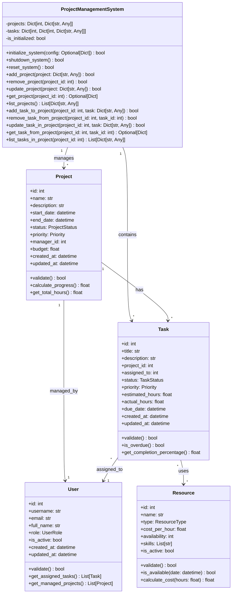
```mermaid
classDiagram
    class ProjectManagementSystem {
        -projects: Dict[int, Dict[str, Any]]
        -tasks: Dict[int, Dict[int, Dict[str, Any]]]
        -is_initialized: bool
        +initialize_system(config: Optional[Dict]) bool
        +shutdown_system() bool
        +reset_system() bool
        +add_project(project: Dict[str, Any]) bool
        +remove_project(project_id: int) bool
        +update_project(project: Dict[str, Any]) bool
        +get_project(project_id: int) Optional[Dict]
        +list_projects() List[Dict[str, Any]]
        +add_task_to_project(project_id: int, task: Dict[str, Any]) bool
        +remove_task_from_project(project_id: int, task_id: int) bool
        +update_task_in_project(project_id: int, task: Dict[str, Any]) bool
        +get_task_from_project(project_id: int, task_id: int) Optional[Dict]
        +list_tasks_in_project(project_id: int) List[Dict[str, Any]]
    }

    class Project {
        +id: int
        +name: str
        +description: str
        +start_date: datetime
        +end_date: datetime
        +status: ProjectStatus
        +priority: Priority
        +manager_id: int
        +budget: float
        +created_at: datetime
        +updated_at: datetime
        +validate() bool
        +calculate_progress() float
        +get_total_hours() float
    }

    class Task {
        +id: int
        +title: str
        +description: str
        +project_id: int
        +assigned_to: int
        +status: TaskStatus
        +priority: Priority
        +estimated_hours: float
        +actual_hours: float
        +due_date: datetime
        +created_at: datetime
        +updated_at: datetime
        +validate() bool
        +is_overdue() bool
        +get_completion_percentage() float
    }

    class User {
        +id: int
        +username: str
        +email: str
        +full_name: str
        +role: UserRole
        +is_active: bool
        +created_at: datetime
        +updated_at: datetime
        +validate() bool
        +get_assigned_tasks() List[Task]
        +get_managed_projects() List[Project]
    }

    class Resource {
        +id: int
        +name: str
        +type: ResourceType
        +cost_per_hour: float
        +availability: int
        +skills: List[str]
        +is_active: bool
        +validate() bool
        +is_available(date: datetime) bool
        +calculate_cost(hours: float) float
    }

    ProjectManagementSystem "1" --> "*" Project : manages
    ProjectManagementSystem "1" --> "*" Task : contains
    Project "1" --> "*" Task : has
    Project "1" --> "1" User : managed_by
    Task "*" --> "1" User : assigned_to
    Task "*" --> "*" Resource : uses
```

### 1.2 Planning and Estimation Module

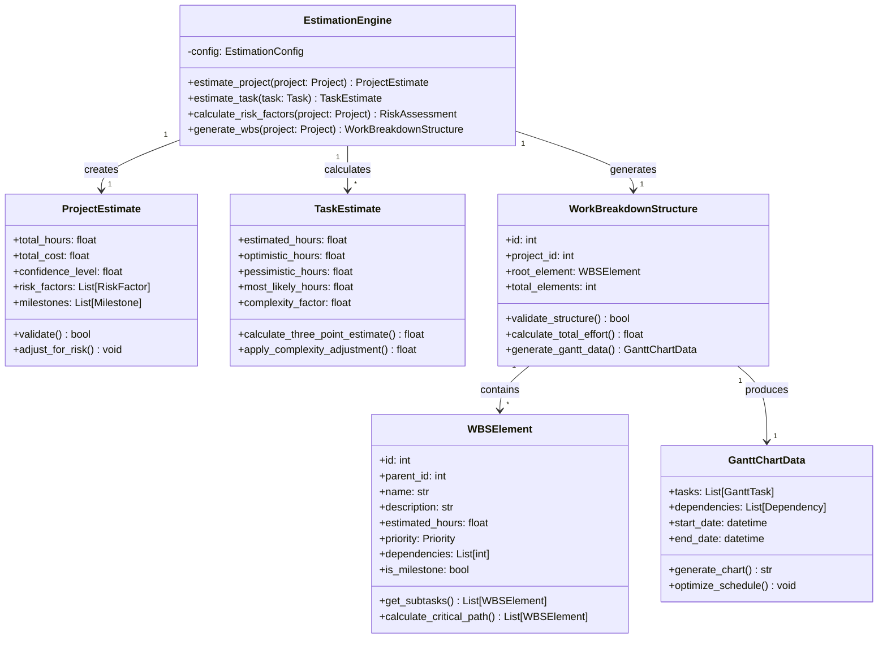
```mermaid
classDiagram
    class EstimationEngine {
        -config: EstimationConfig
        +estimate_project(project: Project) ProjectEstimate
        +estimate_task(task: Task) TaskEstimate
        +calculate_risk_factors(project: Project) RiskAssessment
        +generate_wbs(project: Project) WorkBreakdownStructure
    }

    class ProjectEstimate {
        +total_hours: float
        +total_cost: float
        +confidence_level: float
        +risk_factors: List[RiskFactor]
        +milestones: List[Milestone]
        +validate() bool
        +adjust_for_risk() void
    }

    class TaskEstimate {
        +estimated_hours: float
        +optimistic_hours: float
        +pessimistic_hours: float
        +most_likely_hours: float
        +complexity_factor: float
        +calculate_three_point_estimate() float
        +apply_complexity_adjustment() float
    }

    class WorkBreakdownStructure {
        +id: int
        +project_id: int
        +root_element: WBSElement
        +total_elements: int
        +validate_structure() bool
        +calculate_total_effort() float
        +generate_gantt_data() GanttChartData
    }

    class WBSElement {
        +id: int
        +parent_id: int
        +name: str
        +description: str
        +estimated_hours: float
        +priority: Priority
        +dependencies: List[int]
        +is_milestone: bool
        +get_subtasks() List[WBSElement]
        +calculate_critical_path() List[WBSElement]
    }

    class GanttChartData {
        +tasks: List[GanttTask]
        +dependencies: List[Dependency]
        +start_date: datetime
        +end_date: datetime
        +generate_chart() str
        +optimize_schedule() void
    }

    EstimationEngine "1" --> "1" ProjectEstimate : creates
    EstimationEngine "1" --> "*" TaskEstimate : calculates
    EstimationEngine "1" --> "1" WorkBreakdownStructure : generates
    WorkBreakdownStructure "1" --> "*" WBSElement : contains
    WorkBreakdownStructure "1" --> "1" GanttChartData : produces
```

### 1.3 Progress Reporting Module

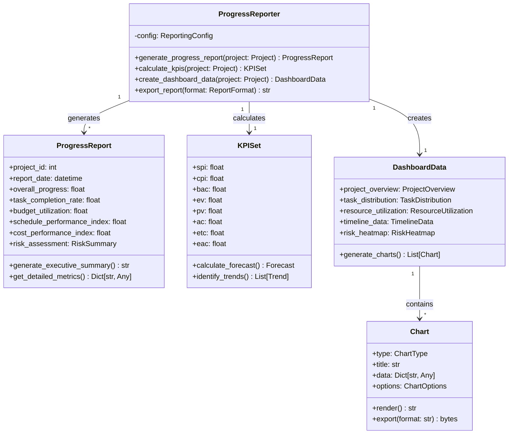
```mermaid
classDiagram
    class ProgressReporter {
        -config: ReportingConfig
        +generate_progress_report(project: Project) ProgressReport
        +calculate_kpis(project: Project) KPISet
        +create_dashboard_data(project: Project) DashboardData
        +export_report(format: ReportFormat) str
    }

    class ProgressReport {
        +project_id: int
        +report_date: datetime
        +overall_progress: float
        +task_completion_rate: float
        +budget_utilization: float
        +schedule_performance_index: float
        +cost_performance_index: float
        +risk_assessment: RiskSummary
        +generate_executive_summary() str
        +get_detailed_metrics() Dict[str, Any]
    }

    class KPISet {
        +spi: float
        +cpi: float
        +bac: float
        +ev: float
        +pv: float
        +ac: float
        +etc: float
        +eac: float
        +calculate_forecast() Forecast
        +identify_trends() List[Trend]
    }

    class DashboardData {
        +project_overview: ProjectOverview
        +task_distribution: TaskDistribution
        +resource_utilization: ResourceUtilization
        +timeline_data: TimelineData
        +risk_heatmap: RiskHeatmap
        +generate_charts() List[Chart]
    }

    class Chart {
        +type: ChartType
        +title: str
        +data: Dict[str, Any]
        +options: ChartOptions
        +render() str
        +export(format: str) bytes
    }

    ProgressReporter "1" --> "*" ProgressReport : generates
    ProgressReporter "1" --> "1" KPISet : calculates
    ProgressReporter "1" --> "1" DashboardData : creates
    DashboardData "1" --> "*" Chart : contains
```

### 1.4 Communication and Risk Management

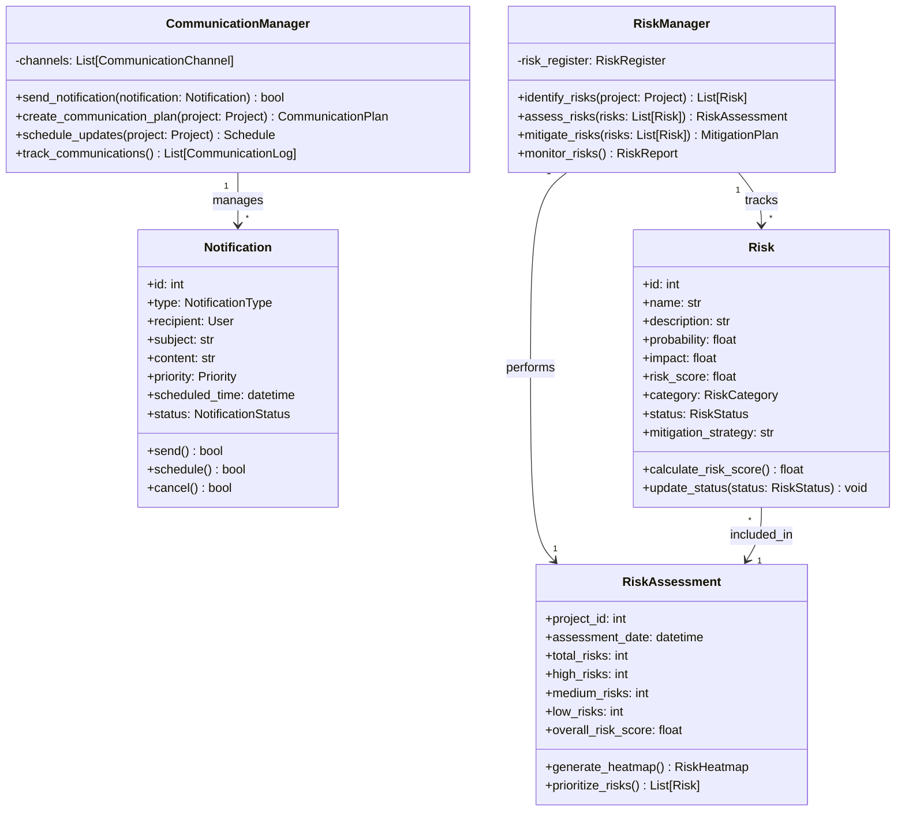
```mermaid
classDiagram
    class CommunicationManager {
        -channels: List[CommunicationChannel]
        +send_notification(notification: Notification) bool
        +create_communication_plan(project: Project) CommunicationPlan
        +schedule_updates(project: Project) Schedule
        +track_communications() List[CommunicationLog]
    }

    class RiskManager {
        -risk_register: RiskRegister
        +identify_risks(project: Project) List[Risk]
        +assess_risks(risks: List[Risk]) RiskAssessment
        +mitigate_risks(risks: List[Risk]) MitigationPlan
        +monitor_risks() RiskReport
    }

    class Notification {
        +id: int
        +type: NotificationType
        +recipient: User
        +subject: str
        +content: str
        +priority: Priority
        +scheduled_time: datetime
        +status: NotificationStatus
        +send() bool
        +schedule() bool
        +cancel() bool
    }

    class Risk {
        +id: int
        +name: str
        +description: str
        +probability: float
        +impact: float
        +risk_score: float
        +category: RiskCategory
        +status: RiskStatus
        +mitigation_strategy: str
        +calculate_risk_score() float
        +update_status(status: RiskStatus) void
    }

    class RiskAssessment {
        +project_id: int
        +assessment_date: datetime
        +total_risks: int
        +high_risks: int
        +medium_risks: int
        +low_risks: int
        +overall_risk_score: float
        +generate_heatmap() RiskHeatmap
        +prioritize_risks() List[Risk]
    }

    CommunicationManager "1" --> "*" Notification : manages
    RiskManager "1" --> "*" Risk : tracks
    RiskManager "1" --> "1" RiskAssessment : performs
    Risk "*" --> "1" RiskAssessment : included_in
```

### 1.5 Resource Management Module

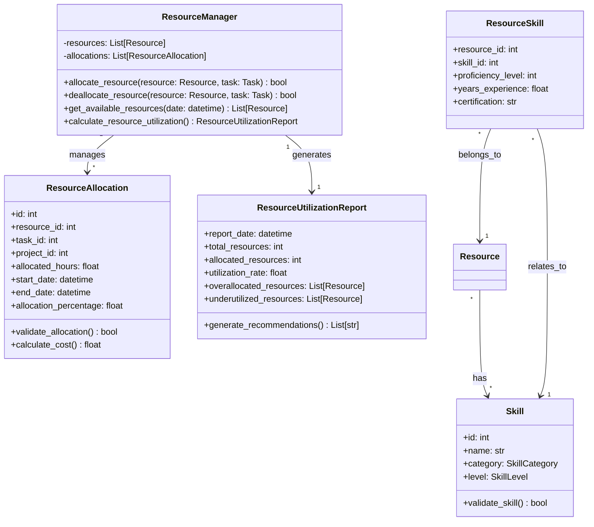
```mermaid
classDiagram
    class ResourceManager {
        -resources: List[Resource]
        -allocations: List[ResourceAllocation]
        +allocate_resource(resource: Resource, task: Task) bool
        +deallocate_resource(resource: Resource, task: Task) bool
        +get_available_resources(date: datetime) List[Resource]
        +calculate_resource_utilization() ResourceUtilizationReport
    }

    class ResourceAllocation {
        +id: int
        +resource_id: int
        +task_id: int
        +project_id: int
        +allocated_hours: float
        +start_date: datetime
        +end_date: datetime
        +allocation_percentage: float
        +validate_allocation() bool
        +calculate_cost() float
    }

    class ResourceUtilizationReport {
        +report_date: datetime
        +total_resources: int
        +allocated_resources: int
        +utilization_rate: float
        +overallocated_resources: List[Resource]
        +underutilized_resources: List[Resource]
        +generate_recommendations() List[str]
    }

    class Skill {
        +id: int
        +name: str
        +category: SkillCategory
        +level: SkillLevel
        +validate_skill() bool
    }

    class ResourceSkill {
        +resource_id: int
        +skill_id: int
        +proficiency_level: int
        +years_experience: float
        +certification: str
    }

    ResourceManager "1" --> "*" ResourceAllocation : manages
    ResourceManager "1" --> "1" ResourceUtilizationReport : generates
    Resource "*" --> "*" Skill : has
    ResourceSkill "*" --> "1" Resource : belongs_to
    ResourceSkill "*" --> "1" Skill : relates_to
```

## 🔧 Service Layer Architecture

### 2.1 GitHub Integration Services

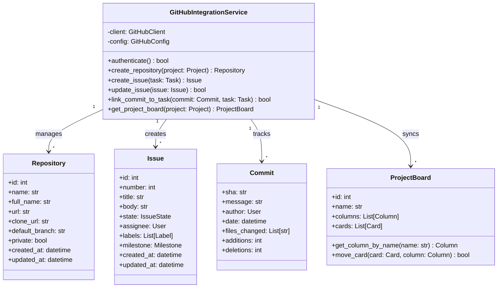
```mermaid
classDiagram
    class GitHubIntegrationService {
        -client: GitHubClient
        -config: GitHubConfig
        +authenticate() bool
        +create_repository(project: Project) Repository
        +create_issue(task: Task) Issue
        +update_issue(issue: Issue) bool
        +link_commit_to_task(commit: Commit, task: Task) bool
        +get_project_board(project: Project) ProjectBoard
    }

    class Repository {
        +id: int
        +name: str
        +full_name: str
        +url: str
        +clone_url: str
        +default_branch: str
        +private: bool
        +created_at: datetime
        +updated_at: datetime
    }

    class Issue {
        +id: int
        +number: int
        +title: str
        +body: str
        +state: IssueState
        +assignee: User
        +labels: List[Label]
        +milestone: Milestone
        +created_at: datetime
        +updated_at: datetime
    }

    class Commit {
        +sha: str
        +message: str
        +author: User
        +date: datetime
        +files_changed: List[str]
        +additions: int
        +deletions: int
    }

    class ProjectBoard {
        +id: int
        +name: str
        +columns: List[Column]
        +cards: List[Card]
        +get_column_by_name(name: str) Column
        +move_card(card: Card, column: Column) bool
    }

    GitHubIntegrationService "1" --> "*" Repository : manages
    GitHubIntegrationService "1" --> "*" Issue : creates
    GitHubIntegrationService "1" --> "*" Commit : tracks
    GitHubIntegrationService "1" --> "*" ProjectBoard : syncs
```

### 2.2 JSON Data Services

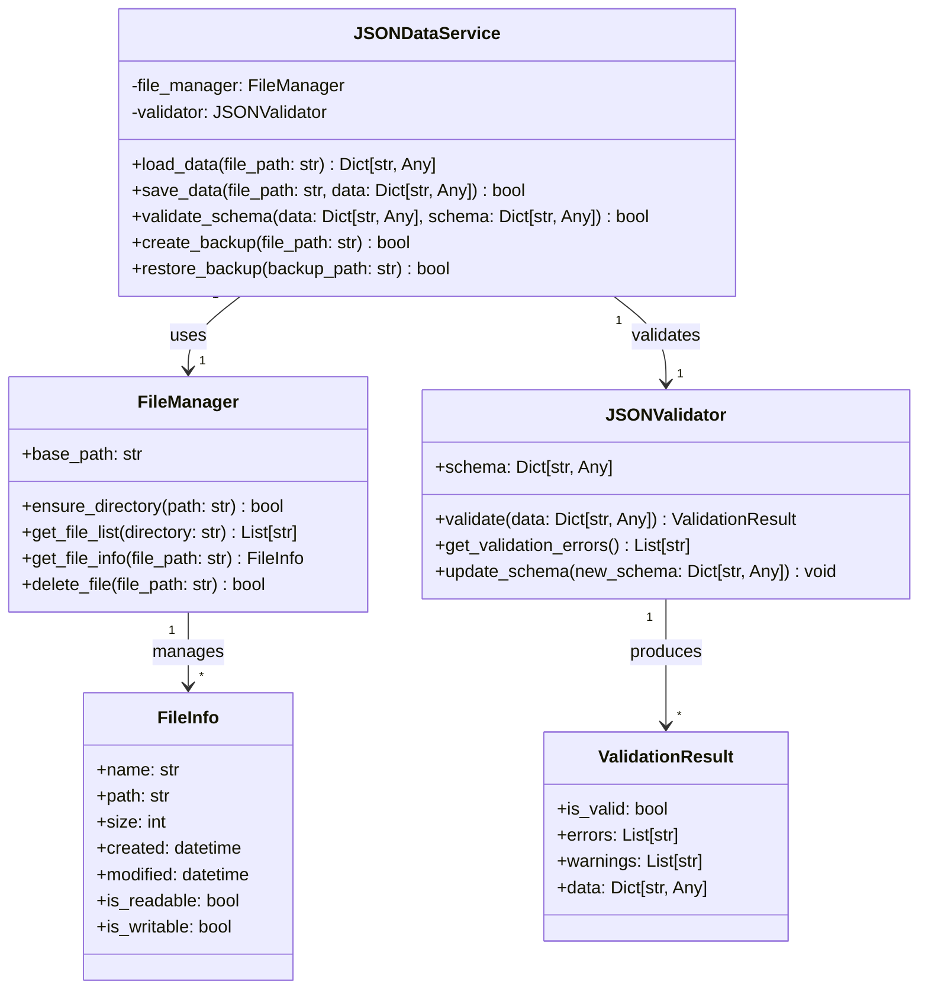
```mermaid
classDiagram
    class JSONDataService {
        -file_manager: FileManager
        -validator: JSONValidator
        +load_data(file_path: str) Dict[str, Any]
        +save_data(file_path: str, data: Dict[str, Any]) bool
        +validate_schema(data: Dict[str, Any], schema: Dict[str, Any]) bool
        +create_backup(file_path: str) bool
        +restore_backup(backup_path: str) bool
    }

    class FileManager {
        +base_path: str
        +ensure_directory(path: str) bool
        +get_file_list(directory: str) List[str]
        +get_file_info(file_path: str) FileInfo
        +delete_file(file_path: str) bool
    }

    class JSONValidator {
        +schema: Dict[str, Any]
        +validate(data: Dict[str, Any]) ValidationResult
        +get_validation_errors() List[str]
        +update_schema(new_schema: Dict[str, Any]) void
    }

    class ValidationResult {
        +is_valid: bool
        +errors: List[str]
        +warnings: List[str]
        +data: Dict[str, Any]
    }

    class FileInfo {
        +name: str
        +path: str
        +size: int
        +created: datetime
        +modified: datetime
        +is_readable: bool
        +is_writable: bool
    }

    JSONDataService "1" --> "1" FileManager : uses
    JSONDataService "1" --> "1" JSONValidator : validates
    JSONValidator "1" --> "*" ValidationResult : produces
    FileManager "1" --> "*" FileInfo : manages
```

## 📊 Data Processing Classes

### 3.1 Data Collection and Processing

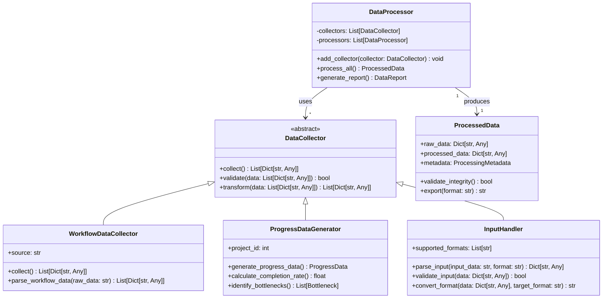
```mermaid
classDiagram
    class DataCollector {
        <<abstract>>
        +collect() List[Dict[str, Any]]
        +validate(data: List[Dict[str, Any]]) bool
        +transform(data: List[Dict[str, Any]]) List[Dict[str, Any]]
    }

    class WorkflowDataCollector {
        +source: str
        +collect() List[Dict[str, Any]]
        +parse_workflow_data(raw_data: str) List[Dict[str, Any]]
    }

    class ProgressDataGenerator {
        +project_id: int
        +generate_progress_data() ProgressData
        +calculate_completion_rate() float
        +identify_bottlenecks() List[Bottleneck]
    }

    class InputHandler {
        +supported_formats: List[str]
        +parse_input(input_data: str, format: str) Dict[str, Any]
        +validate_input(data: Dict[str, Any]) bool
        +convert_format(data: Dict[str, Any], target_format: str) str
    }

    class DataProcessor {
        -collectors: List[DataCollector]
        -processors: List[DataProcessor]
        +add_collector(collector: DataCollector) void
        +process_all() ProcessedData
        +generate_report() DataReport
    }

    class ProcessedData {
        +raw_data: Dict[str, Any]
        +processed_data: Dict[str, Any]
        +metadata: ProcessingMetadata
        +validate_integrity() bool
        +export(format: str) str
    }

    DataCollector <|-- WorkflowDataCollector
    DataCollector <|-- ProgressDataGenerator
    DataCollector <|-- InputHandler
    DataProcessor "1" --> "*" DataCollector : uses
    DataProcessor "1" --> "1" ProcessedData : produces
```

### 3.2 Quality and Commit Management

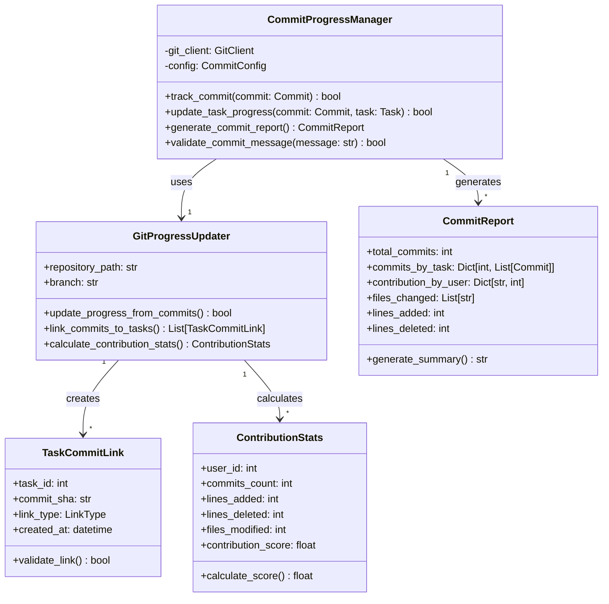
```mermaid
classDiagram
    class CommitProgressManager {
        -git_client: GitClient
        -config: CommitConfig
        +track_commit(commit: Commit) bool
        +update_task_progress(commit: Commit, task: Task) bool
        +generate_commit_report() CommitReport
        +validate_commit_message(message: str) bool
    }

    class GitProgressUpdater {
        +repository_path: str
        +branch: str
        +update_progress_from_commits() bool
        +link_commits_to_tasks() List[TaskCommitLink]
        +calculate_contribution_stats() ContributionStats
    }

    class CommitReport {
        +total_commits: int
        +commits_by_task: Dict[int, List[Commit]]
        +contribution_by_user: Dict[str, int]
        +files_changed: List[str]
        +lines_added: int
        +lines_deleted: int
        +generate_summary() str
    }

    class TaskCommitLink {
        +task_id: int
        +commit_sha: str
        +link_type: LinkType
        +created_at: datetime
        +validate_link() bool
    }

    class ContributionStats {
        +user_id: int
        +commits_count: int
        +lines_added: int
        +lines_deleted: int
        +files_modified: int
        +contribution_score: float
        +calculate_score() float
    }

    CommitProgressManager "1" --> "1" GitProgressUpdater : uses
    CommitProgressManager "1" --> "*" CommitReport : generates
    GitProgressUpdater "1" --> "*" TaskCommitLink : creates
    GitProgressUpdater "1" --> "*" ContributionStats : calculates
```

## 🎨 UI/UX Classes

### 4.1 Dashboard Components

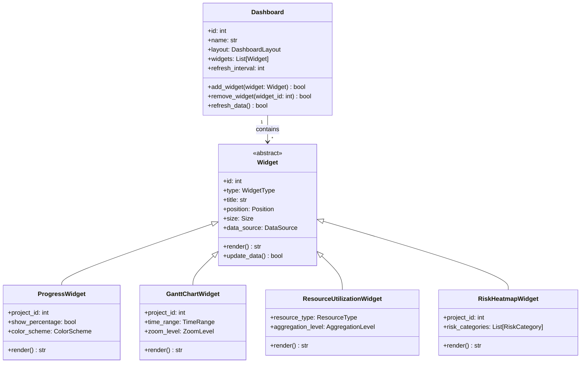
```mermaid
classDiagram
    class Dashboard {
        +id: int
        +name: str
        +layout: DashboardLayout
        +widgets: List[Widget]
        +refresh_interval: int
        +add_widget(widget: Widget) bool
        +remove_widget(widget_id: int) bool
        +refresh_data() bool
    }

    class Widget {
        <<abstract>>
        +id: int
        +type: WidgetType
        +title: str
        +position: Position
        +size: Size
        +data_source: DataSource
        +render() str
        +update_data() bool
    }

    class ProgressWidget {
        +project_id: int
        +show_percentage: bool
        +color_scheme: ColorScheme
        +render() str
    }

    class GanttChartWidget {
        +project_id: int
        +time_range: TimeRange
        +zoom_level: ZoomLevel
        +render() str
    }

    class ResourceUtilizationWidget {
        +resource_type: ResourceType
        +aggregation_level: AggregationLevel
        +render() str
    }

    class RiskHeatmapWidget {
        +project_id: int
        +risk_categories: List[RiskCategory]
        +render() str
    }

    Dashboard "1" --> "*" Widget : contains
    Widget <|-- ProgressWidget
    Widget <|-- GanttChartWidget
    Widget <|-- ResourceUtilizationWidget
    Widget <|-- RiskHeatmapWidget
```

## 🔗 Relationships and Associations

### 5.1 Entity Relationship Summary

| Relationship Type | From | To | Cardinality | Description |
|------------------|------|----|-------------|-------------|
| **Composition** | Project | Task | 1:N | Project contains multiple tasks |
| **Aggregation** | User | Project | 1:N | User manages multiple projects |
| **Association** | Task | User | N:1 | Task assigned to one user |
| **Association** | Task | Resource | N:M | Task uses multiple resources |
| **Composition** | Dashboard | Widget | 1:N | Dashboard contains widgets |
| **Aggregation** | Project | Milestone | 1:N | Project has milestones |

### 5.2 Inheritance Hierarchy

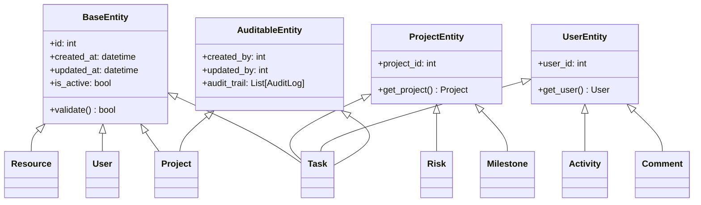
```mermaid
classDiagram
    class BaseEntity {
        +id: int
        +created_at: datetime
        +updated_at: datetime
        +is_active: bool
        +validate() bool
    }

    class ProjectEntity {
        +project_id: int
        +get_project() Project
    }

    class UserEntity {
        +user_id: int
        +get_user() User
    }

    class AuditableEntity {
        +created_by: int
        +updated_by: int
        +audit_trail: List[AuditLog]
    }

    BaseEntity <|-- Project
    BaseEntity <|-- Task
    BaseEntity <|-- User
    BaseEntity <|-- Resource
    
    ProjectEntity <|-- Task
    ProjectEntity <|-- Milestone
    ProjectEntity <|-- Risk
    
    UserEntity <|-- Task
    UserEntity <|-- Comment
    UserEntity <|-- Activity
    
    AuditableEntity <|-- Project
    AuditableEntity <|-- Task
```

## 📋 Design Patterns Implementation

### 6.1 Creational Patterns

#### Singleton Pattern - ProjectManagementSystem
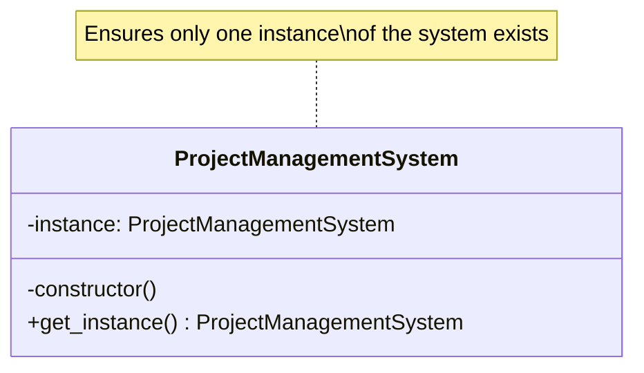
```mermaid
classDiagram
    class ProjectManagementSystem {
        -instance: ProjectManagementSystem
        -constructor() 
        +get_instance() ProjectManagementSystem
    }
    
    note for ProjectManagementSystem "Ensures only one instance\nof the system exists"
```

#### Factory Pattern - Task Creation
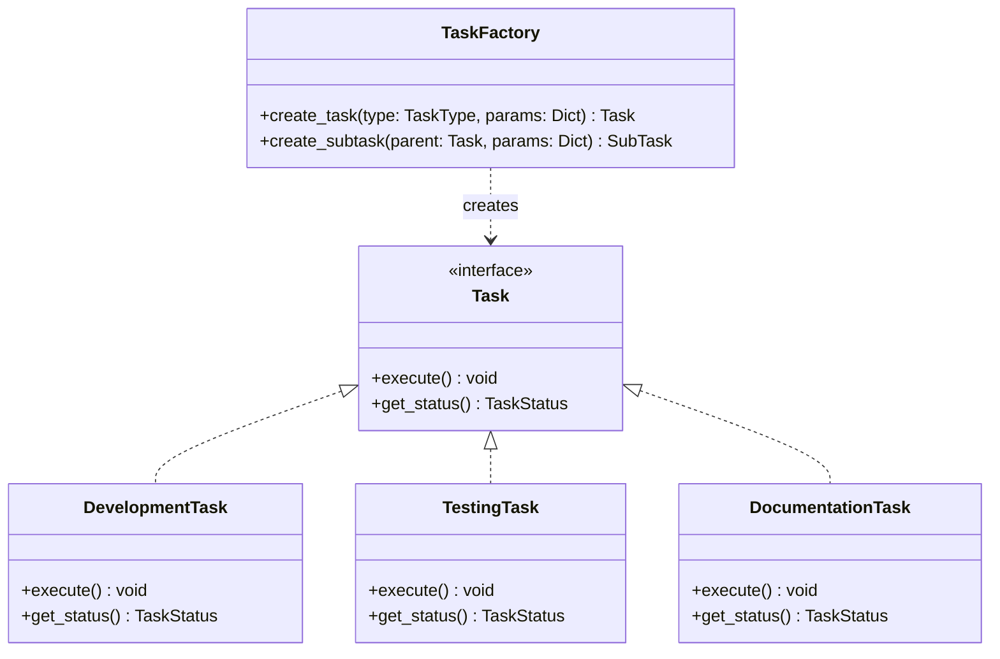
```mermaid
classDiagram
    class TaskFactory {
        +create_task(type: TaskType, params: Dict) Task
        +create_subtask(parent: Task, params: Dict) SubTask
    }

    class Task {
        <<interface>>
        +execute() void
        +get_status() TaskStatus
    }

    class DevelopmentTask {
        +execute() void
        +get_status() TaskStatus
    }

    class TestingTask {
        +execute() void
        +get_status() TaskStatus
    }

    class DocumentationTask {
        +execute() void
        +get_status() TaskStatus
    }

    TaskFactory ..> Task : creates
    Task <|.. DevelopmentTask
    Task <|.. TestingTask
    Task <|.. DocumentationTask
```

### 6.2 Structural Patterns

#### Decorator Pattern - Task Enhancement
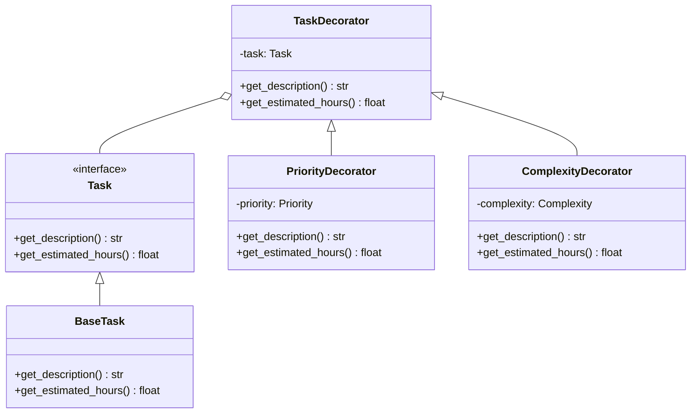
```mermaid
classDiagram
    class Task {
        <<interface>>
        +get_description() str
        +get_estimated_hours() float
    }

    class BaseTask {
        +get_description() str
        +get_estimated_hours() float
    }

    class TaskDecorator {
        -task: Task
        +get_description() str
        +get_estimated_hours() float
    }

    class PriorityDecorator {
        -priority: Priority
        +get_description() str
        +get_estimated_hours() float
    }

    class ComplexityDecorator {
        -complexity: Complexity
        +get_description() str
        +get_estimated_hours() float
    }

    Task <|-- BaseTask
    TaskDecorator o-- Task
    TaskDecorator <|-- PriorityDecorator
    TaskDecorator <|-- ComplexityDecorator
```

### 6.3 Behavioral Patterns

#### Observer Pattern - Progress Monitoring
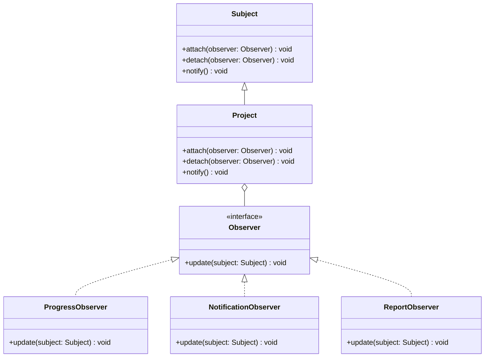
```mermaid
classDiagram
    class Subject {
        +attach(observer: Observer) void
        +detach(observer: Observer) void
        +notify() void
    }

    class Observer {
        <<interface>>
        +update(subject: Subject) void
    }

    class Project {
        +attach(observer: Observer) void
        +detach(observer: Observer) void
        +notify() void
    }

    class ProgressObserver {
        +update(subject: Subject) void
    }

    class NotificationObserver {
        +update(subject: Subject) void
    }

    class ReportObserver {
        +update(subject: Subject) void
    }

    Subject <|-- Project
    Observer <|.. ProgressObserver
    Observer <|.. NotificationObserver
    Observer <|.. ReportObserver
    Project o-- Observer
```

## 📊 Data Models and Schemas

### 7.1 JSON Schema Definitions

#### Project Schema
```json
{
  "$schema": "http://json-schema.org/draft-07/schema#",
  "type": "object",
  "properties": {
    "id": {"type": "integer"},
    "name": {"type": "string", "maxLength": 100},
    "description": {"type": "string", "maxLength": 500},
    "start_date": {"type": "string", "format": "date"},
    "end_date": {"type": "string", "format": "date"},
    "status": {"enum": ["planning", "active", "on_hold", "completed", "cancelled"]},
    "priority": {"enum": ["low", "medium", "high", "critical"]},
    "budget": {"type": "number", "minimum": 0},
    "manager_id": {"type": "integer"}
  },
  "required": ["id", "name", "status", "priority"]
}
```

#### Task Schema
```json
{
  "$schema": "http://json-schema.org/draft-07/schema#",
  "type": "object",
  "properties": {
    "id": {"type": "integer"},
    "title": {"type": "string", "maxLength": 200},
    "description": {"type": "string", "maxLength": 1000},
    "project_id": {"type": "integer"},
    "assigned_to": {"type": "integer"},
    "status": {"enum": ["todo", "in_progress", "review", "testing", "done"]},
    "priority": {"enum": ["low", "medium", "high", "critical"]},
    "estimated_hours": {"type": "number", "minimum": 0},
    "actual_hours": {"type": "number", "minimum": 0},
    "due_date": {"type": "string", "format": "date"}
  },
  "required": ["id", "title", "project_id", "status", "priority"]
}
```

## 🔍 Class Responsibilities and Collaborations

### 8.1 CRC Cards Summary

#### ProjectManagementSystem CRC
| Responsibility | Collaboration |
|----------------|---------------|
| Manage all projects | Project, Task, User |
| Handle CRUD operations | Database, FileManager |
| Maintain data integrity | Validator, Logger |
| Provide system status | StatusService |

#### Task CRC
| Responsibility | Collaboration |
|----------------|---------------|
| Store task information | Project, User, Resource |
| Track progress | ProgressTracker |
| Manage dependencies | DependencyManager |
| Calculate metrics | EstimationEngine |

#### User CRC
| Responsibility | Collaboration |
|----------------|---------------|
| Manage user profile | AuthenticationService |
| Track assigned tasks | TaskManager |
| Manage permissions | PermissionManager |
| Generate reports | ReportGenerator |

## 🚀 Extension Points

### 9.1 Plugin Architecture

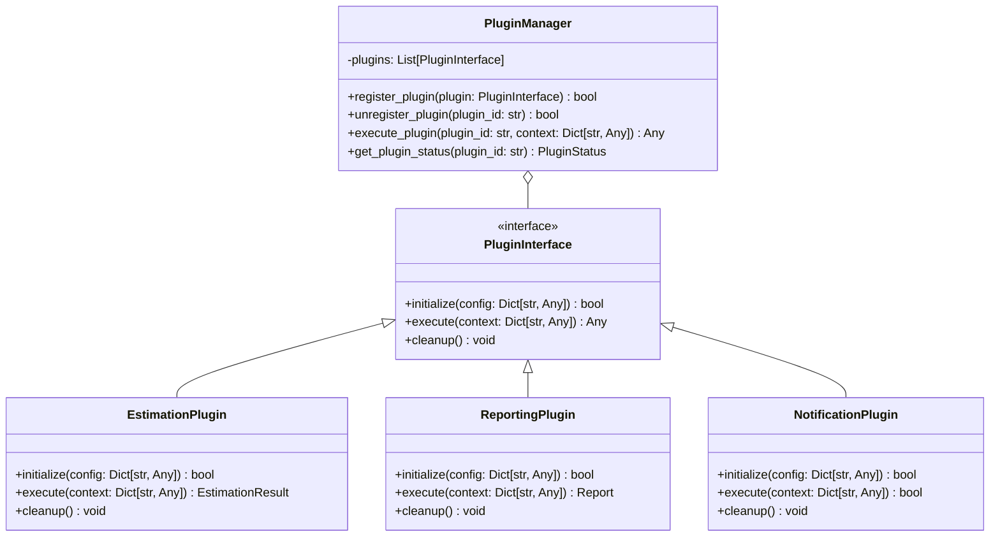
```mermaid
classDiagram
    class PluginInterface {
        <<interface>>
        +initialize(config: Dict[str, Any]) bool
        +execute(context: Dict[str, Any]) Any
        +cleanup() void
    }

    class EstimationPlugin {
        +initialize(config: Dict[str, Any]) bool
        +execute(context: Dict[str, Any]) EstimationResult
        +cleanup() void
    }

    class ReportingPlugin {
        +initialize(config: Dict[str, Any]) bool
        +execute(context: Dict[str, Any]) Report
        +cleanup() void
    }

    class NotificationPlugin {
        +initialize(config: Dict[str, Any]) bool
        +execute(context: Dict[str, Any]) bool
        +cleanup() void
    }

    class PluginManager {
        -plugins: List[PluginInterface]
        +register_plugin(plugin: PluginInterface) bool
        +unregister_plugin(plugin_id: str) bool
        +execute_plugin(plugin_id: str, context: Dict[str, Any]) Any
        +get_plugin_status(plugin_id: str) PluginStatus
    }

    PluginInterface <|-- EstimationPlugin
    PluginInterface <|-- ReportingPlugin
    PluginInterface <|-- NotificationPlugin
    PluginManager o-- PluginInterface
```

## 📋 Configuration Classes

### 10.1 System Configuration

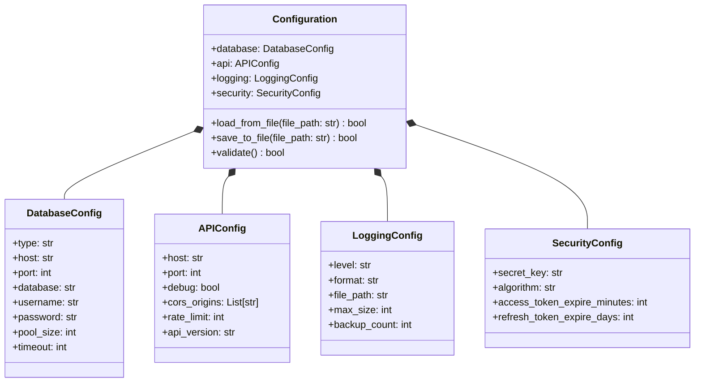
```mermaid
classDiagram
    class Configuration {
        +database: DatabaseConfig
        +api: APIConfig
        +logging: LoggingConfig
        +security: SecurityConfig
        +load_from_file(file_path: str) bool
        +save_to_file(file_path: str) bool
        +validate() bool
    }

    class DatabaseConfig {
        +type: str
        +host: str
        +port: int
        +database: str
        +username: str
        +password: str
        +pool_size: int
        +timeout: int
    }

    class APIConfig {
        +host: str
        +port: int
        +debug: bool
        +cors_origins: List[str]
        +rate_limit: int
        +api_version: str
    }

    class LoggingConfig {
        +level: str
        +format: str
        +file_path: str
        +max_size: int
        +backup_count: int
    }

    class SecurityConfig {
        +secret_key: str
        +algorithm: str
        +access_token_expire_minutes: int
        +refresh_token_expire_days: int
    }

    Configuration *-- DatabaseConfig
    Configuration *-- APIConfig
    Configuration *-- LoggingConfig
    Configuration *-- SecurityConfig
```

---

<div align="center">
  <p><strong>UML Class Diagrams Documentation</strong></p>
  <p><strong>Version:</strong> 1.0.0</p>
  <p><strong>Last Updated:</strong> 2025-08-14</p>
  <p><strong>© 2024-2025 AutoProjectManagement Team</strong></p>
</div>
