# 📋 UML Class Diagrams Documentation - AutoProjectManagement System

## 🎯 Overview

The AutoProjectManagement system is a comprehensive automated project management platform built with Python 3.8+. This document provides detailed UML class diagrams showcasing the object-oriented design relationships, architectural patterns, and design principles used throughout the codebase.

### Key Design Principles

- **Single Responsibility Principle**: Each class has one primary responsibility
- **Open/Closed Principle**: Classes are open for extension but closed for modification
- **Dependency Inversion**: High-level modules don't depend on low-level modules
- **Composition over Inheritance**: Favor composition for flexibility
- **DRY (Don't Repeat Yourself)**: Minimize code duplication
- **KISS (Keep It Simple, Stupid)**: Maintain simplicity in design

---

## 🏗️ System Architecture

### High-Level Architecture Overview

The system follows a modular architecture with clear separation of concerns, utilizing object-oriented design principles including inheritance, composition, and dependency injection.

### 1.1 Main Project Management System


### 1.2 Task Management Module

```mermaid
classDiagram
    class Task {
        -task_id: int
        -project_id: int
        -title: str
        -description: str
        -status: TaskStatus
        -priority: Priority
        -assigned_to: Optional[str]
        -due_date: Optional[datetime]
        -created_at: datetime
        -updated_at: datetime
        -tags: List[str]
        +create() bool
        +update(updates: Dict[str, Any]) bool
        +delete() bool
        +assign_to(user: str) bool
        +set_priority(priority: Priority) bool
        +set_status(status: TaskStatus) bool
        +add_tag(tag: str) bool
        +remove_tag(tag: str) bool
        +get_progress() float
    }

    class TaskStatus {
        <<enumeration>>
        PENDING
        IN_PROGRESS
        COMPLETED
        CANCELLED
        ON_HOLD
    }

    class Priority {
        <<enumeration>>
        LOW
        MEDIUM
        HIGH
        CRITICAL
    }

    class TaskWorkflow {
        -workflow_rules: Dict[str, List[str]]
        -validators: List[Callable]
        +validate_transition(task: Task, new_status: TaskStatus) bool
        +get_next_possible_states(task: Task) List[TaskStatus]
        +execute_workflow(task: Task, action: str) bool
        +add_workflow_rule(from_status: TaskStatus, to_status: TaskStatus) bool
    }

    class TaskDependency {
        -dependency_id: int
        -task_id: int
        -depends_on_task_id: int
        -dependency_type: DependencyType
        +create() bool
        +delete() bool
        +get_dependencies(task_id: int) List[TaskDependency]
        +get_dependents(task_id: int) List[TaskDependency]
    }

    class DependencyType {
        <<enumeration>>
        FINISH_TO_START
        START_TO_START
        FINISH_TO_FINISH
        START_TO_FINISH
    }

    Task --> TaskStatus : has
    Task --> Priority : has
    TaskWorkflow --> Task : manages
    TaskDependency --> Task : relates
    TaskDependency --> DependencyType : has
```



### 1.3 Resource Management Module


### 1.4 Communication & Risk Management


### 1.5 Progress Reporting & Analytics


## 🔧 Design Patterns Used

### Factory Pattern
- **Usage**: Creating different types of tasks, resources, and reports
- **Benefit**: Encapsulates object creation logic

### Observer Pattern
- **Usage**: Real-time updates for progress tracking and notifications
- **Benefit**: Loose coupling between components

### Strategy Pattern
- **Usage**: Different algorithms for task prioritization and resource allocation
- **Benefit**: Easy to add new strategies without modifying existing code

### Repository Pattern
- **Usage**: Data persistence layer abstraction
- **Benefit**: Clean separation between business logic and data access

### Decorator Pattern
- **Usage**: Adding functionality to reports and metrics dynamically
- **Benefit**: Flexible extension without inheritance

## 📊 Class Relationships

### Inheritance Hierarchy
```
BaseEntity
├── Task
├── Project
├── Resource
└── User
```

### Composition Relationships
- ProjectManagementSystem contains Projects
- Projects contain Tasks
- Tasks have ResourceAllocations
- Resources have Skills and Availability

### Association Relationships
- Many-to-Many: Tasks ↔ Resources (through ResourceAllocation)
- One-to-Many: Project ↔ Tasks
- One-to-One: Task ↔ TaskWorkflow

## 🔄 Data Flow

### Typical Workflow
1. **Initialization**: ConfigurationManager loads system settings
2. **Project Creation**: ProjectManagementSystem creates new projects
3. **Task Management**: Tasks are created and assigned to projects
4. **Resource Allocation**: Resources are allocated to tasks based on availability and skills
5. **Progress Tracking**: Metrics are collected and reports are generated
6. **Communication**: Status updates are sent through CommunicationManager
7. **Risk Management**: Risks are identified, assessed, and mitigated

## 🎯 Usage Examples

### Creating a New Project
```python
# Initialize the system
system = ProjectManagementSystem()
system.initialize_system(config)

# Create a new project
project = {
    "name": "Website Redesign",
    "description": "Complete overhaul of company website",
    "start_date": datetime.now(),
    "end_date": datetime.now() + timedelta(days=90),
    "budget": 50000.0
}
system.add_project(project)
```

### Allocating Resources
```python
# Create a resource
resource = Resource(
    name="Senior Developer",
    type=ResourceType.HUMAN,
    capacity=40.0,  # hours per week
    skills=["Python", "Django", "React"]
)

# Allocate to task
allocation = ResourceAllocation(
    resource_id=resource.resource_id,
    task_id=task.task_id,
    allocated_amount=20.0,  # 20 hours per week
    start_date=datetime.now(),
    end_date=datetime.now() + timedelta(days=30)
)
```

## 📈 Performance Considerations

### Optimization Strategies
- **Lazy Loading**: Resources and tasks are loaded on-demand
- **Caching**: Frequently accessed data is cached
- **Batch Operations**: Database operations are batched when possible
- **Indexing**: Proper indexing for fast queries

### Memory Management
- **Object Pooling**: Reuse of expensive objects
- **Garbage Collection**: Efficient cleanup of unused objects
- **Memory Profiling**: Regular monitoring of memory usage

## 🔒 Security Considerations

### Access Control
- **Role-Based Access Control (RBAC)**: Different access levels for different roles
- **Authentication**: User identity verification
- **Authorization**: Permission-based access to resources

### Data Protection
- **Encryption**: Sensitive data is encrypted at rest and in transit
- **Audit Trail**: All changes are logged with user attribution
- **Backup Strategy**: Regular automated backups with recovery procedures

## 🧪 Testing Strategy

### Unit Tests
- Individual class testing
- Method-level validation
- Edge case handling

### Integration Tests
- Component interaction testing
- Database integration testing
- API endpoint testing

### System Tests
- End-to-end workflow testing
- Performance testing
- Security testing

## 📚 Maintenance Guidelines

### Code Organization
- **Modular Structure**: Clear separation of concerns
- **Documentation**: Comprehensive inline documentation
- **Naming Conventions**: Consistent naming across all classes

### Version Control
- **Semantic Versioning**: Clear version numbering
- **Change Logs**: Detailed change documentation
- **Branching Strategy**: Feature branches for new development

---

## 🔄 Version History

- **v1.0.0**: Initial class diagram documentation
- **v1.1.0**: Added resource management diagrams
- **v1.2.0**: Enhanced with design patterns
- **v1.3.0**: Added security and testing sections

## 📞 Support

For questions or issues regarding these class diagrams, please:
1. Check the [System Overview](../System_Overview.md) for general context
2. Review the [Technical Architecture](../Technical_Architecture.md) for implementation details
3. Create an issue in the project repository with the label `documentation`
