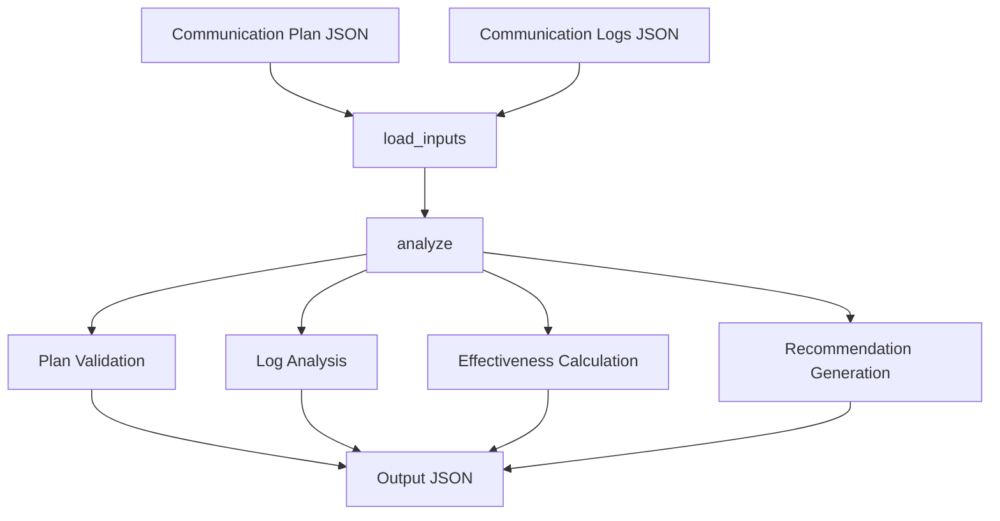

# Communication Management Module Documentation

*Last updated: 2025-08-14*

## Overview

The `communication_management.py` module is a core component of the AutoProjectManagement system that provides comprehensive communication analysis and management capabilities. This module processes communication plans and logs to generate actionable insights and recommendations for improving project communication effectiveness.

## Architecture Diagram


## Module Structure

### Class Hierarchy

| Class | Description | Inheritance |
|-------|-------------|-------------|
| `BaseManagement` | Base class for file-based operations | - |
| `CommunicationManagement` | Communication analysis and management | Inherits from `BaseManagement` |

### Key Components

| Component | Type | Purpose |
|-----------|------|---------|
| `communication_plan_path` | Configuration | Path to communication plan JSON file |
| `communication_logs_path` | Configuration | Path to communication logs JSON file |
| `output_path` | Configuration | Path for saving analysis results |
| `inputs` | Data Storage | Loaded input data from JSON files |
| `output` | Data Storage | Processed analysis results |

## Detailed Method Documentation

### BaseManagement Class

#### Constructor
```python
def __init__(self, input_paths: Dict[str, str], output_path: str) -> None
```

**Purpose:** Initializes the base management class with input and output file paths.

**Parameters:**
| Parameter | Type | Required | Description | Default |
|-----------|------|----------|-------------|---------|
| `input_paths` | `Dict[str, str]` | Yes | Dictionary mapping input names to file paths | - |
| `output_path` | `str` | Yes | Path where output will be saved | - |

**Validation Rules:**
- `input_paths` must be a non-empty dictionary
- `output_path` must be a non-empty string

#### load_json Method
```python
def load_json(self, path: str) -> Optional[Dict[str, Any]]
```

**Purpose:** Loads JSON data from a specified file path.

**Parameters:**
| Parameter | Type | Required | Description |
|-----------|------|----------|-------------|
| `path` | `str` | Yes | Path to the JSON file |

**Returns:** `Optional[Dict[str, Any]]` - Dictionary containing JSON data or None if file doesn't exist

**Error Handling:**
- `json.JSONDecodeError`: If file contains invalid JSON
- `OSError`: If there's an error reading the file

#### save_json Method
```python
def save_json(self, data: Dict[str, Any], path: str) -> None
```

**Purpose:** Saves data as JSON to a specified file path.

**Parameters:**
| Parameter | Type | Required | Description |
|-----------|------|----------|-------------|
| `data` | `Dict[str, Any]` | Yes | Dictionary to save as JSON |
| `path` | `str` | Yes | Path where to save the file |

**Error Handling:**
- `TypeError`: If data is not JSON serializable
- `OSError`: If there's an error writing the file

### CommunicationManagement Class

#### Constructor
```python
def __init__(self, communication_plan_path: str = DEFAULT_COMMUNICATION_PLAN_PATH,
             communication_logs_path: str = DEFAULT_COMMUNICATION_LOGS_PATH,
             output_path: str = DEFAULT_OUTPUT_PATH) -> None
```

**Purpose:** Initializes communication management with default or custom file paths.

**Parameters:**
| Parameter | Type | Required | Default | Description |
|-----------|------|----------|---------|-------------|
| `communication_plan_path` | `str` | No | `project_inputs/PM_JSON/user_inputs/communication_plan.json` | Path to communication plan |
| `communication_logs_path` | `str` | No | `project_inputs/PM_JSON/user_inputs/communication_logs.json` | Path to communication logs |
| `output_path` | `str` | No | `project_inputs/PM_JSON/system_outputs/communication_management.json` | Output path |

#### analyze Method
```python
def analyze(self) -> None
```

**Purpose:** Performs comprehensive communication analysis including plan validation, log analysis, effectiveness calculation, and recommendation generation.

**Analysis Process:**
1. **Plan Validation**: Validates communication plan structure and required fields
2. **Log Analysis**: Analyzes communication patterns and frequency
3. **Effectiveness Calculation**: Computes communication effectiveness score
4. **Recommendation Generation**: Creates actionable recommendations

**Output Structure:**
```json
{
  "summary": {
    "status": "completed",
    "total_logs": 25,
    "plan_valid": true,
    "effectiveness_score": 0.85
  },
  "plan_validation": {
    "valid": true,
    "issues": [],
    "stakeholder_count": 5,
    "communication_types": 3
  },
  "log_analysis": {
    "total_logs": 25,
    "frequency_analysis": {
      "email": 15,
      "meeting": 8,
      "report": 2
    },
    "effectiveness_trends": [],
    "gaps": []
  },
  "effectiveness": {
    "score": 0.85,
    "metrics": {
      "actual_communications": 25,
      "expected_minimum": 10,
      "plan_stakeholders": 5
    },
    "issues": []
  },
  "recommendations": [
    "Increase meeting frequency",
    "Improve report distribution"
  ]
}
```

## Data Flow Diagram



## Validation Rules

### Communication Plan Validation
| Field | Type | Required | Description | Validation Rules |
|-------|------|----------|-------------|-----------------|
| `stakeholders` | `List[Dict]` | Yes | List of project stakeholders | Must contain at least one stakeholder |
| `communication_types` | `List[str]` | Yes | Types of communication methods | Must contain at least one type |
| `frequency` | `Dict[str, Any]` | Yes | Communication frequency settings | Must contain valid frequency settings |

### Effectiveness Calculation Formula

The communication effectiveness score is calculated using the following formula:

```
effectiveness_score = min(actual_communications / expected_minimum, 1.0)
```

Where:
- `actual_communications` = Total number of communication log entries
- `expected_minimum` = Number of stakeholders × 2 (minimum expected communications per stakeholder)

## Error Handling and Logging

### Log Levels
| Level | Usage | Example |
|-------|-------|---------|
| `INFO` | Successful operations | "Loaded input: communication_plan from path" |
