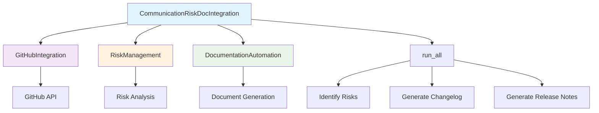
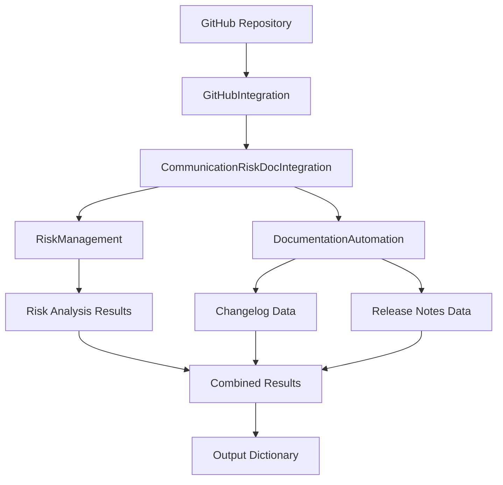

# Communication Risk Documentation Integration Module

*Last updated: 2025-08-14*

## Overview

The `communication_risk_doc_integration.py` module serves as an integration layer between communication risk management and documentation automation systems. It combines GitHub integration, risk management, and documentation automation capabilities to provide comprehensive project insights and automated documentation generation.

## Architecture Diagram



## Module Structure

### Class Hierarchy

| Class | Description | Dependencies |
|-------|-------------|--------------|
| `CommunicationRiskDocIntegration` | Main integration class | `GitHubIntegration`, `RiskManagement`, `DocumentationAutomation` |

### Integration Components

| Component | Type | Purpose | Source Module |
|-----------|------|---------|---------------|
| `GitHubIntegration` | Service Integration | GitHub API communication | `services/integration_services/github_integration.py` |
| `RiskManagement` | Risk Analysis | Risk identification and management | `main_modules/communication_risk/risk_management.py` |
| `DocumentationAutomation` | Documentation | Automated documentation generation | `services/configuration_cli/documentation_automation.py` |

## Detailed Method Documentation

### CommunicationRiskDocIntegration Class

#### Constructor
```python
def __init__(self, repo_owner: str, repo_name: str, token: Optional[str] = None) -> None
```

**Purpose:** Initializes the integration class with GitHub repository information and authentication.

**Parameters:**
| Parameter | Type | Required | Description | Default |
|-----------|------|----------|-------------|---------|
| `repo_owner` | `str` | Yes | GitHub repository owner/organization | - |
| `repo_name` | `str` | Yes | GitHub repository name | - |
| `token` | `Optional[str]` | No | GitHub personal access token | `None` |

**Authentication Requirements:**
- Public repositories: Token optional for read access
- Private repositories: Token required for access
- Rate limiting: Token provides higher rate limits

#### run_all Method
```python
def run_all(self) -> Dict[str, Any]
```

**Purpose:** Executes the complete integration workflow including risk analysis and documentation generation.

**Workflow Process:**
1. **Risk Identification**: Uses RiskManagement to identify project risks
2. **Risk Summary**: Generates comprehensive risk summary report
3. **Changelog Generation**: Creates automated changelog from Git history
4. **Release Notes**: Generates release notes for the latest version

**Returns:** `Dict[str, Any]` - Comprehensive results containing:
```json
{
  "risks": {
    "identified_risks": [],
    "risk_categories": [],
    "severity_levels": {}
  },
  "risk_summary": {
    "total_risks": 0,
    "high_priority": 0,
    "medium_priority": 0,
    "low_priority": 0,
    "summary_text": "Risk analysis summary"
  },
  "changelog": {
    "version": "1.0.0",
    "changes": [],
    "contributors": []
  },
  "release_notes": {
    "version": "latest",
    "features": [],
    "bug_fixes": [],
    "breaking_changes": []
  }
}
```

## Data Flow Diagram



## Integration Points

### GitHub Integration
| Feature | Description | API Endpoints Used |
|---------|-------------|-------------------|
| Repository Access | Read repository information | `/repos/{owner}/{repo}` |
| Commit History | Access Git commit history | `/repos/{owner}/{repo}/commits` |
| Issues & PRs | Read issues and pull requests | `/repos/{owner}/{repo}/issues` |
| Releases | Access release information | `/repos/{owner}/{repo}/releases` |

### Risk Management Integration
| Risk Category | Description | Analysis Method |
|---------------|-------------|----------------|
| Code Quality | Code complexity and quality issues | Static analysis |
| Documentation | Missing or outdated documentation | Content analysis |
| Dependencies | Outdated or vulnerable dependencies | Dependency scanning |
| Security | Security vulnerabilities and risks | Security scanning |
| Performance | Performance bottlenecks and issues | Performance analysis |

### Documentation Automation
| Document Type | Description | Generation Method |
|---------------|-------------|------------------|
| Changelog | Automated change history | Git commit analysis |
| Release Notes | Version release information | Git tags and commits |
| Risk Reports | Comprehensive risk analysis | Risk data aggregation |
| Project Documentation | Overall project documentation | Template-based generation |

## Configuration Requirements

### Environment Variables
| Variable | Description | Required | Default |
|----------|-------------|----------|---------|
| `GITHUB_TOKEN` | GitHub personal access token | Optional | `None` |
| `GITHUB_OWNER` | Repository owner/organization | Required | - |
| `GITHUB_REPO` | Repository name | Required | - |

### Authentication Setup
```bash
# Set GitHub token (recommended for production)
export GITHUB_TOKEN=your_personal_access_token
export GITHUB_OWNER=your_organization
export GITHUB_REPO=your_repository
```

## Usage Examples

### Basic Usage
```python
