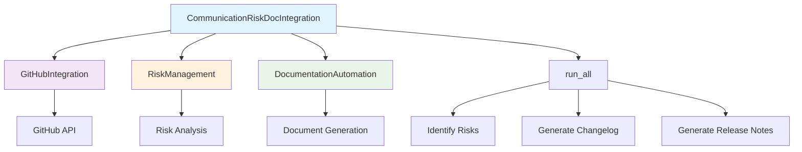

# Communication Risk Documentation Integration Module

*Last updated: 2025-08-14*

## Overview

The `communication_risk_doc_integration.py` module serves as an integration layer between communication risk management and documentation automation systems. It combines GitHub integration, risk management, and documentation automation capabilities to provide comprehensive project insights and automated documentation generation.

## Architecture Diagram



## Module Structure

### Class Hierarchy

| Class | Description | Dependencies |
|-------|-------------|--------------|
| `CommunicationRiskDocIntegration` | Main integration class | `GitHubIntegration`, `RiskManagement`, `DocumentationAutomation` |

### Integration Components

| Component | Type | Purpose | Source Module |
|-----------|------|---------|---------------|
| `GitHubIntegration` | Service Integration | GitHub API communication | `services/integration_services/github_integration.py` |
| `RiskManagement` | Risk Analysis | Risk identification and management | `main_modules/communication_risk/risk_management.py` |
| `DocumentationAutomation` | Documentation | Automated documentation generation | `services/configuration_cli/documentation_automation.py` |

## Detailed Method Documentation

### CommunicationRiskDocIntegration Class

#### Constructor
```python
def __init__(self, repo_owner: str, repo_name: str, token: Optional[str] = None) -> None
```

**Purpose:** Initializes the integration class with GitHub repository information and authentication.

**Parameters:**
| Parameter | Type | Required | Description | Default |
|-----------|------|----------|-------------|---------|
| `repo_owner` | `str` | Yes | GitHub repository owner/organization | - |
| `repo_name` | `str` | Yes | GitHub repository name | - |
| `token` | `Optional[str]` | No | GitHub personal access token | `None` |

**Authentication Requirements:**
- Public repositories: Token optional for read access
- Private repositories: Token required for access
- Rate limiting: Token provides higher rate limits

#### run_all Method
```python
def run_all(self) -> Dict[str, Any]
```

**Purpose:** Executes the complete integration workflow including risk analysis and documentation generation.

**Workflow Process:**
1. **Risk Identification**: Uses RiskManagement to identify project risks
2. **Risk Summary**: Generates comprehensive risk summary report
