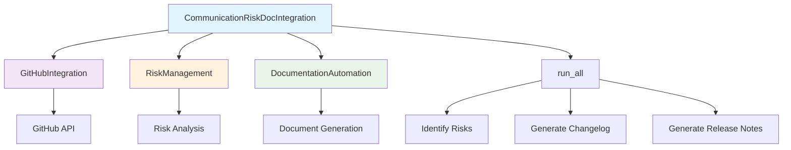
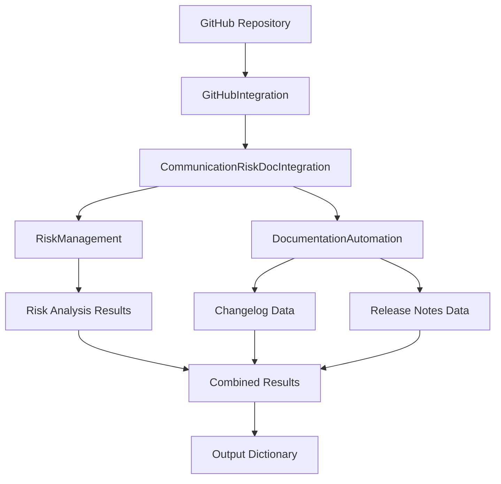

# Communication Risk Documentation Integration Module

*Last updated: 2025-08-14*

## Overview

The `communication_risk_doc_integration.py` module serves as an integration layer between communication risk management and documentation automation systems. It combines GitHub integration, risk management, and documentation automation capabilities to provide comprehensive project insights and automated documentation generation.

## Architecture Diagram



## Module Structure

### Class Hierarchy

| Class | Description | Dependencies |
|-------|-------------|--------------|
| `CommunicationRiskDocIntegration` | Main integration class | `GitHubIntegration`, `RiskManagement`, `DocumentationAutomation` |

### Integration Components

| Component | Type | Purpose | Source Module |
|-----------|------|---------|---------------|
| `GitHubIntegration` | Service Integration | GitHub API communication | `services/integration_services/github_integration.py` |
| `RiskManagement` | Risk Analysis | Risk identification and management | `main_modules/communication_risk/risk_management.py` |
| `DocumentationAutomation` | Documentation | Automated documentation generation | `services/configuration_cli/documentation_automation.py` |

## Detailed Method Documentation

### CommunicationRiskDocIntegration Class

#### Constructor
```python
def __init__(self, repo_owner: str, repo_name: str, token: Optional[str] = None) -> None
```

**Purpose:** Initializes the integration class with GitHub repository information and authentication.

**Parameters:**
| Parameter | Type | Required | Description | Default |
|-----------|------|----------|-------------|---------|
| `repo_owner` | `str` | Yes | GitHub repository owner/organization | - |
| `repo_name` | `str` | Yes | GitHub repository name | - |
| `token` | `Optional[str]` | No | GitHub personal access token | `None` |

**Authentication Requirements:**
- Public repositories: Token optional for read access
- Private repositories: Token required for access
- Rate limiting: Token provides higher rate limits

#### run_all Method
```python
def run_all(self) -> Dict[str, Any]
```

**Purpose:** Executes the complete integration workflow including risk analysis and documentation generation.

**Workflow Process:**
1. **Risk Identification**: Uses RiskManagement to identify project risks
2. **Risk Summary**: Generates comprehensive risk summary report
3. **Changelog Generation**: Creates automated changelog from Git history
4. **Release Notes**: Generates release notes for the latest version

**Returns:** `Dict[str, Any]` - Comprehensive results containing:
```json
{
  "risks": {
    "identified_risks": [],
    "risk_categories": [],
    "severity_levels": {}
  },
  "risk_summary": {
    "total_risks": 0,
    "high_priority": 0,
    "medium_priority": 0,
    "low_priority": 0,
    "summary_text": "Risk analysis summary"
  },
  "changelog": {
    "version": "1.0.0",
    "changes": [],
    "contributors": []
  },
  "release_notes": {
    "version": "latest",
    "features": [],
    "bug_fixes": [],
    "breaking_changes": []
  }
}
```

## Data Flow Diagram



## Integration Points

### GitHub Integration
| Feature | Description | API Endpoints Used |
|---------|-------------|-------------------|
| Repository Access | Read repository information | `/repos/{owner}/{repo}` |
| Commit History | Access Git commit history | `/repos/{owner}/{repo}/commits` |
| Issues & PRs | Read issues and pull requests | `/repos/{owner}/{repo}/issues` |
| Releases | Access release information | `/repos/{owner}/{repo}/releases` |

### Risk Management Integration
| Risk Category | Description | Analysis Method |
|---------------|-------------|----------------|
| Code Quality | Code complexity and quality issues | Static analysis |
| Documentation | Missing or outdated documentation | Content analysis |
| Dependencies | Outdated or vulnerable dependencies | Dependency scanning |
| Security | Security vulnerabilities and risks | Security scanning |
| Performance | Performance bottlenecks and issues | Performance analysis |

### Documentation Automation
| Document Type | Description | Generation Method |
|---------------|-------------|------------------|
| Changelog | Automated change history | Git commit analysis |
| Release Notes | Version release information | Git tags and commits |
| Risk Reports | Comprehensive risk analysis | Risk data aggregation |
| Project Documentation | Overall project documentation | Template-based generation |

## Configuration Requirements

### Environment Variables
| Variable | Description | Required | Default |
|----------|-------------|----------|---------|
| `GITHUB_TOKEN` | GitHub personal access token | Optional | `None` |
| `GITHUB_OWNER` | Repository owner/organization | Required | - |
| `GITHUB_REPO` | Repository name | Required | - |

### Authentication Setup
```bash
# Set GitHub token (recommended for production)
export GITHUB_TOKEN=your_personal_access_token
export GITHUB_OWNER=your_organization
export GITHUB_REPO=your_repository
```

## Usage Examples

### Basic Usage
```python
from autoprojectmanagement.main_modules.communication_risk.communication_risk_doc_integration import CommunicationRiskDocIntegration

# Initialize integration
integration = CommunicationRiskDocIntegration(
    repo_owner="your-organization",
    repo_name="project-management",
    token="your_github_token"  # Optional for public repos
)

# Run complete analysis
results = integration.run_all()

# Access results
print("Risk Summary:", results["risk_summary"])
print("Changelog:", results["changelog"])
print("Release Notes:", results["release_notes"])
```

### Advanced Configuration
```python
# Custom integration with error handling
try:
    integration = CommunicationRiskDocIntegration(
        repo_owner="company",
        repo_name="important-project",
        token=os.getenv("GITHUB_TOKEN")
    )
    
    # Run specific components individually
    risks = integration.risk_manager.identify_risks()
    changelog = integration.doc_automation.generate_changelog()
    
except Exception as e:
    print(f"Integration failed: {e}")
```

## Error Handling

### Common Error Scenarios
| Error Type | Description | Resolution |
|------------|-------------|------------|
| `GitHub API Error` | GitHub API rate limiting or access issues | Use authentication token, implement retry logic |
| `Repository Not Found` | Invalid repository owner or name | Verify repository existence and permissions |
| `Authentication Failure` | Invalid or expired GitHub token | Regenerate token with appropriate permissions |
| `Network Issues` | Connection problems to GitHub API | Check network connectivity, implement timeout |

### Error Response Format
```json
{
  "error": "GitHub API rate limit exceeded",
  "detail": "API rate limit exceeded for user. Please use authentication token.",
  "retry_after": 3600,
  "timestamp": "2025-08-14T10:30:00.000Z"
}
```

## Performance Considerations

### API Rate Limiting
| Scenario | Rate Limit | Mitigation Strategy |
|----------|------------|---------------------|
| Unauthenticated | 60 requests/hour | Use authentication token |
| Authenticated | 5000 requests/hour | Implement request caching |
| Enterprise | Custom limits | Contact GitHub support |

### Processing Time
| Operation | Estimated Time | Factors Affecting Performance |
|-----------|----------------|-------------------------------|
| Risk Analysis | 1-5 minutes | Repository size, complexity |
| Changelog Generation | 30 seconds - 2 minutes | Commit history length |
| Release Notes | 1-3 minutes | Number of releases, changes |

## Best Practices

### Security Considerations
1. **Token Management**: Store GitHub tokens securely using environment variables
2. **Permission Scoping**: Use tokens with minimal required permissions
3. **Rate Limit Awareness**: Implement caching to avoid rate limiting
4. **Error Handling**: Comprehensive error handling for network issues

### Performance Optimization
1. **Caching**: Cache GitHub API responses where appropriate
2. **Pagination**: Handle pagination for large repositories
3. **Parallel Processing**: Process multiple operations in parallel when possible
4. **Memory Management**: Handle large repositories with streaming processing

### Maintenance
1. **Dependency Updates**: Keep GitHub API library updated
2. **Token Rotation**: Regularly rotate authentication tokens
3. **Monitoring**: Monitor API usage and rate limits
4. **Logging**: Comprehensive logging for debugging and audit trails

## Integration Testing

### Test Scenarios
| Scenario | Description | Expected Outcome |
|----------|-------------|------------------|
| Public Repository | Access public repo without token | Successful analysis with rate limits |
| Private Repository | Access private repo with valid token | Successful full analysis |
| Invalid Repository | Attempt to access non-existent repo | Clear error message |
| Rate Limit Exceeded | Exceed API rate limits | Graceful degradation with retry |

### Test Data Requirements
```python
# Test configuration
TEST_REPO_OWNER = "test-organization"
TEST_REPO_NAME = "test-repository"
TEST_TOKEN = "test-token"  # For private repo tests

# Mock responses for unit testing
MOCK_RISK_DATA = {
    "identified_risks": ["risk1", "risk2"],
    "risk_categories": ["security", "performance"]
}

MOCK_DOCUMENTATION = {
    "changelog": "Test changelog content",
    "release_notes": "Test release notes"
}
```

## Version History

| Version | Date | Changes | Compatibility |
|---------|------|---------|---------------|
| 1.0.0 | 2025-08-14 | Initial production release | Python 3.8+ |
| 0.9.0 | 2025-07-01 | Beta release with basic integration | Python 3.8+ |
| 0.1.0 | 2024-01-01 | Initial development version | Python 3.8+ |

## Future Enhancements

### Planned Features
1. **Advanced Risk Scoring**: Machine learning-based risk assessment
2. **Real-time Monitoring**: Continuous risk monitoring and alerts
3. **Multi-Repository Support**: Analyze multiple repositories simultaneously
4. **Custom Templates**: Customizable documentation templates
5. **Export Formats**: Support for PDF, HTML, and other formats

### Technical Improvements
1. **Async Processing**: Async/await for better performance
2. **Webhook Integration**: Real-time updates via GitHub webhooks
