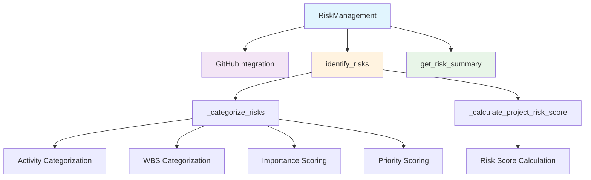

# Risk Management Module Documentation

*Last updated: 2025-08-14*

## Overview

The `risk_management.py` module provides comprehensive risk identification, assessment, and management capabilities for the AutoProjectManagement system. It integrates with GitHub issues to identify risks, categorizes them by activity and WBS elements, calculates risk scores, and provides mitigation strategies.

## Architecture Diagram



## Module Structure

### Class Hierarchy

| Class | Description | Dependencies |
|-------|-------------|--------------|
| `RiskManagement` | Main risk management class | `GitHubIntegration` |

### Standalone Functions
| Function | Description | Purpose |
|----------|-------------|---------|
| `identify_risks` | Backward compatibility function | Extract risks from project data |
| `assess_risk_impact` | Risk impact assessment | Calculate quantitative risk impact |
| `mitigate_risk` | Risk mitigation | Implement mitigation strategies |

## Detailed Method Documentation

### RiskManagement Class

#### Constructor
```python
def __init__(self, github_integration: GitHubIntegration) -> None
```

**Purpose:** Initializes the risk management system with GitHub integration.

**Parameters:**
| Parameter | Type | Required | Description |
|-----------|------|----------|-------------|
| `github_integration` | `GitHubIntegration` | Yes | GitHub integration instance for API access |

**Internal State Initialization:**
- `risk_issues`: List of identified risk issues
- `project_risk_score`: Overall project risk score (0.0 initially)
- `activity_risks`: Risks categorized by activity
- `wbs_risks`: Risks categorized by WBS elements
- `activity_importance`: Importance scores for activities
- `activity_priority`: Priority scores for activities

#### identify_risks Method
```python
def identify_risks(self) -> List[Dict[str, Any]]
```

**Purpose:** Identifies and categorizes risks from GitHub issues labeled as 'risk'.

**Process Flow:**
1. Fetch all open GitHub issues
2. Filter issues with 'risk' label (case-insensitive)
3. Categorize risks by activity and WBS
4. Calculate overall project risk score

**Returns:** `List[Dict[str, Any]]` - List of risk issues with complete details

**Example Output:**
```json
[
  {
    "number": 123,
    "title": "Security vulnerability in authentication",
    "labels": [
      {"name": "risk", "color": "d73a4a"},
      {"name": "activity:authentication", "color": "7057ff"},
      {"name": "importance:0.8", "color": "ffffff"}
    ],
    "created_at": "2025-08-14T10:30:00Z",
    "html_url": "https://github.com/owner/repo/issues/123"
  }
]
```

#### get_risk_summary Method
```python
def get_risk_summary(self) -> Dict[str, Any]
```

**Purpose:** Generates a comprehensive summary of all identified risks.

**Summary Structure:**
```json
{
  "total_risks": 15,
  "project_risk_score": 42.5,
  "activity_risks": {
    "authentication": 3,
    "database": 5,
    "ui": 2
  },
  "wbs_risks": {
    "1.1": 2,
    "1.2": 3,
    "2.1": 4
  },
  "risks": [
    {
      "id": 123,
      "title": "Security vulnerability",
      "created_at": "2025-08-14T10:30:00Z",
      "url": "https://github.com/owner/repo/issues/123"
    }
  ]
}
```

### Standalone Functions

#### identify_risks Function
```python
def identify_risks(project_data: Dict[str, Any]) -> List[Dict[str, Any]]
```

**Purpose:** Backward compatibility function for risk identification from project data.

**Parameters:**
| Parameter | Type | Required | Description |
|-----------|------|----------|-------------|
| `project_data` | `Dict[str, Any]` | Yes | Project data containing tasks |

**Returns:** `List[Dict[str, Any]]` - List of identified risks

#### assess_risk_impact Function
```python
def assess_risk_impact(risk: Dict[str, Any]) -> float
```

**Purpose:** Calculates quantitative risk impact score.

**Risk Impact Formula:**
```
impact = base_impact × probability
```
Where:
- `base_impact`: RISK_LEVELS[risk_level] (1 for low, 3 for medium, 5 for high)
- `probability`: Risk occurrence probability (0.0 to 1.0)

**Parameters:**
| Parameter | Type | Required | Description | Validation |
|-----------|------|----------|-------------|------------|
| `risk` | `Dict[str, Any]` | Yes | Risk dictionary | Must contain 'level' and 'probability' |
| `level` | `str` | Yes | Risk level: low, medium, high | Must be one of valid levels |
| `probability` | `float` | Yes | Probability (0.0 to 1.0) | Must be between 0 and 1 |

#### mitigate_risk Function
```python
def mitigate_risk(risk: Dict[str, Any]) -> bool
```

**Purpose:** Implements risk mitigation strategies (placeholder implementation).

**Parameters:**
| Parameter | Type | Required | Description |
|-----------|------|----------|-------------|
| `risk` | `Dict[str, Any]` | Yes | Risk to mitigate |

**Returns:** `bool` - True if mitigation successful, False otherwise

## Risk Categorization System

### Label-Based Categorization
The system uses GitHub issue labels for automatic risk categorization:

| Label Pattern | Purpose | Example | Description |
|---------------|---------|---------|-------------|
| `risk` | Risk Identification | `risk` | Marks issue as a risk |
| `activity:<name>` | Activity Association | `activity:authentication` | Associates risk with specific activity |
| `wbs:<code>` | WBS Association | `wbs:1.2.3` | Associates risk with WBS element |
