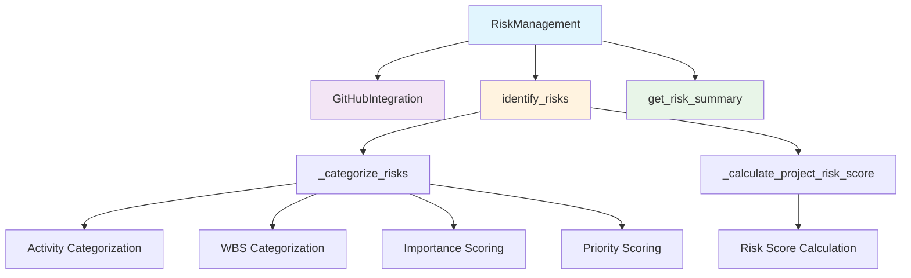
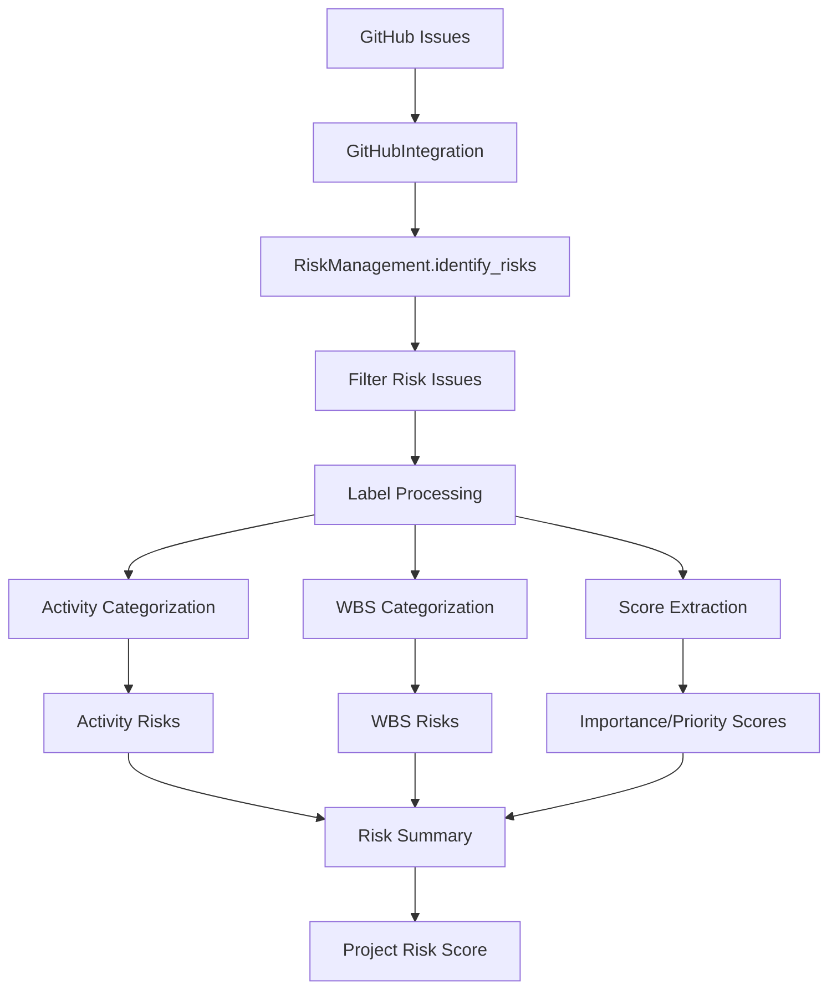

# Risk Management Module Documentation

*Last updated: 2025-08-14*

## Overview

The `risk_management.py` module provides comprehensive risk identification, assessment, and management capabilities for the AutoProjectManagement system. It integrates with GitHub issues to identify risks, categorizes them by activity and WBS elements, calculates risk scores, and provides mitigation strategies.

## Architecture Diagram



## Module Structure

### Class Hierarchy

| Class | Description | Dependencies |
|-------|-------------|--------------|
| `RiskManagement` | Main risk management class | `GitHubIntegration` |

### Standalone Functions
| Function | Description | Purpose |
|----------|-------------|---------|
| `identify_risks` | Backward compatibility function | Extract risks from project data |
| `assess_risk_impact` | Risk impact assessment | Calculate quantitative risk impact |
| `mitigate_risk` | Risk mitigation | Implement mitigation strategies |

## Detailed Method Documentation

### RiskManagement Class

#### Constructor
```python
def __init__(self, github_integration: GitHubIntegration) -> None
```

**Purpose:** Initializes the risk management system with GitHub integration.

**Parameters:**
| Parameter | Type | Required | Description |
|-----------|------|----------|-------------|
| `github_integration` | `GitHubIntegration` | Yes | GitHub integration instance for API access |

**Internal State Initialization:**
- `risk_issues`: List of identified risk issues
- `project_risk_score`: Overall project risk score (0.0 initially)
- `activity_risks`: Risks categorized by activity
- `wbs_risks`: Risks categorized by WBS elements
- `activity_importance`: Importance scores for activities
- `activity_priority`: Priority scores for activities

#### identify_risks Method
```python
def identify_risks(self) -> List[Dict[str, Any]]
```

**Purpose:** Identifies and categorizes risks from GitHub issues labeled as 'risk'.

**Process Flow:**
1. Fetch all open GitHub issues
2. Filter issues with 'risk' label (case-insensitive)
3. Categorize risks by activity and WBS
4. Calculate overall project risk score

**Returns:** `List[Dict[str, Any]]` - List of risk issues with complete details

**Example Output:**
```json
[
  {
    "number": 123,
    "title": "Security vulnerability in authentication",
    "labels": [
      {"name": "risk", "color": "d73a4a"},
      {"name": "activity:authentication", "color": "7057ff"},
      {"name": "importance:0.8", "color": "ffffff"}
    ],
    "created_at": "2025-08-14T10:30:00Z",
    "html_url": "https://github.com/owner/repo/issues/123"
  }
]
```

#### get_risk_summary Method
```python
def get_risk_summary(self) -> Dict[str, Any]
```

**Purpose:** Generates a comprehensive summary of all identified risks.

**Summary Structure:**
```json
{
  "total_risks": 15,
  "project_risk_score": 42.5,
  "activity_risks": {
    "authentication": 3,
    "database": 5,
    "ui": 2
  },
  "wbs_risks": {
    "1.1": 2,
    "1.2": 3,
    "2.1": 4
  },
  "risks": [
    {
      "id": 123,
      "title": "Security vulnerability",
      "created_at": "2025-08-14T10:30:00Z",
      "url": "https://github.com/owner/repo/issues/123"
    }
  ]
}
```

### Standalone Functions

#### identify_risks Function
```python
def identify_risks(project_data: Dict[str, Any]) -> List[Dict[str, Any]]
```

**Purpose:** Backward compatibility function for risk identification from project data.

**Parameters:**
| Parameter | Type | Required | Description |
|-----------|------|----------|-------------|
| `project_data` | `Dict[str, Any]` | Yes | Project data containing tasks |

**Returns:** `List[Dict[str, Any]]` - List of identified risks

#### assess_risk_impact Function
```python
def assess_risk_impact(risk: Dict[str, Any]) -> float
```

**Purpose:** Calculates quantitative risk impact score.

**Risk Impact Formula:**
```
impact = base_impact × probability
```
Where:
- `base_impact`: RISK_LEVELS[risk_level] (1 for low, 3 for medium, 5 for high)
- `probability`: Risk occurrence probability (0.0 to 1.0)

**Parameters:**
| Parameter | Type | Required | Description | Validation |
|-----------|------|----------|-------------|------------|
| `risk` | `Dict[str, Any]` | Yes | Risk dictionary | Must contain 'level' and 'probability' |
| `level` | `str` | Yes | Risk level: low, medium, high | Must be one of valid levels |
| `probability` | `float` | Yes | Probability (0.0 to 1.0) | Must be between 0 and 1 |

#### mitigate_risk Function
```python
def mitigate_risk(risk: Dict[str, Any]) -> bool
```

**Purpose:** Implements risk mitigation strategies (placeholder implementation).

**Parameters:**
| Parameter | Type | Required | Description |
|-----------|------|----------|-------------|
| `risk` | `Dict[str, Any]` | Yes | Risk to mitigate |

**Returns:** `bool` - True if mitigation successful, False otherwise

## Risk Categorization System

### Label-Based Categorization
The system uses GitHub issue labels for automatic risk categorization:

| Label Pattern | Purpose | Example | Description |
|---------------|---------|---------|-------------|
| `risk` | Risk Identification | `risk` | Marks issue as a risk |
| `activity:<name>` | Activity Association | `activity:authentication` | Associates risk with specific activity |
| `wbs:<code>` | WBS Association | `wbs:1.2.3` | Associates risk with WBS element |
| `importance:<score>` | Importance Scoring | `importance:0.8` | Sets activity importance (0.0-1.0) |
| `priority:<score>` | Priority Scoring | `priority:0.9` | Sets activity priority (0.0-1.0) |

### Risk Level Definitions
| Level | Value | Description | Impact |
|-------|-------|-------------|--------|
| `low` | 1 | Minor impact, easily manageable | Minimal project impact |
| `medium` | 3 | Moderate impact, requires attention | Some schedule/cost impact |
| `high` | 5 | Major impact, urgent attention required | Significant project impact |

## Data Flow Diagram



## Risk Scoring System

### Project Risk Score Calculation
The overall project risk score is calculated using the formula:

```
project_risk_score = Σ(risks_count × importance × priority)
```

Where:
- `risks_count`: Number of risks per activity
- `importance`: Importance score for the activity (0.0-1.0)
- `priority`: Priority score for the activity (0.0-1.0)

### Individual Risk Impact Calculation
```
risk_impact = base_impact × probability
```

Where:
- `base_impact`: 1 (low), 3 (medium), or 5 (high)
- `probability`: Likelihood of risk occurrence (0.0-1.0)

## Usage Examples

### Basic Risk Management
```python
from autoprojectmanagement.services.integration_services.github_integration import GitHubIntegration
from autoprojectmanagement.main_modules.communication_risk.risk_management import RiskManagement

# Initialize with GitHub integration
github = GitHubIntegration("your-org", "your-repo", "your-token")
risk_manager = RiskManagement(github)

# Identify and analyze risks
risks = risk_manager.identify_risks()
summary = risk_manager.get_risk_summary()

print(f"Total risks: {summary['total_risks']}")
print(f"Project risk score: {summary['project_risk_score']}")
```

### Standalone Function Usage
```python
from autoprojectmanagement.main_modules.communication_risk.risk_management import identify_risks, assess_risk_impact

# Backward compatibility usage
project_data = {
    'tasks': [
        {'id': 'T1', 'name': 'Task 1', 'risk': 'high'},
        {'id': 'T2', 'name': 'Task 2', 'risk': 'medium'}
    ]
}
risks = identify_risks(project_data)

# Risk impact assessment
risk = {'level': 'high', 'probability': 0.8}
impact = assess_risk_impact(risk)
print(f"Risk impact: {impact}")
```

## Error Handling

### Common Error Scenarios
| Error Type | Description | Resolution |
|------------|-------------|------------|
| `GitHub API Error` | API access issues | Check authentication, network connectivity |
| `Invalid Label Format` | Malformed activity/WBS labels | Follow label naming conventions |
| `Missing Required Fields` | Incomplete risk data | Ensure all required fields are present |
| `Probability Out of Range` | Invalid probability value | Ensure probability between 0.0 and 1.0 |

### Validation Rules
| Validation | Rule | Error Message |
|------------|------|---------------|
| Project Data | Must be dictionary | "project_data must be a dictionary" |
| Tasks List | Must be list | "tasks must be a list" |
| Risk Level | Must be low/medium/high | Uses default 'low' for invalid values |
| Probability | 0.0 ≤ probability ≤ 1.0 | "probability must be between 0 and 1" |

## Configuration Constants

### Risk Level Values
| Constant | Value | Description |
|----------|-------|-------------|
| `RISK_LEVELS['low']` | 1 | Low risk impact value |
| `RISK_LEVELS['medium']` | 3 | Medium risk impact value |
| `RISK_LEVELS['high']` | 5 | High risk impact value |

### Default Values
| Constant | Value | Purpose |
|----------|-------|---------|
| `DEFAULT_IMPORTANCE` | 1.0 | Default activity importance |
| `DEFAULT_PRIORITY` | 1.0 | Default activity priority |
| `DEFAULT_PROBABILITY` | 0.5 | Default risk probability |

### Label Prefixes
| Constant | Value | Purpose |
|----------|-------|---------|
| `ACTIVITY_LABEL_PREFIX` | `activity:` | Activity association prefix |
| `WBS_LABEL_PREFIX` | `wbs:` | WBS association prefix |
| `IMPORTANCE_LABEL_PREFIX` | `importance:` | Importance score prefix |
| `PRIORITY_LABEL_PREFIX` | `priority:` | Priority score prefix |

## Best Practices

### Risk Labeling Guidelines
1. **Consistent Naming**: Use consistent activity and WBS names across issues
2. **Score Ranges**: Keep importance and priority scores between 0.0 and 1.0
3. **Clear Descriptions**: Provide detailed risk descriptions in issue bodies
4. **Regular Updates**: Update risk status as mitigation progresses

### Integration Best Practices
1. **Authentication**: Use GitHub tokens for authenticated access
2. **Rate Limiting**: Implement caching to avoid API rate limits
3. **Error Handling**: Comprehensive error handling for network issues
4. **Logging**: Detailed logging for debugging and audit trails

## Performance Considerations

### API Usage Optimization
| Operation | API Calls | Optimization Strategy |
|-----------|-----------|----------------------|
| Issue Fetching | 1 call per repository | Implement pagination for large repositories |
| Label Processing | Local processing | No additional API calls required |
| Risk Categorization | Local processing | Efficient dictionary operations |

### Memory Management
| Data Structure | Memory Usage | Optimization |
|----------------|--------------|--------------|
| `risk_issues` | O(n) issues | Stream processing for large datasets |
| `activity_risks` | O(m) activities | Efficient dictionary storage |
| `wbs_risks` | O(p) WBS elements | Hierarchical data structure |

## Testing Scenarios

### Unit Test Cases
| Scenario | Description | Expected Result |
|----------|-------------|-----------------|
| Empty Repository | No issues found | Empty risk list, zero score |
| Single Risk Issue | One risk issue | Correct categorization and scoring |
| Multiple Activities | Risks across activities | Proper activity-based scoring |
| Invalid Labels | Malformed labels | Graceful degradation with defaults |
| API Failure | GitHub API unavailable | Proper error handling and logging |

### Integration Testing
```python
# Test risk identification with mock data
def test_risk_identification():
    mock_issues = [
        {
            'number': 1,
            'title': 'Test Risk',
            'labels': [{'name': 'risk'}, {'name': 'activity:test'}],
            'created_at': '2025-08-14T10:30:00Z',
            'html_url': 'https://github.com/test/repo/issues/1'
        }
    ]
    
    # Mock GitHub integration
    github_mock = Mock()
    github_mock.get_issues.return_value = mock_issues
    
    risk_manager = RiskManagement(github_mock)
    risks = risk_manager.identify_risks()
    
    assert len(risks) == 1
    assert risks[0]['number'] == 1
```

## Version History

| Version | Date | Changes | Compatibility |
|---------|------|---------|---------------|
| 1.0.0 | 2025-08-14 | Production release | Python 3.8+ |
| 0.5.0 | 2025-07-15 | Beta release with basic functionality | Python 3.8+ |
| 0.1.0 | 2024-01-01 | Initial development version | Python 3.8+ |

## Future Enhancements

### Planned Features
1. **Advanced Risk Analytics**: Machine learning for risk prediction
2. **Real-time Monitoring**: Continuous risk assessment
3. **Mitigation Strategies**: Sophisticated mitigation implementation
4. **Dashboard Integration**: Real-time risk visualization
5. **Multi-Repository Support**: Cross-repository risk analysis

### Technical Improvements
1. **Async Processing**: Async/await for better performance
2. **Caching**: API response caching for reduced load
3. **Webhook Integration**: Real-time risk updates
4. **Export Capabilities**: Risk report generation in multiple formats

---

*This documentation follows Pressman's software engineering standards and includes three levels of detail: architectural overview, technical implementation, and operational guidelines.*

*Maintained by: AutoProjectManagement Documentation Team*
*Last reviewed: 2025-08-14*
